[English](#en) | [中文](#zh)

---

<a name="en"></a>

# WeDB: Next-Generation Ultra-High Performance Redis-Compatible Distributed Storage System

WeDB is an ultra-high performance, Redis-compatible distributed cache and persistent storage engine built on Rust 2024, meticulously benchmarked against Microsoft Garnet and completely re-engineered with modern zero-cost abstractions.

The architecture is cleanly decoupled into three primary tiers: a minimal network and host foundation ([`wnode`](https://github.com/webc-site/wedb/tree/main/wedb/wnode)), a lightweight standalone storage engine without cluster logic ([`wedb_standalone`](https://github.com/webc-site/wedb/tree/main/wedb/wedb_standalone)), and a highly available distributed cluster coordination layer ([`wedb`](https://github.com/webc-site/wedb/tree/main/wedb/wedb)). Each crate adheres to high cohesion, low coupling, and a strictly acyclic dependency DAG.

---

- [Architectural Topology & Garnet Mapping](#architectural-topology-garnet-mapping)
  - [Garnet Subsystem Correspondence Matrix](#garnet-subsystem-correspondence-matrix)
- [Architectural Decoupling Highlights](#architectural-decoupling-highlights)
  - [1. Physical Isolation Between Standalone and Cluster](#1-physical-isolation-between-standalone-and-cluster)
  - [2. Base Purity & Specialized Engines (`wnode` & `waof`)](#2-base-purity-specialized-engines-wnode-waof)
- [High-Performance Technology Stack](#high-performance-technology-stack)
- [Quick Start & Verification](#quick-start-verification)
  - [Build & Lint](#build-lint)
  - [Launch Standalone Node](#launch-standalone-node)
  - [Launch Distributed Cluster Node](#launch-distributed-cluster-node)

## Architectural Topology & Garnet Mapping

```mermaid
graph TD
    subgraph ClientAndNetwork ["Client & Network Layer"]
        wconn["wconn: Connection Handshake / Pipelines / Buffer Pooling"]
        wresp["wresp: Binary-Safe RESP2/3 Codec"]
    end

    subgraph HostBase ["Host Foundation & Traits"]
        wnode["wnode: TCP/UDS Listeners / Shutdown / Session Interface"]
    end

    subgraph StandaloneEngine ["Standalone Engine (wedb_standalone)"]
        wedb_standalone["wedb_standalone: Standalone Orchestration / Txn / DB / PubSub / TTL"]
        wacl["wacl: Access Control List"]
        wlua["wlua: Embedded Lua Sandbox"]
        wcol["wcol: Complex Collections (List/Hash/Set/ZSet)"]
    end

    subgraph ClusterSystem ["Distributed Cluster System (wedb)"]
        wedb["wedb: Cluster Protocol / Slot Sharding / Node Assembly / Cluster Traits"]
        gossip["Gossip: Node Discovery / Heartbeat / Config Epoch Convergence"]
        failover["Failover: Consensus Voting / Replica Elevation"]
        migration["Migration: Online Slot Migration / Key Chunk Pipeline"]
        replication["Replication: AOF Stream Replication / Resync / Backpressure"]
    end

    subgraph StorageCore ["HybridLog & Storage Engine Core"]
        wkv["wkv: KV Store Engine (HybridLog + Concurrent Hash)"]
        wbftree["wbftree: Concurrent Lock-Free B+Tree"]
        waof["waof: Low-Level WAL / AOF Persistence Log & Protocol"]
        whlog["whlog: HybridLog Paged Allocator"]
        wdev["wdev: Storage Device Abstraction & Segmented Device"]
        wcompact["wcompact: HybridLog Compaction & Space Reclamation"]
        wcpr["wcpr: Consistent Prefix Recovery (CPR) Checkpoint"]
        wepoch["wepoch: Garbage Collection & LightEpoch Protection"]
        windex["windex: Lock-Free Hash Index / Direct Virtual Memory & Native Memory Tracking"]
        whasher["whasher: High Performance Hashing"]
        wval["wval: Compact Value Types & Payload Layout"]
        wbase["wbase: Fundamental Utilities"]
    end

    wedb_standalone --> wnode
    wedb_standalone --> wkv
    wedb_standalone --> waof
    wedb_standalone --> wresp
    wedb_standalone --> wacl
    wedb_standalone --> wlua

    wedb --> wnode
    wedb --> wkv
    wedb --> wconn
    wedb --> wresp
    wedb --> waof

    wkv --> whlog
    wkv --> windex
    wkv --> wbftree
    wkv --> wcompact
    wkv --> wcpr

    windex --> wbase
    whlog --> wdev
    whlog --> wepoch
    waof --> wdev
```



### Garnet Subsystem Correspondence Matrix

| Garnet Project (C#) | WeDB Crate (Rust) | Responsibility & Scope |
|:---|:---|:---|
| `Garnet.host` / `libs/networking` | [`wnode`](https://github.com/webc-site/wedb/tree/main/wedb/wnode) | Host foundation: TCP / Unix Domain Socket listeners, nested text configuration, graceful shutdown coordination, session consumer interfaces (**zero storage, zero AOF, zero cluster code**). |
| `Garnet.server` | [`wedb_standalone`](https://github.com/webc-site/wedb/tree/main/wedb/wedb_standalone) | Standalone Redis-compatible server: session pipeline, MULTI/EXEC transactions, databases, PubSub, TTL eviction (**100% pure standalone, zero cluster code**). |
| `Garnet.cluster` | [`wedb`](https://github.com/webc-site/wedb/tree/main/wedb/wedb) | Distributed cluster protocols & state machines: Gossip health checks, Failover election, live Migration, replication streams, cluster traits (**zero dependency on `wedb_standalone`**). |
| `Garnet.client` | [`wconn`](https://github.com/webc-site/wedb/tree/main/wedb/wconn) | High-performance asynchronous client network layer: connection pool, handshakes, request multiplexing. |
| `libs/server/Resp` | [`wresp`](https://github.com/webc-site/wedb/tree/main/wedb/wresp) | Binary-safe Redis Serialization Protocol (RESP2/RESP3) parser and command extractor. |
| `libs/server/ACL` | [`wacl`](https://github.com/webc-site/wedb/tree/main/wedb/wacl) | User authentication, command categorization white-listing, and key-pattern permissions. |
| `libs/server/Lua` | [`wlua`](https://github.com/webc-site/wedb/tree/main/wedb/wlua) | Embedded Lua script sandbox runner and compiled bytecode cache. |
| `libs/server/Objects` | [`wcol`](https://github.com/webc-site/wedb/tree/main/wedb/wcol) | Complex data collections (Hash/Set/ZSet/List/Geo) and the BfTree range-index operator layer. |
| `Tsavorite.core` | [`wkv`](https://github.com/webc-site/wedb/tree/main/wedb/wkv), [`whlog`](https://github.com/webc-site/wedb/tree/main/wedb/whlog), [`windex`](https://github.com/webc-site/wedb/tree/main/wedb/windex), [`wcpr`](https://github.com/webc-site/wedb/tree/main/wedb/wcpr) | Concurrent hash table, hybrid log allocator, lock-free hash index with direct virtual memory / native memory tracking (`windex::ram`), incremental checkpointing and crash recovery. |
| `bftree-garnet` | [`wbftree`](https://github.com/webc-site/wedb/tree/main/wedb/wbftree) | Concurrent latch-free B+tree index. |
| `Tsavorite.devices` | [`wdev`](https://github.com/webc-site/wedb/tree/main/wedb/wdev), [`waof`](https://github.com/webc-site/wedb/tree/main/wedb/waof) | Abstract storage device (segmented files, direct I/O), write-ahead append log streams and protocol. |
| `libs/common` | [`wbase`](https://github.com/webc-site/wedb/tree/main/wedb/wbase), [`whasher`](https://github.com/webc-site/wedb/tree/main/wedb/whasher), [`wval`](https://github.com/webc-site/wedb/tree/main/wedb/wval) | Fundamental utilities and buffer pools (tiered sector-aligned `wbase::pool::BufferPool`, fixed-size network `wbase::pool::LimitedFixedBufferPool`), fast hashing algorithms, compact value models, and primitive utilities. |
| `modules/*` | [`wext_json`](https://github.com/webc-site/wedb/tree/main/wedb/wext_json), [`wext_roaring`](https://github.com/webc-site/wedb/tree/main/wedb/wext_roaring) | Compile-time static feature extensions (`wnode`'s `default = ["roaring", "json"]` pulls the two crates in): RedisJSON syntax support and RoaringBitmap computation. The C# `NoOpModule` is a sample plugin and, per the static-feature ruling, is not transpiled. |

---

## Architectural Decoupling Highlights

### 1. Physical Isolation Between Standalone and Cluster
- **Purity of `wedb_standalone`**:
  Eliminates all cluster slot checking hooks (`txn_cluster_slot_check`), cluster role transition barriers (`ClusterRoleGate`), and cluster session branches. The standalone engine remains lean and focused exclusively on local execution.
- **Independence of `wedb`**:
  All distributed clustering mechanisms (16,384 CRC16 slot hashing, failover state machines, Gossip discovery, migration pipelines) reside entirely inside `wedb`. `wedb` has **zero dependency on `wedb_standalone`** in its `Cargo.toml`.

### 2. Base Purity & Specialized Engines (`wnode` & `waof`)
- **`wnode` Pure Network & Host Base**:
  Contains no storage, AOF, or cluster business logic. Focuses exclusively on low-level networking: TCP/UDS listeners, backpressure throttling, lifecycle management, and pure virtual session traits (`MessageConsumerFace`, `SessionProviderFace`). Network buffers are not pooled here: `wnode` borrows `LimitedFixedBufferPool` through `wbase`'s `pool` feature. That pool owns the buffers in `wbase::pool` with a fixed 64 KiB block size, a 1024-entry resident ceiling, and lock-free borrow/return over a bounded `crossfire` MPMC ring; it is not a sharded structure.
- **`waof` WAL & AOF Protocol Engine**:
  Independently handles write-ahead logging and replication stream primitives:
  - **`AofAddress`**: 40-byte compact strictly ordered log offset supporting stack allocation and zero-copy serialization.
  - **`AofEntryType`**: Efficient discriminant enum representing physical AOF record types.
  - **Sub-log Persistence**: Multi-segment append log management.
- **`wedb` Cluster-Specific Aspects**:
  Cluster-specific high-availability traits are strictly encapsulated within `wedb`, avoiding any leaky abstractions:
  - **`CheckpointCallbackFace`**: Checkpoint phase progression notification trait.
  - **`StoreCommitFn`**: AOF commit marker write delegate closure (mirrors C# StoreWrapper.EnqueueCommit direct call; not a trait).
  - **`AofBackpressureFace`**: Zero-allocation backpressure gate tracking cross-replica shipped watermarks.
  - **`ReplicaReplayHook`**: Decoupled hook triggered when physical log frames are safely persisted to disk.

---

## High-Performance Technology Stack

Engineered strictly according to modern Rust performance guidelines:

- **Asynchronous Runtime**: Powered by `compio`, leveraging kernel I/O completion engines (Linux `io_uring` / macOS `kqueue` / Windows `IOCP`).
- **Concurrent Maps**: `papaya` for lock-free concurrent hash maps, hashed via `gxhash`.
- **Synchronization**: `std::sync::Mutex` and `RwLock` are eliminated in favor of `parking_lot` to prevent poisoning overhead and spin wasting.
- **Channel Pipelines**: High-efficiency MPSC queues powered by `crossfire`.
- **Low-Overhead Clocks**: Monotonic timestamps provided by `coarsetime` to avoid frequent system call transitions.
- **Zero-Allocation Formatting**: Integers formatted via `itoa` and floats via `zmij`; JSON processed via `sonic-rs`; binary protocols serialized via `bitcode`.

---

## Quick Start & Verification

Chapter docs: [benchmark report](https://github.com/webc-site/wedb/tree/main/readme/en/bench.md).

### Build & Lint

```bash
# Run strict Clippy lint checks with zero warnings
./clippy.sh

# Run all 1,800+ unit and integration tests
./test.sh
```

### Launch Standalone Node

```bash
cargo run --release -p wedb_standalone -- --port 6379 --dir ./data
```

### Launch Distributed Cluster Node

```bash
cargo run --release -p wedb -- --port 7000 --dir ./cluster_data_7000
```


---

<a name="zh"></a>

# WeDB: 新一代极致性能 Redis 兼容分布式存储系统

WeDB 是基于 Rust 2024 构建的极致性能 Redis 兼容分布式缓存与持久化存储引擎，深度对标微软 Garnet 体系并进行现代化零成本抽象重构。

系统解耦为三大核心层级：纯净底层网络与宿主底座（`wnode`）、轻量无集群单机存储引擎（`wedb_standalone`）以及高可用分布式集群编排（`wedb`）。各模块职责高内聚、物理低耦合、依赖单向无环。

---

- [架构拓扑与 Garnet 模块对标](#架构拓扑与-garnet-模块对标)
  - [对标 Garnet 模块矩阵](#对标-garnet-模块矩阵)
- [核心解耦架构](#核心解耦架构)
  - [1. 单机与集群彻底物理剥离](#1-单机与集群彻底物理剥离)
  - [2. 底座职责极致纯化（`wnode` 与 `waof`）](#2-底座职责极致纯化wnode-与-waof)
- [极致性能技术选型](#极致性能技术选型)
- [快速开始与验证](#快速开始与验证)
  - [编译与检查](#编译与检查)
  - [启动单机节点](#启动单机节点)
  - [启动分布式集群节点](#启动分布式集群节点)

## 架构拓扑与 Garnet 模块对标

```mermaid
graph TD
    subgraph ClientAndNetwork ["客户端与网络连接"]
        wconn["wconn: 连接握手 / 管道 / 缓冲池"]
        wresp["wresp: 二进制 RESP2/3 协议编解码"]
    end

    subgraph HostBase ["宿主与网络底座"]
        wnode["wnode: 网络监听 / UDS / 停机协调 / 会话消费者抽象 / 慢流控"]
    end

    subgraph StandaloneEngine ["单机存储引擎 (wedb_standalone)"]
        wedb_standalone["wedb_standalone: 单机服务编排 / 事务 / 数据库 / PubSub / TTL"]
        wacl["wacl: 权限控制系统"]
        wlua["wlua: Lua 脚本沙箱引擎"]
        wcol["wcol: 复合集合类型 (List/Hash/Set/ZSet)"]
    end

    subgraph ClusterSystem ["分布式集群系统 (wedb)"]
        wedb["wedb: 集群协议编排 / 槽位分片路由 / 节点组装"]
        gossip["Gossip: 节点发现 / 心跳探活 / 配置版本收敛"]
        failover["Failover: 故障转移 / 候选副本投票 / 仲裁提升"]
        migration["Migration: 槽位在线平滑迁移 / 键块流水线同步"]
        replication["Replication: AOF 流复制 / 断点续传 / 背压反馈"]
    end

    subgraph StorageCore ["底层混合日志与存储引擎"]
        wkv["wkv: 键值存储引擎 (HybridLog + 并发哈希)"]
        wbftree["wbftree: 并发 B+树索引"]
        waof["waof: WAL / AOF 追加日志引擎 / AOF 地址协议与条目类型"]
        whlog["whlog: 混合日志 HybridLog 分页分配器"]
        wdev["wdev: 存储设备抽象与段设备实现"]
        wcompact["wcompact: 混合日志紧缩与回收"]
        wcpr["wcpr: 一致性前缀检查点恢复 CPR"]
        wepoch["wepoch: 垃圾回收与保护历元 LightEpoch"]
        windex["windex: 无锁哈希索引 / 直接虚拟内存与原生内存追踪"]
        whasher["whasher: 高性能哈希计算"]
        wval["wval: 紧凑值类型与载荷定义"]
        wbase["wbase: 基础通用工具"]
    end

    wedb_standalone --> wnode
    wedb_standalone --> wkv
    wedb_standalone --> waof
    wedb_standalone --> wresp
    wedb_standalone --> wacl
    wedb_standalone --> wlua

    wedb --> wnode
    wedb --> wkv
    wedb --> wconn
    wedb --> wresp
    wedb --> waof

    wkv --> whlog
    wkv --> windex
    wkv --> wbftree
    wkv --> wcompact
    wkv --> wcpr

    windex --> wbase
    whlog --> wdev
    whlog --> wepoch
    waof --> wdev
```



### 对标 Garnet 模块矩阵

| Garnet 项目 (C#) | WeDB Crate (Rust) | 职责定位 |
|:---|:---|:---|
| `Garnet.host` / `libs/networking` | [`wnode`](https://github.com/webc-site/wedb/tree/main/wedb/wnode) | 节点宿主底座：TCP/UDS 监听、嵌套文本配置、优雅关机协调、会话消费者接口（**零存储、零 AOF、零集群侵入**） |
| `Garnet.server` | [`wedb_standalone`](https://github.com/webc-site/wedb/tree/main/wedb/wedb_standalone) | 单机 Redis 兼容引擎：会话编排、MULTI/EXEC 事务、数据库管理、PubSub、TTL 清理（**100% 纯单机，零集群代码**） |
| `Garnet.cluster` | [`wedb`](https://github.com/webc-site/wedb/tree/main/wedb/wedb) | 分布式集群协议与状态机：Gossip 探活、Failover 故障转移、Migration 槽位迁移、Replication 主从复制（**零依赖 `wedb_standalone`**） |
| `Garnet.client` | [`wconn`](https://github.com/webc-site/wedb/tree/main/wedb/wconn) | 异步客户端连接层：握手管理、请求流水线编排、网络缓冲区管理 |
| `libs/server/Resp` | [`wresp`](https://github.com/webc-site/wedb/tree/main/wedb/wresp) | 二进制安全 RESP 协议解析器、命令枚举与参数提取 |
| `libs/server/ACL` | [`wacl`](https://github.com/webc-site/wedb/tree/main/wedb/wacl) | 用户身份验证、命令类别白名单与键权限过滤 |
| `libs/server/Lua` | [`wlua`](https://github.com/webc-site/wedb/tree/main/wedb/wlua) | 嵌入式 Lua 沙箱运行器与脚本缓存 |
| `libs/server/Objects` | [`wcol`](https://github.com/webc-site/wedb/tree/main/wedb/wcol) | 复杂数据结构（Hash/Set/ZSet/List/Geo）与 BfTree 范围索引算子层 |
| `Tsavorite.core` | [`wkv`](https://github.com/webc-site/wedb/tree/main/wedb/wkv), [`whlog`](https://github.com/webc-site/wedb/tree/main/wedb/whlog), [`windex`](https://github.com/webc-site/wedb/tree/main/wedb/windex), [`wcpr`](https://github.com/webc-site/wedb/tree/main/wedb/wcpr) | 混合并发哈希与日志存储核心、无锁哈希索引与直接虚拟内存 / 原生内存追踪（`windex::ram`）、增量检查点与崩溃恢复 |
| `bftree-garnet` | [`wbftree`](https://github.com/webc-site/wedb/tree/main/wedb/wbftree) | 高性能并发无锁 B+ 树索引结构 |
| `Tsavorite.devices` | [`wdev`](https://github.com/webc-site/wedb/tree/main/wedb/wdev), [`waof`](https://github.com/webc-site/wedb/tree/main/wedb/waof) | 存储设备适配器（段文件、直接 I/O）、预写日志追加流 |
| `libs/common` | [`wbase`](https://github.com/webc-site/wedb/tree/main/wedb/wbase), [`whasher`](https://github.com/webc-site/wedb/tree/main/wedb/whasher), [`wval`](https://github.com/webc-site/wedb/tree/main/wedb/wval) | 基础通用工具与缓冲池（分级扇区对齐 `wbase::pool::BufferPool`、固定块网络池 `wbase::pool::LimitedFixedBufferPool`）、哈希算法、二进制紧凑值布局与基元工具 |
| `modules/*` | [`wext_json`](https://github.com/webc-site/wedb/tree/main/wedb/wext_json), [`wext_roaring`](https://github.com/webc-site/wedb/tree/main/wedb/wext_roaring) | 编译期静态特性扩展（`wnode` 的 `default = ["roaring", "json"]` 分别引入两个 crate）：RedisJSON 语法支持与 RoaringBitmap 位图计算；C# 侧 `NoOpModule` 系示例插件，按静态特性裁定不转写 |

---

## 核心解耦架构

### 1. 单机与集群彻底物理剥离
- **`wedb_standalone` 纯粹化**：
  单机引擎仅关注本地高性能读写与生命周期，物理删除所有集群槽位检验插桩（`txn_cluster_slot_check`）、角色切换锁（`ClusterRoleGate`）与集群会话分支。
- **`wedb` 集群完全独立**：
  集群层聚焦于分布式拓扑协调。`wedb/Cargo.toml` 中**彻底剔除对 `wedb_standalone` 的依赖**，集群会话与复制链路经由统一底座及存储抽象切面完成，消除巨石交叉引用。

### 2. 底座职责极致纯化（`wnode` 与 `waof`）
- **`wnode` 纯粹网络与宿主底座**：
  不包含任何存储、AOF 或集群业务逻辑，专注底层通信：TCP/UDS 监听、慢流控闸门、生命周期管理与 `MessageConsumerFace` / `SessionProviderFace` 纯虚会话契约。网络缓冲区不自建池，而是经 `wbase` 的 `pool` 特性借用 `LimitedFixedBufferPool`：本体归属 `wbase::pool`，固定 64KB 块、池内常驻上限 1024，由 `crossfire` 有界 MPMC 环无锁借还，并非分片结构。
- **`waof` WAL 与 AOF 协议引擎**：
  独立承载预写日志追加与复制协议基元：
  - **`AofAddress`**：40 字节紧凑全序复制/日志位点，支持栈上零分配序列化。
  - **`AofEntryType`**：高效判别 AOF 物理载荷类型的统一枚举。
  - **多子日志追加与持久化**：管理分段 AOF 文件与追加写入。
- **`wedb` 集群专有切面**：
  分布式集群特有的高可用切面完整收敛于 `wedb` 内部，不对底层造成任何抽象泄漏：
  - **`CheckpointCallbackFace`**：检查点状态流转通知切面。
  - **`StoreCommitFn`**：AOF 提交标记写入委托闭包（对标 C# StoreWrapper.EnqueueCommit 直调，非 trait）。
  - **`AofBackpressureFace`**：基于物理子日志跨副本最小推进水位的零分配反压闸门。
  - **`ReplicaReplayHook`**：物理帧落盘后的重放驱动切面。

---

## 极致性能技术选型

遵循现代 Rust 高性能规范，关键路径全面剔除多余开销：

- **异步运行时**：基于 `compio`，结合操作系统原语（Linux `io_uring` / macOS `kqueue` / Windows `IOCP`）实现零拷贝异步 I/O。
- **并发字典**：并发哈希字典采用 `papaya`，哈希算法采用 `gxhash`。
- **同步原语**：全局禁用 `std::sync::Mutex` 与 `std::sync::RwLock`，统一采用 `parking_lot` 避免毒化开销与自旋损耗。
- **管道通信**：内部多生产者单消费者/异步队列统一采用 `crossfire`。
- **时钟与时间**：避免高频系统调用，时间戳读取统一采用 `coarsetime`；高精度纳秒全序序列号采用原子递增推进。
- **零分配序列化**：数值转换采用 `itoa` 与 `zmij`，JSON 解析采用 `sonic-rs`，数据流编解码采用 `bitcode`。

---

## 快速开始与验证

分章文档：[性能评测](https://github.com/webc-site/wedb/tree/main/readme/zh/bench.md)。

### 编译与检查

```bash
# 执行全量代码规范与 Clippy 零警告校验
./clippy.sh

# 执行全套 1800+ 集成与单元测试
./test.sh
```

### 启动单机节点

```bash
cargo run --release -p wedb_standalone -- --port 6379 --dir ./data
```

### 启动分布式集群节点

```bash
cargo run --release -p wedb -- --port 7000 --dir ./cluster_data_7000
```

