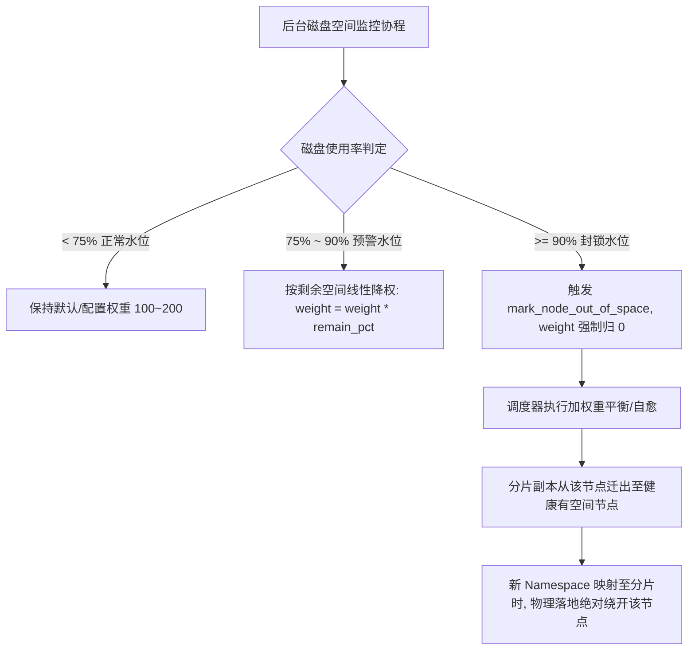
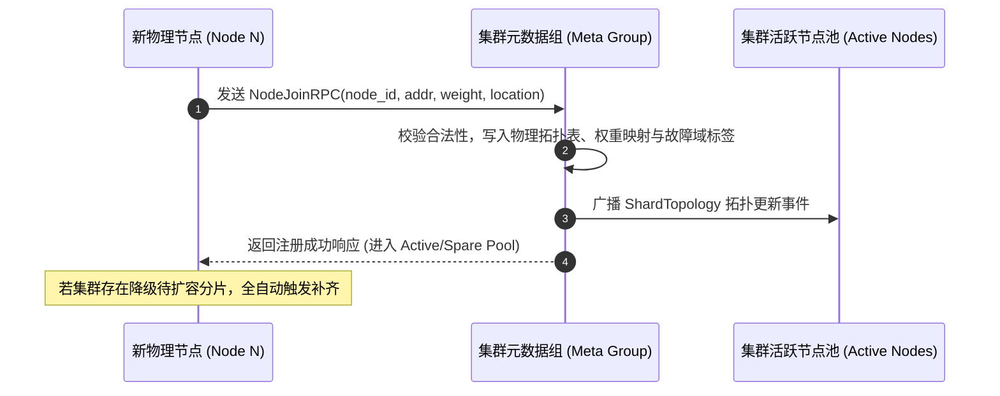
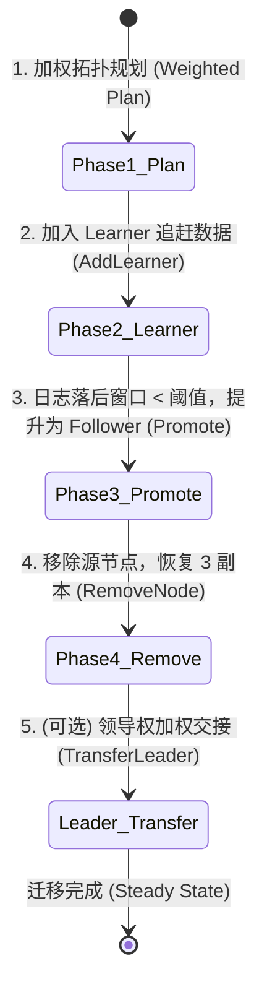
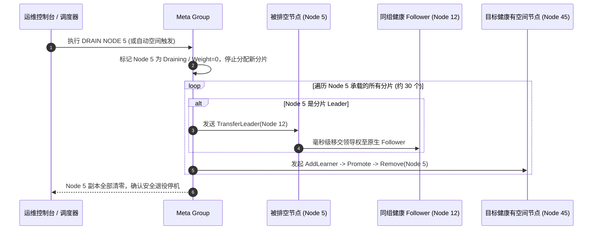
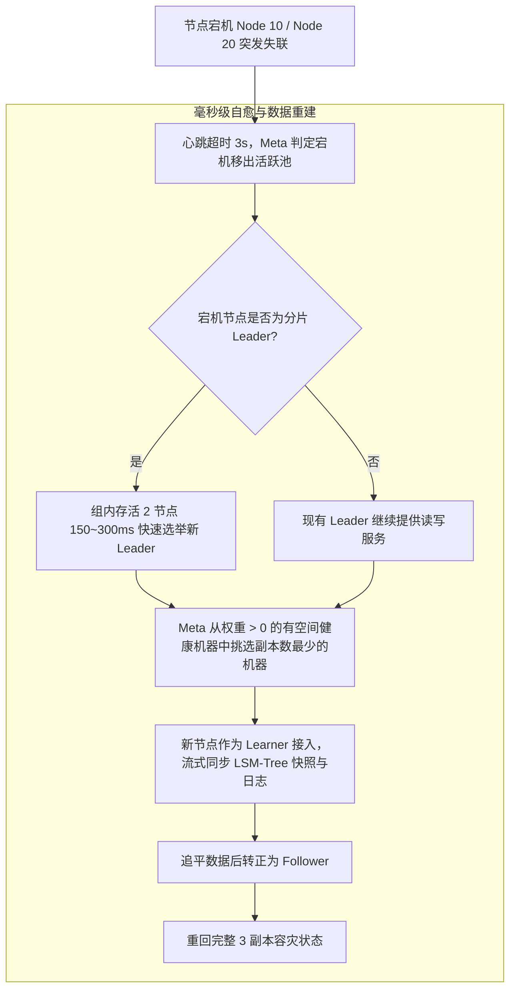
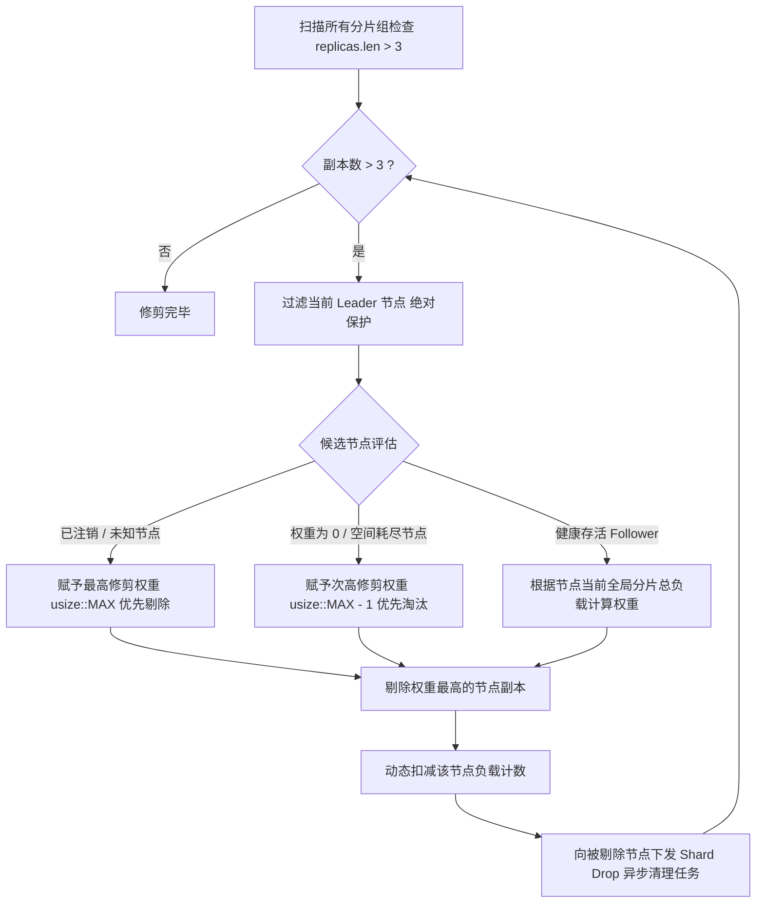

# WeDb 百节点集群弹性扩缩容、动态加权与 3 副本自愈设计方案

## 1. 架构总览与核心设计原则

在大规模分布式键值存储系统（如 100 台物理机集群）中，若采用单一大 Raft 组覆盖全集群，会导致心跳风暴、全连接网络爆炸与 $O(N)$ 线性开销。WeDb 采用**虚拟分片（Virtual Sharding）**、**严格 3 副本隔离**与**动态节点加权容量调度**架构：

```mermaid
graph TD
    Client["客户端 Client / SDK"] -->|rapidhash(ns) % 1024| Router["协议路由层 Proxy / Router"]
    
    subgraph ClusterTopology["100 节点异构物理集群 (Node 1 .. Node 100)"]
        subgraph HighPerfGroup["高性能节点 (Weight = 200, 承载 2x 副本)"]
            N1_L["Node 1 (Leader, Weight 200)"]
        end
        
        subgraph StandardGroup["标准节点 (Weight = 100, 默认基线)"]
            N2_F["Node 2 (Follower, Weight 100)"]
            N3_F["Node 3 (Follower, Weight 100)"]
        end

        subgraph FullGroup["空间耗尽/维护节点 (Weight = 0, 禁入新分片)"]
            N4_Full["Node 4 (Weight 0, 空间已满/只读)"]
        end
    end
    
    Router -->|写入活跃分片| N1_L
    Router -->|写入活跃分片| N2_F
    Router -. 禁入新分片/租户 .-> N4_Full
```

### 1.1 核心设计指标
- **虚拟分片槽位（Virtual Sharding）**：集群预置 1024 个虚拟分片组（Shard Group `0..1023`），任意租户命名空间通过 `rapidhash_v3` 确定性映射至分片编号：
  $$\text{shard\_id} = \text{rapidhash}(\text{namespace}) \pmod{1024}$$
- **严格 3 副本隔离（Strict 3-Replica Isolation）**：每个虚拟分片组仅分配至 3 台物理节点（1 Leader + 2 Followers），构成独立的 3 节点 Multi-Raft 复制组，网络心跳范围严格局限在组内 3 台机器。
- **异构节点加权调度（Heterogeneous Weighting）**：支持为不同硬件规格机器配置权重（`weight: u32`），高性能节点承载更多分片与 Leader，无空间节点完全隔离。
- **极低系统开销**：单机仅需维护约 30 个轻量分片状态机，单机拓扑调度元数据仅占用约 3.8 KB 内存。
- **零 Dyn 强类型分发**：全链路状态流转、命令分发与存储指令一律采用 Rust 强类型枚举分发（Enum Dispatch）与领域错误类型，无虚表寻址与动态装箱开销。

---

## 2. 节点权重体系与容量保护机制

### 2.1 默认权重推荐值：`100`
系统默认节点基准权重设为 **`DEFAULT_NODE_WEIGHT = 100`**，具有以下核心工程优势：
1. **认知直观（100% 性能基准）**：以 100 作为标准单机性能基线，上调或下调直观对应百分比（如高配 1.5 倍为 `150`，低配为 `50`）。
2. **颗粒度精细**：支持 `0..10000` 范围内的精细微调，满足微小配置差异的微调诉求。
3. **避免浮点计算**：使用纯整数无符号标量（`u32`），彻底规避浮点数累加导致的精度漂移与跨平台不确定性。

### 2.2 节点权重推荐对照表
| 硬件规格 / 运行状态 | 推荐权重 | 分片承载比例 | 业务含义 |
| :--- | :--- | :--- | :--- |
| **标准基准机型**（16C / 64G / NVMe SSD） | **`100` (默认)** | $1.0\times$ 基准 | 承载标准基线负载（100 台集群约 30 个分片） |
| **高性能旗舰机型**（64C / 256G / 快速 NVMe） | **`200 ~ 300`** | $2.0\times \sim 3.0\times$ | 承载 2~3 倍分片与 Leader 写入吞吐 |
| **低配/老旧机型**（8C / 32G / SATA SSD） | **`50`** | $0.5\times$ | 承载一半分片，降低 CPU 与 IO 压力 |
| **空间预警机器**（磁盘使用率 $75\% \sim 90\%$） | **`10 ~ 30`** | 动态衰减 | 逐步减少分片流入，平滑降载 |
| **空间耗尽 / 维护机器**（磁盘使用率 $\ge 90\%$） | **`0`** | **$0$ (完全隔离)** | **禁止分配任何新分片/新 Namespace，只读或触发排空** |

### 2.3 磁盘容量水位线与无空间节点优化方案
为杜绝在无空间机器上创建新 Namespace 或写入导致节点崩溃，系统引入三级动态保护：



1. **Namespace 与物理空间解耦**：客户端创建新 Namespace 时，通过哈希映射到 1024 个虚拟分片组之一；只要分片拓扑中无空间节点已被降为 0 权重，该分片的所有物理副本均位于健康有空间节点上，新 Namespace 天然获得充足存储保障。
2. **0 权重绝对隔离**：加权重平衡（[`rebalance_3replicas`](../cmd/src/sharding.rs#L513-L521)）、自愈补全（[`auto_heal`](../cmd/src/sharding.rs#L775-L838)）与排空（[`drain_node`](../cmd/src/sharding.rs#L717-L772)）算法均严格过滤 `get_node_weight(id) > 0` 的节点，权重为 0 的节点被物理跳过。

---

## 3. 平滑加权轮询调度算法 (Smooth Weighted Placement)

当集群存在异构权重配置时，系统自动采用 **平滑加权轮询（Smooth Weighted Round-Robin, SWRR）** 算法，使 1024 个虚拟分片在不同权重节点之间平滑、无聚集、严格按比例分布。

### 3.1 目标配额数学公式
设集群中所有权重 $>0$ 的健康节点集合为 $\mathcal{N}$，总权重 $W = \sum_{i \in \mathcal{N}} w_i$。
节点 $i$ 的理论目标副本分配数为：
$$\text{Quota}_i = \frac{w_i}{W} \times (1024 \times 3)$$

```
例如：
- 节点 1 (权重 200)
- 节点 2 (权重 100)
- 节点 3 (权重 100)
- 节点 4 (权重 0, 空间已满)

总权重 W = 400
- 节点 1 目标副本数: (200 / 400) * 3072 = 1536 个副本 (50.0%)
- 节点 2 目标副本数: (100 / 400) * 3072 = 768 个副本 (25.0%)
- 节点 3 目标副本数: (100 / 400) * 3072 = 768 个副本 (25.0%)
- 节点 4 目标副本数: 0 (0.0%，完全无副本接入)
```

---

### 3.2 物理机架与多可用区容灾感知 (Rack / AZ / Region-Aware Fault Domain Hierarchy)
在大规模分布式数据中心或公有云多可用区（Multi-AZ）部署场景下，系统通过 [`NodeLocation`](../cmd/src/sharding.rs#L69-L147) 支持 **Region（大区）-> Zone/DC（可用区/机房）-> Rack（机架/机柜）-> Host（宿主机）** 四级故障域隔离体系。

#### 1. 拓扑距离度量公式 $D(u, v)$
$$D(u, v) = \begin{cases} 4 & \text{if } \text{region}(u) \ne \text{region}(v) \quad (\text{跨大区/异地容灾}) \\ 3 & \text{if } \text{zone}(u) \ne \text{zone}(v) \quad (\text{同地区跨可用区/机房}) \\ 2 & \text{if } \text{rack}(u) \ne \text{rack}(v) \quad (\text{同机房跨机架}) \\ 1 & \text{if } \text{host}(u) \ne \text{host}(v) \quad (\text{同机架跨宿主机}) \\ 0 & \text{if } u = v \quad (\text{同物理机/未配置}) \end{cases}$$

#### 2. 多维放置与调度准则
调度器执行放置与自愈时最大化副本间的最小拓扑距离：
$$\max \min_{i \ne j} D(u_i, u_j)$$
- **3AZ 生产部署**：$\min D(u_i, u_j) \ge 3$，3 副本严格分布在 3 个独立可用区，天然免疫单机房断电或光缆中断。
- **单机房多机架部署**：$\min D(u_i, u_j) \ge 2$，3 副本严格分布在 3 个独立机架，天然免疫单机柜 PDU 或 Top-of-Rack (ToR) 交换机故障。
- **单机/开发测试环境**：算法自动平滑降级，不阻断运行。

### 3.3 Leader 绝对均摊二次微调 (Secondary Leader Equalization)
在分片选出 3 个候选副本后，为杜绝写入 Leader 在局部节点上聚集，调度器执行二次微调贪心分配：
$$\text{leader} = \arg\min_{u \in \text{replicas}(s)} \left( \frac{\text{CurrentLeaders}(u)}{\text{Weight}(u)} \right)$$
确保全集群所有节点的 Leader 承载比率标准差 $\sigma \to 0$，写入吞吐与 CPU 负载实现数学层面的绝对平滑。

---

## 4. 节点启动与集群注册流程

### 4.1 物理节点启动配置与 NestedText 配置文件 (`wedb.nt`)
WeDb 采用简洁直观的 [NestedText](https://docs.rs/nested-text) 分块层级配置文件格式，支持 **全局统一 IP 复用与各个分块单独指定 port**，通过 `-f / --conf` 参数指定配置文件，并支持**命令行参数对配置文件项进行精细覆盖**：

#### 1. 配置文件示例 (`wedb.nt`)
```nestedtext
# 全局通用 IP (各子模块自动继承，可选)
ip: 10.0.1.10

server:
  port: 6379

cluster:
  node_id: 1
  weight: 100

raft:
  port: 4910
  heartbeat: 50
  join:
    - 10.0.1.11:4910
    - 10.0.1.12:4910

fjall:
  data_dir: /var/lib/wedb/data
  compression: lz4
  journal_compression: none
  manual_journal_persist: false
  cache_size: 67108864

topology:
  region: cn-beijing
  zone: zone-a
  rack: rack-01
  host: 10.0.1.10
```

#### 2. 命令行指定配置文件与参数覆盖 (CLI Overriding)
系统遵循 **命令行显式参数 > 配置文件指定值 > 系统默认值** 的层级合并策略：

```bash
# 1. 纯配置文件启动 (若当前目录存在 wedb.nt 会自动默认载入)
wedb --conf wedb.nt

# 2. 配置文件 + 命令行局部覆盖 (以 node_id=2, zone=zone-b, port=6380 覆盖配置文件)
wedb --conf wedb.nt --node_id 2 --zone zone-b -p 6380

# 3. 纯命令行快速启动 (指定统一 IP 与各自端口)
wedb --ip 10.0.1.10 -p 6379 -r 4910 --node_id 1 --region cn-beijing --zone zone-a --rack rack-01 --weight 100
```

### 4.2 元数据注册与视图同步


---

## 5. 线上渐进式自动扩容机制 (Scale-Out)

当集群新加入物理机器或提升某批机器的权重时，Meta 调度器计算最优平滑重平衡拓扑，平滑将部分分片副本迁移至目标机器，全程不阻断业务读写。

### 5.1 四阶段渐进迁移状态机



1. **加权拓扑规划（Weighted Planning）**：调度器根据各节点权重计算目标分片分配，挑选高负载超额机器中的分片，指派高权重/新加入机器作为目标。
2. **异步加入 Learner（AddLearner）**：源分片 Leader 向目标新节点发起 `AddLearner`。新节点流式拉取底层 LSM-Tree 快照与增量日志；Learner 不参与多数派投票，不增加业务写延迟。
3. **追赶完毕升级 Follower（Promote）**：当新节点日志落后量小于阈值（如 100 条日志以内）时，Leader 发起变更将 Learner 提升为正式 Follower，此时该分片临时处于 4 副本状态。
4. **移除旧节点（RemoveNode）**：Leader 发起成员变更从副本集中剔除旧节点，分片恢复严格 3 副本状态。
5. **领导权加权再平衡（Leader Transfer）**：若需平衡全局写入负载，Leader 执行 `TransferLeader` 指令将领导权毫秒级移交给目标节点。

### 5.2 最小数据迁移增量重平衡 (Incremental Minimal Migration)
扩容时通过 [`rebalance_incremental`](../cmd/src/sharding.rs#L632-L709) 仅将超额节点上的多余分片副本迁移至新加入的欠载节点：
$$\text{MigratedReplicas} \approx \frac{3072}{N+1}$$
其余超过 **90% ~ 99%** 的分片副本物理位置保持完全不动，大幅降低集群扩容时的网络与磁盘 IO 复制开销。

---

## 6. 线上优雅缩容与排空机制 (Scale-In / Drain Node)

当某台物理节点（如 Node 5）需要下线维护、永久缩容或空间彻底耗尽时，执行 [`drain_node`](../cmd/src/sharding.rs#L717-L772) 流程，确保数据零丢失且业务毫秒级无感切换。



---

## 7. 突发宕机检测与自动自愈机制 (Crash Self-Healing)

在大规模分布式集群中，硬件故障属于常态。得益于严格 3 副本架构，单节点突发宕机仅损失 1 个副本，同组剩余 2 个副本依然满足 Raft 多数派（$\frac{2}{3}$），业务读写零中断。



---

## 8. 超过 3 节点自动修剪与异步 GC 清理 (Excess Replica Pruning)

在网络分区愈合、迁移中间态或离线节点重新上线等异常场景下，某个分片组可能出现短暂的 4 个或更多副本。系统内置**确定性权重修剪算法**与**异步 LSM-Tree 存储物理垃圾回收**机制：



---

## 9. Redis 7.2 原生集群协议支持

WeDb 完全兼容 Redis 7.2 集群管理协议，可直接使用标准 Redis Cluster 客户端（如 `redis-cli`, `ioredis`, `redis-py`）进行集群拓扑探测与监控：

### 9.1 CLUSTER SHARDS 输出规范
执行 `CLUSTER SHARDS` 指令返回所有 1024 个虚拟分片的详细拓扑信息：

```
1) 1) "slots"
   2) 1) (integer) 0
      2) (integer) 0
   3) "nodes"
   4) 1) 1) "id"
         2) "node_1"
         3) "addr"
         4) "192.168.1.1:6379"
         5) "ip"
         6) "192.168.1.1"
         7) "port"
         8) (integer) 6379
         9) "role"
        10) "master"
        11) "health"
        12) "online"
      2) 1) "id"
         2) "node_2"
         3) "addr"
         4) "192.168.1.2:6379"
         5) "ip"
         6) "192.168.1.2"
         7) "port"
         8) (integer) 6379
         9) "role"
        10) "replica"
        11) "health"
        12) "online"
      3) 1) "id"
         2) "node_3"
         3) "addr"
         4) "192.168.1.3:6379"
         5) "ip"
         6) "192.168.1.3"
         7) "port"
         8) (integer) 6379
         9) "role"
        10) "replica"
        11) "health"
        12) "online"
```

### 9.2 标准 Redis 7.2 集群运维指令速查表

| 标准 Redis 集群指令 | 指令语法 | 功能说明 | 对标内部拓扑接口 |
| :--- | :--- | :--- | :--- |
| **`CLUSTER SHARDS`** | `CLUSTER SHARDS` | 查询 1024 个分片的 Leader 与副本拓扑 | [`to_cluster_shards_resp`](../cmd/src/sharding.rs#L980-L1034) |
| **`CLUSTER NODES`** | `CLUSTER NODES` | 查询所有物理节点网络状态与角色 | [`to_cluster_nodes_resp`](../cmd/src/sharding.rs#L1037-L1059) |
| **`CLUSTER INFO`** | `CLUSTER INFO` | 查询集群状态、已知节点与槽位指标 | [`to_cluster_info_resp`](../cmd/src/sharding.rs#L1062-L1069) |
| **`CLUSTER MEET`** | `CLUSTER MEET <ip> <port> [node_id]` | 纳管新物理机器并注册至集群 | [`register_node`](../cmd/src/sharding.rs#L219-L221) |
| **`CLUSTER FORGET`** | `CLUSTER FORGET <node_id>` | 下线指定节点并触发副本优雅排空 | [`drain_node`](../cmd/src/sharding.rs#L717-L772) |
| **`CLUSTER REBALANCE`**| `CLUSTER REBALANCE` | 触发全集群平滑加权与机架感知重平衡 | [`rebalance_3replicas`](../cmd/src/sharding.rs#L513-L521) |
| **`CLUSTER FAILOVER`** | `CLUSTER FAILOVER` | 触发当前节点/指定分片故障转移 | [`transfer_leader`](../cmd/src/sharding.rs#L494-L510) |
| **`CLUSTER MYID`** | `CLUSTER MYID` | 获取当前节点的 40 位 hex 节点标识 | `format!("{:040x}", node_id)` |
| **`CLUSTER KEYSLOT`** | `CLUSTER KEYSLOT <key>` | 计算指定键对应的虚拟分片/槽位编号 | [`calculate_shard_id`](../cmd/src/sharding.rs#L21-L34) |
| **`CLUSTER RESET`** | `CLUSTER RESET [HARD\|SOFT]` | 重置集群状态 | 无状态重置 |

---

## 10. 核心算法与 Rust 架构实现映射

| 架构设计阶段 | Rust 核心实现模块与接口 | 核心复杂度 / 性能特征 |
| :--- | :--- | :--- |
| **租户分片哈希** | [`calculate_shard_id`](../cmd/src/sharding.rs#L21-L34) | $O(1)$，基于 rapidhash_v3 纳秒级哈希计算 |
| **分片元数据结构** | [`ShardInfo`](../cmd/src/sharding.rs#L37-L66) / [`ShardTopology`](../cmd/src/sharding.rs#L151-L1070) | 单分片内存开销 $< 64$ 字节 |
| **节点权重与机架** | [`register_node_with_rack`](../cmd/src/sharding.rs#L236-L245) / [`set_node_weight`](../cmd/src/sharding.rs#L427-L431) | 默认 100，支持跨机架/跨可用区容灾 |
| **机架感知加权调度** | [`rebalance_weighted_with_target_replicas`](../cmd/src/sharding.rs#L550-L629) | 机架感知 SWRR 与 Leader 绝对均摊二次微调 |
| **最小迁移重平衡** | [`rebalance_incremental`](../cmd/src/sharding.rs#L632-L709) | 增量平滑扩缩容，迁移量降至理论下界 $\Delta_{\min}$ |
| **节点优雅缩容排空** | [`drain_node`](../cmd/src/sharding.rs#L717-L772) | 优先移交 Leader 至存活 Follower，最轻载候选补偿 |
| **突发宕机自动自愈** | [`auto_heal`](../cmd/src/sharding.rs#L775-L838) | 排除死节点与 0 权重节点，自动重构第 3 副本 |
| **超额副本修剪 GC** | [`prune_excess_replicas`](../cmd/src/sharding.rs#L932-L977) | 严格保护 Leader，优先剔除未知/0权重节点 |
| **Redis 协议输出** | [`to_cluster_shards_resp`](../cmd/src/sharding.rs#L980-L1034) | 零拷贝 RESP2/RESP3 结构体构建 |
| **全链路集成验证** | [`sharding_lifecycle.rs`](../cluster/tests/sharding_lifecycle.rs) | 异构加权、机架隔离、最小迁移、缩容与自愈全量测试 |

---

## 11. 服务器节点容量上限与最佳服务器规模规划

### 11.1 是否可以“无限”添加服务器？（容量上限分析）

**结论：不能真正无限制无限添加。** 系统在默认配置下存在确定性的物理与数学容量上限：

1. **总副本槽位硬上限（3072 槽位）**：
   - 默认虚拟分片槽位数为 1024 个（`DEFAULT_SHARD_COUNT = 1024`）。
   - 每个分片组严格绑定 3 副本（1 Leader + 2 Followers）。
   - 全集群总副本槽位数恒定为：$$C_{\text{slots}} = 1024 \times 3 = 3072 \text{ 个副本槽位}$$
   - **物理服务器硬上限为 3072 台**。若物理服务器节点数 $N > 3072$（例如接入 4000 台机器），根据抽屉原理（Pigeonhole Principle），至少会有 $4000 - 3072 = 928$ 台机器无法被分配到任何分片副本（承载副本数 = 0，完全闲置）。
2. **Leader 写入并发打散上限（1024 台）**：
   - 全集群总共只有 1024 个分片 Leader。
   - 当物理机器数 $N > 1024$ 时，超出 1024 的节点仅能担当 Follower 读副本，无法分担原生写入 Leader 角色。

### 11.2 多少服务器比较合适？（最佳拓扑配比与推荐机型规模）

在分布式 LSM-Tree 存储与 Multi-Raft 架构下，**单机承载 20 ~ 50 个分片副本（约 7 ~ 17 个 Leader 写入槽位）** 是系统兼顾 CPU 利用率、磁盘 IO 吞吐、内存开销与运维故障半径的黄金平衡区间。

#### 1. 推荐部署规模梯队
| 集群规模分类 | 推荐物理机数量 | 单机平均分片副本数 | 单机 Leader 数 | 适用业务场景与架构特征 |
| :--- | :--- | :--- | :--- | :--- |
| **微型/起步集群** | **3 ~ 6 台** | 512 ~ 1024 个 | 170 ~ 341 个 | 适合中小规模、单机高配硬件（64C/256G），满足高可用基线 |
| **中型黄金集群** | **15 ~ 30 台** | 102 ~ 204 个 | 34 ~ 68 个 | 性价比极高，写入负载打散充分，单机 IO 压力平缓 |
| **大型黄金集群 (推荐)** | **50 ~ 100 台** | **30 ~ 61 个** | **10 ~ 20 个** | **最理想黄金区间**：单机故障半径仅占集群 1%~2%，秒级无感自愈 |
| **超大型扩展集群** | **100 ~ 300 台** | 10 ~ 30 个 | 3 ~ 10 个 | 极高并发与超大容量场景，建议配合更高规格网络 |

#### 2. 服务器扩展原则与机房对齐规范
1. **优先按 3 的倍数扩展（3, 6, 9, ..., 30, 60, 99, 102 台）**：
   - 生产环境中结合 3-AZ（3 个独立可用区）或 3 机架容灾部署时，按 3 的倍数可以在每个可用区均匀放置相同数量的机器（如 3 个 AZ 各部署 33 台），使得副本在故障域间的拓扑距离 $D(u, v) \ge 3$ 达到数学上的绝对对称。
2. **更高规模的横向扩展路径**：
   - 若业务确实需要超过 300 ~ 500 台服务器，建议通过调大编译期或初始化参数 `shard_count`（如扩至 4096 / 8192），或者采用多业务集群联邦（Multi-Cluster Federation）进行隔离部署。


