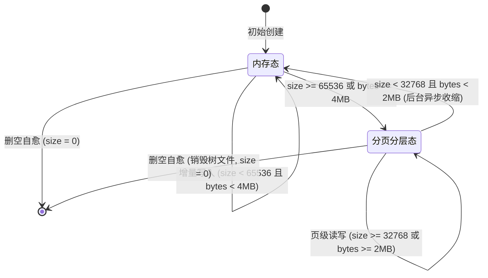

# 集合类型自适应混合分层架构

## 1. 架构目标

兼顾小中规模集合的纳秒级低延迟与超大规模集合（千万至上亿条目）的海量容量与页级冷热换入换出。对客户端 RESP 命令（`H*`, `S*`, `Z*`, `L*`）100% 透明，杜绝单集合膨胀引发的内存耗尽与冷读整包反序列化读放大。

---

## 2. 双态存储模型

| 维度 | 内存态 | 分页分层态 |
| :--- | :--- | :--- |
| 底层载体 | `wcol::IGarnetObject` 内存对象 | 专属独立 `wbftree` 实例 |
| 存储打标 | `KeyTag::ObjectEnvelope (0x0C)` | `KeyTag::Meta (0x01)` 存根 + 树文件 |
| 读写延迟 | 纯内存直接变异，耗时 ~数十纳秒 | B+ 树页级缓存，冷读单页 Direct I/O (< 100μs) |
| AOF 记录 | `AofEntryType::ObjectStoreRMW (0x11)`（对象增量日志） | 稳态写 `StoreEvent::TieredCollectionWrite` 入账为 `AofEntryType::ObjectStoreRMW (0x11)`（物理键取 Meta 域物化键）；升阶/重灌树数据走 `StoreEvent::RangeIndexStream`（CPR 快照分块 `RangeIndexStreamChunk (0x80)`），清退走 `RangeIndexDrop`（入账 `AofEntryType::StoreDelete`） |
| 容量规模 | 小中规模 (条目数 $\le 65536$ 且 体积 $\le 4\text{MB}$) | 千万至上亿级条目海量存储 |

RI.SET/RI.DEL 扩展通道（`StoreEvent::RangeIndexWrite` → `AofEntryType::StoreRMW (0x01)`）与分层稳态通道（`TieredCollectionWrite` → `ObjectStoreRMW`）分离，勿混用。

---

## 3. 双维度防抖动与双向转换机制

为了兼顾海量短条目（千万级）与大字段/大 Value（百级但体积达数 MB）场景，并杜绝临界增删引起频繁升降阶，设计双维度双门限迟滞机制：

### 3.1 双维度判定门限
- 条目数量维度：
  - 升阶高水位：$N_{high} = 65536$（常量 `wcol::TIERED_PROMOTE_THRESHOLD`）
  - 降阶低水位：$N_{low} = 32768$（常量 `wcol::TIERED_DEMOTE_THRESHOLD`）
  - 条目迟滞死区：$[32768, 65536]$
- 内存体积维度：
  - 升阶高水位：$B_{high} = 4\text{MB}$（常量 `wcol::TIERED_PROMOTE_BYTES`）
  - 降阶低水位：$B_{low} = 2\text{MB}$（常量 `wcol::TIERED_DEMOTE_BYTES`）
  - 体积迟滞死区：$[2\text{MB}, 4\text{MB}]$

### 3.2 双向转换触发逻辑
- 升阶触发（OR 逻辑）：当前集合满足 $N \ge N_{high}$ 或 $B \ge B_{high}$ 任意一项时，自动原子就地升阶为独立分层树。
- 降阶触发（AND 逻辑）：当前集合同时满足 $N \le N_{low}$ 且 $B \le B_{low}$ 两项指标时，满足回退条件，可在后台紧缩/异步调度时降阶为内存态信封，释放底层树文件。
- 维持原态（迟滞区间）：任意指标落入死区时，保持现有存储形态不变，彻底消除临界振荡。

### 3.3 懒降阶与删空自愈
- 惰性降阶：日常删除导致条目数或体积下降时，不主动触发昂贵的回退反序列化，继续在分层树内高速执行页级删除。
- 删空自愈：当元素计数减至 0 时，直接触发原子删空逻辑（销毁底层树文件、清理元记录墓碑与随键 TTL），零多余降阶开销。
- 后台紧缩：只有在后台 GC / 日志紧缩阶段，若发现持久化树条目与体积均长期低于低水位，才在低负载时段异步降阶回收。

---

## 4. 转换流程

---

## 5. 命令透传与上下游闭环

1. 会话层分发：`StorageSession` 统一检测键类型与形态，命中内存态走 `wcol`，命中分层态走 `wnode` 四族树内覆盖面单点（`wnode/src/resp/objects/tiered_collection_ops/mod.rs` 分派核 `exec_tiered_by_op_code`，主端 `run_async_rmw` 分层原生臂与重放端 `tiered_replay_arm` 同转引）；`wkv` 侧仅存根/注册/迁移流底座。
2. 零拷贝协议：点查使用 `*_with` 切片借用，范围扫描使用流式迭代器回调。
3. 一致性与恢复：Checkpoint 快照与 AOF 重放器天然统一两态协议，重启无损恢复。
4. RESP 应答透明：分层态与内存态对同一成员集回**逐字节全等**的应答，命令语义无差异；但范围/排名族命令在分层态的时间复杂度与内存态不同（详见第 8 节的性能折损声明），「透明」指**应答正确性**统一，不指**复杂度**统一。

---

## 6. 大键 O(1) 计数规约

无论集合规模多大（含千万至上亿级），全部计数命令（`HLEN`、`SCARD`、`ZCARD`、`LLEN` 与 `RI.COUNT`）均严格保证 O(1) 时间复杂度：

1. 内存态直读：直读 `IGarnetObject` 结构体维护的原子/标量计数字段，无需遍历内部哈希表或跳表。
2. 分页分层态直读：直读 `KeyTag::Meta` 元记录中的 `MetaValue.size` 或 BfTree 头部的总条目数标量；水位内（`now <= next_expiry`，见第 3 条分层态补则）严禁扫描任何底层数据页。
3. 字段级失效惰性剔除：携带字段级 TTL 的集合，计数前先走堆序惰性剔除（摊还 O(弹过量)，稳态堆顶 peek 短路），再直读条目数标量，保证 `HLEN` 在惰性过滤场景下依然保持 O(1) 摊还精度（wcol `HashObject::purge_expired_len` / `SortedSetObject::purge_expired_len` 单点；trait `IGarnetObject::count` 为 raw len 只读口径，仅升阶判定使用，两口径不得混用）。
   分层态补则（已裁决）：内存堆无处安放（成员到期刻度内联树记录、`MetaValue` 32B 定长），以 `next_expiry` 水位承接同一角色——水位内 O(1) 直读 `size` 恒精确；水位越过即首个计数命令物理出账一次（`expire_sweep_or_rebuild`：锁内单趟扫描 + 有到期才整值重灌，树内零墓碑，见 `tiered_collection_ops` 模块头），随后水位前移回归 O(1)，每到期纪元至多一扫。不采到期辅助索引（索引侧清理必生树内墓碑 + 全写臂双写放大）与单批限截断（有界删树同样须落墓碑或整树重灌）。C# 同面亦非恒 O(1)：`HashObject/SortedSetObject.Count` 存在可过期字段时遍历 `expirationTimes` 字典（O(T) 内存只读），本补则与同 spirit——非常态零成本，出账按纪元摊还。

`RI.COUNT` 口径补充（`RI.COUNT` 是本仓自定义扩展，别名 `RI.LEN`，C# 无对应处理器）：

1. 计数面唯一：`RI.LEN` 在主命令分发表与 `RI.COUNT` 同枚举双名（`RespCommand::Ricount`），解析期归一，不存在第二套计数命令或第二个计数函数；存储侧唯一实现为 `wkv/src/range_index/ops.rs:range_index_count`，一次元记录主存读直取 `MetaValue.size`，不取树读锁、不唤树、不迭代。
2. `RI.COUNT` 只承担全区间计数（`Arity 2`，仅一个键参数），晋升（`RIPROMOTE`）、下线惰性恢复（`RIRESTORE`）、`RENAME` 迁移前后计数值不变。
3. 区间计数不设第二个计数命令：由 `RI.SCAN` / `RI.RANGE` 的 `FIELDS KEY` 纯键投影（`ScanReturnField::Key` 真实区间迭代）承担；区间结果严禁取用 `MetaValue.size`（全区间标量，用作区间值即错值）。

---

## 7. 超内存容量场景的分层互补设计

1. 海量小集合（千万级数量，每集合 $\le 65536$ 条且 $\le 4\text{MB}$）：
   - 依赖底层的 HybridLog 页面级冷热淘汰机制（对标 C# Tsavorite）。
   - 内存达到上限时，最冷的小集合自动整包序列化刷盘至分段设备（`SegmentedDevice`），内存中仅保留哈希索引槽位，杜绝 OOM。
   - 冷读时发起异步 Direct I/O 整包载入（几 KB 级别，耗时仅微秒级）。
2. 超大单集合（单集合内含千万至上亿条目）：
   - 依赖独立分页分层树（BfTree）。
   - 集合内部打散为 4KB~16KB 独立数据页，按页级冷热换入换出，冷数据留在磁盘，热数据进缓存，杜绝整包反序列化读放大。

---

## 8. 分层有序集合范围/排名命令的复杂度折损与限流口径

本仓分层态有序集合（SortedSet）在 `wbftree` 内以 `member` 为键存 `member -> 8B f64 分值(+可选 TTL 头)`，**未建分值序二级索引**。故下列命令在分层态由树内流式扫描内核（`wnode/src/resp/objects/tiered_collection_ops/zset.rs:zset_scan_select`）承接：单趟页级顺序扫过全树，按 `(分值, 成员)` 序（比较器单源复用 `wcol::SortedSetComparer`）在内存侧重建排序，内存只随**结果窗口**增长、不随键基数物化整表。

### 8.1 覆盖命令与复杂度
| 命令 | 内存态复杂度 | 分层态复杂度 | 分层态内存 |
| :--- | :--- | :--- | :--- |
| `ZCOUNT` / `ZLEXCOUNT` | $O(\log N + M)$ | $O(N)$（单趟计数） | $O(1)$ |
| `ZRANK` / `ZREVRANK` | $O(\log N)$ | $O(N)$（定位 + 计数两趟扫描） | $O(1)$ |
| `ZRANGE`/`ZREVRANGE`/`ZRANGEBYSCORE`/`ZRANGEBYLEX` 族（含 `REV`/`LIMIT`） | $O(\log N + M)$ | 有界窗口 $O(N)$ 扫描 + 堆留存；`LIMIT`/小窗口内存 $O(\text{offset}+M)$，无界全量（如 `ZRANGE k 0 -1`）退化为 $O(N)$ 留存 | $O(\min(N, \text{窗口}))$ |

要点：
1. **应答正确性与内存态逐字节一致**（parity 由 `wnode/tests/tiered_cmds_align.rs:test_tiered_zset_range_rank_parity` 断言，双协议 RESP2/RESP3、三形态、`LIMIT`、到期成员内联过滤全覆盖）。
2. 本改造**消除了原「穿透全量物化」**（旧路径经 `slow_load_eval` 的 `Degrade` 臂把整树反序列化成 `SortedSetObject` 再求值，内存随键基数增长）：改后内存随结果窗口增长，`ZCOUNT`/`ZRANK`/`ZLEXCOUNT` 计数族内存 $O(1)$。
3. **未消除的代价**：因无分值序索引，时间复杂度仍是 $O(N)$ 一趟全树扫描（非内存态的 $O(\log N + M)$）。千万级集合上一条范围命令即为微秒~毫秒级页扫，亿级为数十毫秒~秒级；这是本票按「代价过大则声明折损」路径主动接受的折损，而非隐藏的失实透明承诺。

### 8.2 与写族的边界（维持原状）
`ZPOPMIN`/`ZPOPMAX`、`ZREMRANGEBY{SCORE,RANK,LEX}`、`ZREMRANGEBYLEX` 等写族，以及多键集合运算（`ZUNION`/`ZDIFF`/`ZINTER`/`ZRANGESTORE`）与 `ZRANDMEMBER`，**不在本票射程**，仍经 `run_async_rmw -> apply_rmw_post_operate` 物化降级通道整值求值 + 重灌（$O(N)$ 物化 + $O(N\log N)$ 重建 + AOF 全量重发）。该面写形前置已闭合（原同定票 `task/done/tiered-ttl-tombstone-residual-source.md` 已收口归档）：现行不变量为「物化臂唯一、树内零墓碑」（见 `wnode/src/resp/objects/tiered_collection_ops/mod.rs` 模块头注，逐成员树内删除漏斗 `tree_del` / `tree_del_batch` 已删净），故上述写族若将来落树内原生臂，必须沿用同一条整值重灌原语（先建快照后原子换入），不得另起第二套删除面。

### 8.3 限流与运维口径
1. 范围/排名族命令的延迟与树基数 $N$ 成正比、与结果窗口 $M$ 无关（扫描侧），故**小 `LIMIT` 窗口不降时间成本、仅降内存成本**。
2. 面向超大分层 zset 的下列命令应纳入按 $N$ 的并发限流：`ZRANGE`/`ZREVRANGE`/`ZRANGEBYSCORE`/`ZRANGEBYLEX`/`ZREVRANGEBY*`/`ZCOUNT`/`ZLEXCOUNT`/`ZRANK`/`ZREVRANK`。建议以键基数为闸门——同一 $N \gg 10^6$ 的分层 zset 上，上述命令的并发在途数受限、并按 $O(N)$ 预估超时预算，杜绝高频范围读打满页缓存与扫描线程。
3. 纯键区间投影优先走 `RI.SCAN` / `RI.RANGE`（页级顺序、不重建分值序）；全区间计数优先 `ZCARD`（$O(1)$ 标量直读）而非 `ZCOUNT -inf +inf`。
4. 若业务确需在大分层 zset 上频繁做 $O(\log N + M)$ 的分值范围/排名，应将该键维持在内存态门槛（$\le 65536$ 条且 $\le 4\text{MB}$）内，或按业务键拆分规避升阶。
