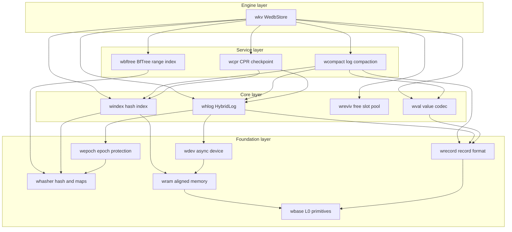
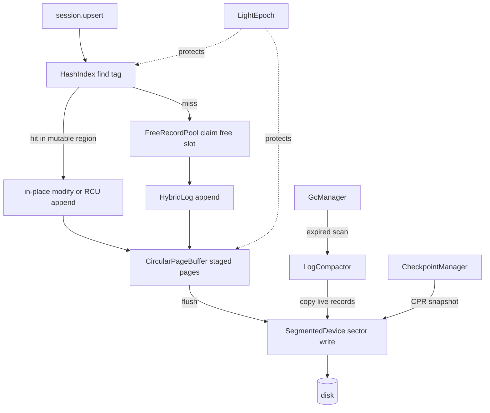

# WeDB Base : Full-stack Rust rewrite of the Microsoft Garnet storage engine

WeDB Base is the storage foundation of [WeDB](https://github.com/webc-site/wedb). It rewrites the C# storage core of Microsoft [Garnet](https://github.com/microsoft/garnet) — Tsavorite's HybridLog, lock-free hash index, CPR checkpointing, revivification, compaction — plus BfTree range indexing, as fourteen focused Rust crates running on the `compio` async runtime (Linux io_uring, Windows IOCP, macOS kqueue).

## What It Does

The workspace ships a layered storage stack. At the bottom, `wbase` provides cacheline-safe primitives: 48-bit log addressing, sector alignment math, adaptive backoff, and TLS thread identity. `wram` manages sector-aligned buffer pools and direct virtual memory; `whasher` wraps AES-accelerated GxHash and lock-free Papaya maps; `wepoch` supplies epoch protection for safe memory reclamation; `wdev` abstracts async block devices over `compio`.

On top of that foundation sit the Tsavorite-equivalent cores. `wrecord` defines the 16-byte record header and zero-copy record views; `windex` implements the 64-byte-aligned lock-free hash index with overflow buckets and per-bucket guards; `whlog` implements the HybridLog allocator with its three-region sliding window (Mutable / ReadOnly / OnDisk); `wreviv` recycles deleted record slots; `wval` adds the Redis value layer: multi-tenant namespace encoding, collection metadata, and compact hash / set / zset codecs.

Service crates orchestrate those cores. `wcpr` drives Concurrent Prefix Recovery checkpoints; `wcompact` compacts read-only log segments; `wbftree` manages BfTree-backed ordered range indexes. The `wkv` crate binds everything into `WedbStore`, a single-node engine with sessions, record-level TTL, background GC, read cache, checkpoint recovery, and range-index operations.

## Usage

Open a store on a segmented file device, then run CRUD through a session. Error handling uses `aok::Void` in tests; production code maps `wkv::Result` directly.

```rust
use std::sync::Arc;

use compio::runtime::Runtime;
use wdev::SegmentedDevice;
use wkv::{StoreConfig, WedbStore};

let rt = Runtime::new()?;
rt.block_on(async {
  // Auto-probe the host, or pin capacity explicitly:
  // index buckets, page size, page count, mutable fraction
  let config = StoreConfig::new(2048, 64 * 1024, 16, 0.5)?;
  let device = Arc::new(SegmentedDevice::single_file("demo.db")?);
  let store = Arc::new(WedbStore::open(config, device)?);

  let session = store.new_session()?;

  // Upsert, read, delete
  let addr = session.upsert(b"user:1001", b"alice").await?;
  assert!(addr > 0);
  assert_eq!(session.read(b"user:1001").await?, Some(b"alice".to_vec()));
  assert!(session.delete(b"user:1001").await?);

  // Flush the in-memory tail to disk
  store.flush_all().await?;

  Ok::<(), wkv::Error>(())
})?;
```

Checkpoint and crash-recover via CPR. After `FoldOver`, the read-only address aligns exactly with the tail address and every record seals on recovery.

```rust
use std::sync::Arc;

use compio::runtime::Runtime;
use wcpr::CheckpointType;
use wdev::SegmentedDevice;
use wkv::{CheckpointManager, StoreConfig, WedbStore};

let rt = Runtime::new()?;
rt.block_on(async {
  let ckpt_dir = std::path::Path::new("checkpoints");

  // 1. Write data, take a FoldOver checkpoint, then drop the store
  let token;
  {
    let device = Arc::new(SegmentedDevice::single_file("demo.db")?);
    let store = Arc::new(WedbStore::open(StoreConfig::default(), device)?);
    let session = store.new_session()?;
    for i in 0..1000 {
      let k = format!("user_click:{i:05}");
      let v = format!("click_count_{i}");
      session.upsert(k.as_bytes(), v.as_bytes()).await?;
    }
    let meta = CheckpointManager::new()
      .create_checkpoint(&store, ckpt_dir, CheckpointType::FoldOver)
      .await?;
    token = meta.token;
  } // process exit simulated here

  // 2. Recover onto a fresh engine and verify
  let device = Arc::new(SegmentedDevice::single_file("demo.db")?);
  let recovered = Arc::new(CheckpointManager::recover(ckpt_dir, token, device).await?);
  assert_eq!(recovered.entry_count(), 1000);

  Ok::<(), wkv::Error>(())
})?;
```

Background GC starts automatically on the first session when `config.gc.enabled`; retune it at runtime without restart.

```rust
store.start_gc();
store.update_gc_config(|gc| {
  gc.scan_interval_ms = 60_000;
  gc.compaction_interval_ms = 300_000;
});
let stats: wkv::GcStatsSnapshot = store.gc_handle().unwrap().stats();
```

Range indexes answer ordered scans and range queries for large sorted collections, backed by BfTree with records carried as 35-byte stubs inside the main log.

```rust
session.range_index_create(b"leaderboard", wbftree::TreeTuning::default()).await?;
session.range_index_set(b"leaderboard", b"score:alice", b"9800").await?;
session.range_index_scan(b"leaderboard", |record| {
  // ScanRecord: ordered stream of key-value pairs
}).await?;
```

## Highlights

- HybridLog memory-disk duality: mutable tail serves reads and in-place updates from memory; flush pipelines move sealed pages to disk through sector-aligned I/O.
- Lock-free hash index: fixed-capacity 64-byte buckets, overflow bucket pool, CAS slot updates guarded by shared / exclusive bucket guards, no rehash on the hot path.
- CPR checkpointing: `FoldOver` seals history read-only; `Snapshot` rebuilds the mutable region at recovery without separate snapshot files.
- Revivification: deleted slots return to size-binned free pools (First-Fit / Best-Fit) and revive in place, cutting allocation and log growth.
- BfTree range indexes: multi-tree registry with lazy recovery, chunked migration protocol, and write barriers shared with the main log.
- Zero-copy discipline: `RecordRef` / `RecordMut` views, `fast_key_eq` SIMD comparison, and stack-backed key buffers avoid allocations on the hot path.
- Crash-consistent devices: `SegmentedDevice` enforces parent-directory fsync so file creation survives power loss.

## Design

Module layering follows strict single-direction dependencies; each layer imports only what it needs.



A write flows from session to disk as follows: locate the hash tag, claim memory in the HybridLog mutable region (reviving freed slots when enabled), stage the page in the circular buffer, then flush sealed pages to the device under epoch protection.



## Tech Stack

- Runtime: `compio` — io_uring on Linux, IOCP on Windows, kqueue on macOS.
- Hashing: `gxhash` AES-accelerated backends; `crc32fast` checksums.
- Concurrency: `papaya` lock-free maps, `parking_lot` striped locks.
- Serialization: `bitcode` binary codecs, `sonic-rs` for checkpoint metadata, `itoa` / `zmij` number formatting.
- Ordered index: `bf-tree` block-format BfTree.
- Errors and enums: `thiserror`, `strum`.
- Observability: `log` facade with `log_init` in tests.

## Directory Layout

```text
embed/
  wbase/     L0 primitives: addressing, alignment, backoff, varint, glob, TLS thread id
  wram/      sector-aligned buffer pool, direct virtual memory, native memory tracker
  whasher/   GxHash backends, streaming checksums, Papaya concurrent maps
  wepoch/    LightEpoch protection and entry table
  wdev/      compio Device trait, SegmentedDevice, NullDevice, fsync contract
  wrecord/   16B record header, zero-copy views, chunk framing, SIMD key compare
  wval/      namespace and session key codec, collection metadata, compact codecs, glob, TTL
  windex/    lock-free hash index, overflow pool, bucket guards
  whlog/     HybridLog allocator, address manager, page buffer, scan iterator
  wreviv/    free record pool, size-binned revivification
  wbftree/   BfTreeService, RangeIndexManager, chunked migration, 35B stub
  wcompact/  LogCompactor, compact session traits, compaction stats
  wcpr/      CPR checkpoint state machine, index checkpoint I/O, metadata formats
  wkv/       WedbStore, sessions, TTL, GC, read cache, recovery orchestration
  example/   workspace template with test scaffolding (not published)
  sh/        development and publish scripts
  test.sh    cargo nextest entry with all features
```

## API Reference

### wkv — top-level engine

- `WedbStore<D: Device>` — the engine over hash index, HybridLog, epoch, device, BfTree, range index, revivification pool, and read cache. Key methods:
  - `WedbStore::open(config, device)` / `open_shared` — build the engine; index capacity is fixed for the lifetime of the store.
  - `new_session()` — register a participant and return a `StoreSession<D>`.
  - `flush_all()` / `flush_and_evict_all()` — drain mutable pages to disk, optionally evicting memory.
  - `start_gc()`, `update_gc_config(f)`, `gc_handle()` — background GC lifecycle and hot reload.
  - `set_write_listener` / `set_range_listener` — inject AOF / replication adapters as ports.
  - Address observability: `tail_address`, `read_only_address`, `head_address`, `begin_address`, `shift_*` counterparts, `truncate`.
  - `keyspace_stats()` — live / expired key census via a pooled scan session.
  - `scan_range_callback(start, end, on_record)` — ordered main-log range scan.
- `StoreConfig` — index buckets, page size, page count, mutable fraction, max sessions, BfTree path, range index dir, revivification / read cache switches, `GcConfig`. Constructors: `auto()`, `auto_with_budget(bytes)`, `new(...)`, `minimal()`, `recommended_index_size(expected_keys)`.
- `StoreSession<D>` — session-scoped operations:
  - `upsert` / `read` / `delete` / `contains_key` / `read_batch_with` — tagged user-key CRUD.
  - `try_read_in_memory`, `try_modify_in_place`, `try_modify_with_slack`, `try_upsert_sync`, `try_read_sync` — fast paths that skip flush waits.
  - `set_context(ns, db)`, `set_namespace`, `set_active_db` — multi-tenant routing; `session_prefix()` exposes the encoded prefix.
  - `enter_batch()` — `BatchStoreSession` groups writes into one epoch window.
  - `load_meta`, `save_meta`, `append_hash_field(s)_batch`, `append_set_member(s)_batch`, `hexpire_at`, `hpersist`, `collect_expired_hash_fields` — collection and field-TTL operations.
  - `range_index_create / set / get / del / scan / range / exists / config / rename` — BfTree range index operations.
- `CheckpointManager` — `create_checkpoint(store, dir, CheckpointType)`, `recover(dir, token, device)`, `recover_latest`, `list_checkpoints`, `find_latest_checkpoint`; plus `take_cpr_snapshots` / `recover_cpr_snapshots`, `take_shared_bftree_snapshot` / `recover_shared_bftree`.
- Re-exports from member crates: `LogCompactor`, `CompactSession`, `CompactStore`, `CompactionStats`, `CompactionType`, `CheckpointMeta`, `CheckpointType`, `CprRecover`, `CprStore`, `StoreMeta`, `BfTreeService`, `RangeIndexManager`, `RangeIndexStub`, `ScanRecord`, `TreeTuning`, `StorageEncoding`, `TaggedKeyBuf`, `GcManager`, `GcHandle`, `GcStatsSnapshot`, `ReadCache`, `TtlOpt`, `TtlProbe`, `WriteListenerFn`, `RangeIndexListenerFn`.

### wbase — L0 primitives

Feature-gated modules, no `full` feature: `addr` (48-bit `LogAddress` masking), `align` (64B cacheline / sector math), `backoff` (adaptive retry state machine), `base32`, `buf`, `crc` (`crc32fast`), `float` (order-preserving f64 bits), `glob`, `simd`, `striped` (lock striping), `thread` (TLS thread identity), `time` (`coarsetime` helpers), `varint` (OPPV varints).

### wram — aligned memory

- `BufferPool` — tiered Direct I/O pools with class capacities, per-thread depots, and `PoolStats`.
- `AlignedBuf`, `DirectVirtualMemory`, `DirectVmBlock`, `system_page_size()`.
- `NativeMemoryTracker`; alignment helpers `align_up` / `align_down` / `is_aligned` / `SectorRange`.

### whasher — hashing and concurrent maps

- `fast_hash(_with_seed)`, `fast_hash_u64`, `fast_hash128`, `hash128`, `hash_value` — GxHash backends.
- `StreamHasher` — streaming checksum with `write` / `finish` / `reset`.
- `compute_checksum(_with_seed)` — CRC-based checksums.
- Re-exports `gxhash` `HashMap` / `HashSet` plus `GxPapayaMap` / `GxPapayaSet` lock-free concurrent collections and constructors.

### wepoch — epoch protection

- `LightEpoch` — `register()`, `suspend` / `resume`, `protect_and_drain()`, `protected_scope()`, `bump_epoch` / `bump_current_epoch_action`, `drain()`, `safe_to_reclaim_epoch()`, `allocate_user_word()`.
- `Participant`, `EpochGuard`, `ProtectedScope`, `EpochEntry`, `MAX_USER_WORDS`.

### wdev — async devices

- `Device` / `StorageDevice` traits — async read / write / flush with segment lifecycle.
- `SegmentedDevice` — growable segmented file (`single_file` constructor), `SegmentChunk` / `SegmentChunks`, `FileMap`.
- `NullDevice` — discard sink for benchmarks.
- `sys::detect_system_memory` / `detect_cpu_cores`, `MAX_SEGMENT_SIZE`; re-exports `wram::BufferPool`.

### wrecord — record format

- `RecordHeader` constants — `HEADER_SIZE` (16B), `SEALED_BIT`, `TOMBSTONE_BIT`, `READ_CACHE_BIT`, `MODIFIED_BIT`, `IN_NEW_VERSION_BIT`, `ADDRESS_MASK`, `MAX_FILLER_BYTES`.
- `RecordRef` / `RecordMut` — zero-copy read / write views over log memory.
- `record_size`, `checked_record_size`, `encode_to_slice`, `try_encode_to_vec` — encode records into log slots.
- `ChunkCodec` / `ChunkIter` — length-prefix chunk framing; `fast_key_eq` — SIMD key comparison.

### wval — value layer

- `KeyTag`, `CollectionType` (`Hash` / `Set` / `ZSet` / …), `StorageEncoding` — tagged key scheme.
- `NamespaceDbCodec`, `SessionPrefixBuf`, `TaggedKeyBuf`, `SubKeyCodec` / `SubKeyRef` — multi-tenant namespace, session prefix, and subkey encoding over OPPV varints.
- `MetaValue` / `CompactMetaValue` — collection metadata; `CompactHash` / `CompactSet` / `CompactZSet` codecs with iterators.
- `glob_match(_nocase)(_opt)` — Redis-style glob matching; `TtlCodec` — field-level TTL values; `sample_distinct_indices` — distinct sampling; `RecordValueExt` / `RecordValueMutExt` — bridge record views to value parsing.

### windex — lock-free hash index

- `HashIndex` — fixed-capacity table of 64B buckets; `find_tag` / `find_tag_by_hash`, CAS slot updates through `HashEntryInfo`.
- `HashBucket` (`ENTRIES_PER_BUCKET`, `DATA_ENTRIES`, `OVERFLOW_INDEX`), `HashBucketEntry`, `CandidateAddresses` (inline candidate list with `retain` / `sort_descending`).
- `OverflowPool`, `MultiBucketGuard`, `BucketExclusiveGuard` / `BucketSharedGuard`, `prefetch_read_l1`.

### whlog — HybridLog allocator

- `HybridLog<D>` — append, in-place update, region shifting, scan, and flush orchestration across the three-region sliding window.
- `HybridLogConfig` — page size, page count, mutable fraction defaults and `ro_lag_num_from_fraction`.
- `AddressManager` / `AddressSnapshot` — logical / physical address translation; `CircularPageBuffer` — staged page ring; `PendingFlushList` / `PageFlushRange` — flush bookkeeping; `ScanIterator`, `RecordOutput`.

### wreviv — free slot recycling

- `FreeRecordPool` — size-binned pools (`DEFAULT_BIN_SIZES`, `DEFAULT_BIN_CAPACITY`), `RevivAllocation`, `RevivStats`.
- `FreeRecordBin`, `FreeRecord`, `SetStatus`, `USE_FIRST_FIT`, `BEST_FIT_SCAN_ALL`.

### wbftree — BfTree range index

- `BfTreeService` — `open_disk` / `open_memory`, `insert`, `read` / `read_into`, `delete`, `scan_with_count_callback`, `WriteBarrierGuard`, `BfTreeConfig`, `TreeTuning`.
- `RangeIndexManager` — multi-tree registry keyed by `key_id_of(key)`, lazy recovery, checkpoint claim / release, `RangeIndexLocks` striped locking.
- `RangeIndexStub` (`RANGE_INDEX_STUB_SIZE` = 35B), `RangeIndexChunkedSerializer` / `RangeIndexChunkedDeserializer` / `RangeIndexMigrationReader`, `compute_checksum(_with_seed)`.

### wcompact — log compaction

- `LogCompactor<S: CompactStore>` — `compact`, `compact_lazy(max_seek_bytes)`, `compact_with_filter`, `with_cas_retries`.
- `CompactStore` / `CompactSession` — host traits wiring the compactor to a live engine; `CompactionType`, `CompactionStats`.

### wcpr — CPR checkpointing

- `CprStore` / `CprRecover` — trait contracts for stores participating in checkpoint / recovery.
- `RecoveredCheckpoint<D>` — recovered `CheckpointMeta` plus rebuilt `HashIndex`, `HybridLog`, `LightEpoch`.
- `write_index_checkpoint` / `read_index_checkpoint_truncated`, `IndexCkptHeader`, `next_token`.
- `CheckpointMeta`, `CheckpointType` (`FoldOver` / `Snapshot`), `StoreMeta`, `HlogMeta`, `IndexMeta`, file naming helpers.
