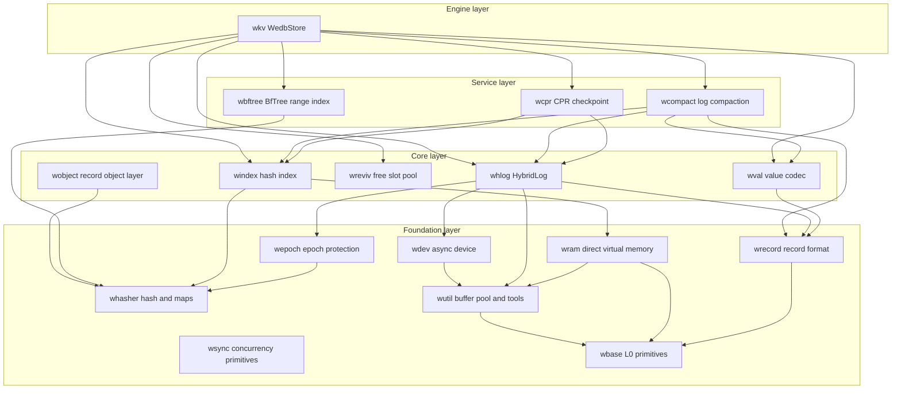
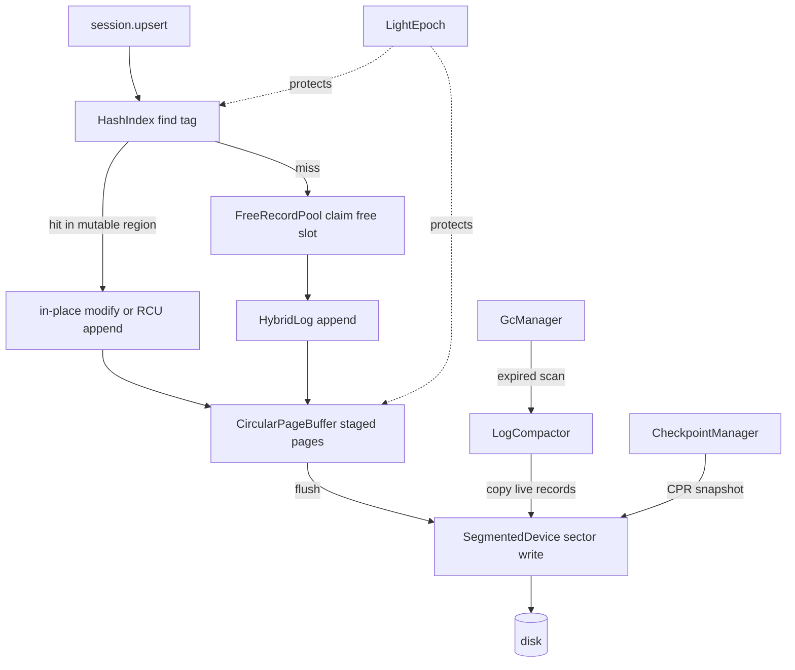

# WeDB Base : Full-stack Rust rewrite of the Microsoft Garnet storage engine

WeDB Base is the storage foundation of [WeDB](https://github.com/webc-site/wedb). It rewrites the C# storage core of Microsoft [Garnet](https://github.com/microsoft/garnet) — Tsavorite HybridLog, lock-free hash index, CPR checkpointing, revivification, log compaction — plus BfTree range indexing, delivered as seventeen focused Rust crates on the `compio` async runtime (Linux io_uring, Windows IOCP, macOS kqueue).

- [What It Does](#what-it-does)
- [Usage](#usage)
- [Highlights](#highlights)
- [Design](#design)
- [Tech Stack](#tech-stack)
- [Directory Layout](#directory-layout)
- [API Reference](#api-reference)
  - [wkv — top-level engine](#wkv-top-level-engine)
  - [wbase — L0 primitives](#wbase-l0-primitives)
  - [wutil — shared tools and buffer pool](#wutil-shared-tools-and-buffer-pool)
  - [wram — direct virtual memory](#wram-direct-virtual-memory)
  - [whasher — hashing and concurrent maps](#whasher-hashing-and-concurrent-maps)
  - [wepoch — epoch protection](#wepoch-epoch-protection)
  - [wdev — async devices](#wdev-async-devices)
  - [wrecord — record format](#wrecord-record-format)
  - [wval — value layer](#wval-value-layer)
  - [windex — lock-free hash index](#windex-lock-free-hash-index)
  - [whlog — HybridLog allocator](#whlog-hybridlog-allocator)
  - [wreviv — free slot recycling](#wreviv-free-slot-recycling)
  - [wbftree — BfTree range index](#wbftree-bftree-range-index)
  - [wcompact — log compaction](#wcompact-log-compaction)
  - [wcpr — CPR checkpointing](#wcpr-cpr-checkpointing)
  - [wsync — Tsavorite concurrency primitives](#wsync-tsavorite-concurrency-primitives)
  - [wobject — record-style object layer](#wobject-record-style-object-layer)

## What It Does

The workspace ships a layered storage stack. At the bottom, `wbase` provides cacheline-safe primitives: 48-bit log addressing, sector alignment math, adaptive backoff, and TLS thread identity. `wram` manages direct virtual memory and native allocation tracking, while `wutil` hosts the sector-aligned buffer pool (mirroring the bottom-layer role of Tsavorite `core/Utilities`) plus the libs/common toolset. `whasher` wraps AES-accelerated GxHash, parallel-lane streaming checksums, and lock-free Papaya maps. `wepoch` supplies epoch protection for safe memory reclamation. `wdev` abstracts async block devices over `compio`. `wsync` hosts the Tsavorite concurrency primitives (read-optimized and single-writer multi-reader locks, turnstile / leader barriers, counting events).

On top of that foundation sit the Tsavorite-equivalent cores. `wrecord` defines the 16-byte record header and zero-copy record views. `windex` implements the 64-byte-aligned lock-free hash index with overflow buckets and per-bucket guards. `whlog` implements the HybridLog allocator with its three-region sliding window (Mutable / ReadOnly / OnDisk). `wreviv` recycles deleted record slots. `wval` adds the Redis value layer: multi-tenant namespace encoding, collection metadata, and compact hash / set / zset codecs. `wobject` provides the record-style object layer — in-memory Hash / Set / List / SortedSet objects over concurrent indexes — consumed by the server tier.

Service crates orchestrate those cores. `wcpr` drives Concurrent Prefix Recovery checkpoints. `wcompact` compacts read-only log segments and physically truncates reclaimed segment files. `wbftree` manages BfTree-backed ordered range indexes. The `wkv` crate binds everything into `WedbStore`, a single-node engine with sessions, record-level TTL, background GC, read cache, checkpoint recovery, and range-index operations.

## Usage

Open a store on a segmented file device, then run CRUD through a session. Tests express errors via `aok::Void`; production code maps `wkv::Result` directly.

```rust
use std::sync::Arc;

use compio::runtime::Runtime;
use wdev::SegmentedDevice;
use wkv::{StoreConfig, WedbStore};

let rt = Runtime::new()?;
rt.block_on(async {
  // Auto-probe the host, or pin capacity explicitly:
  // index buckets, page size, page count, mutable fraction
  let config = StoreConfig::new(2048, 64 * 1024, 16, 0.5)?;
  let device = Arc::new(SegmentedDevice::single_file("demo.db")?);
  let store = Arc::new(WedbStore::open(config, device)?);

  let session = store.new_session()?;

  // Upsert, read, delete
  let addr = session.upsert(b"user:1001", b"alice").await?;
  assert!(addr > 0);
  assert_eq!(session.read(b"user:1001").await?, Some(b"alice".to_vec()));
  assert!(session.delete(b"user:1001").await?);

  // Flush the in-memory tail to disk
  store.flush_all().await?;

  Ok::<(), wkv::Error>(())
})?;
```

Record-level TTL follows Redis `EXPIREAT` / `PERSIST` return-code semantics: `-2` missing key, `0` condition rejected, `1` applied, `2` already expired and physically purged. Expired keys vanish lazily on read; background GC purges them ahead of scans.

```rust
use wbase::time::now_ms;
use wkv::TtlOpt;

assert_eq!(session.expire_at(b"session:42", now_ms() + 60_000, TtlOpt::NONE).await?, 1);
assert_eq!(session.ttl_of(b"session:42").await?, Some(now_ms() + 60_000));
assert_eq!(session.persist(b"session:42").await?, 1);
```

Checkpoint and crash-recover via CPR. After `FoldOver`, the read-only address aligns exactly with the tail address and every record seals on recovery. Recovery rebuilds capacity from the persisted `StoreMeta` — never silently resizes the index.

```rust
use std::sync::Arc;

use compio::runtime::Runtime;
use wcpr::CheckpointType;
use wdev::SegmentedDevice;
use wkv::{CheckpointManager, StoreConfig, WedbStore};

let rt = Runtime::new()?;
rt.block_on(async {
  let ckpt_dir = std::path::Path::new("checkpoints");

  // 1. Write data, take a FoldOver checkpoint, then drop the store
  let token;
  {
    let device = Arc::new(SegmentedDevice::single_file("demo.db")?);
    let store = Arc::new(WedbStore::open(StoreConfig::default(), device)?);
    let session = store.new_session()?;
    for i in 0..1000 {
      let k = format!("user_click:{i:05}");
      let v = format!("click_count_{i}");
      session.upsert(k.as_bytes(), v.as_bytes()).await?;
    }
    let meta = CheckpointManager::new()
      .create_checkpoint(&store, ckpt_dir, CheckpointType::FoldOver)
      .await?;
    token = meta.token;
  } // process exit simulated here

  // 2. Recover onto a fresh engine and verify
  let device = Arc::new(SegmentedDevice::single_file("demo.db")?);
  let recovered = Arc::new(CheckpointManager::recover(ckpt_dir, token, device).await?);
  assert_eq!(recovered.entry_count(), 1000);

  Ok::<(), wkv::Error>(())
})?;
```

Background GC starts automatically on `open_shared` when `config.gc.enabled`; retune it at runtime without restart, and drive single rounds manually when needed.

```rust
store.start_gc();
store.update_gc_config(|gc| {
  gc.scan_interval_ms = 60_000;
  gc.compaction_interval_ms = 300_000;
});
let stats: wkv::GcStatsSnapshot = store.gc_handle().unwrap().stats();
```

Compaction copies live records down the log and physically deletes reclaimed segment files.

```rust
use wcompact::{CompactionType, LogCompactor};

let stats = LogCompactor::new(Arc::clone(&store))
  .compact(2 * segment_size, CompactionType::Scan)
  .await?;
assert_eq!(store.begin_address(), stats.new_begin_address);
```

Range indexes answer ordered scans and closed-interval range queries for large sorted collections, backed by BfTree with records carried as 35-byte stubs inside the main log.

```rust
use wbftree::{ScanReturnField, StorageBackend, TreeTuning};

session
  .range_index_create(b"leaderboard", StorageBackend::Std, TreeTuning::default())
  .await?;
session.range_index_set(b"leaderboard", b"score:alice", b"9800").await?;
let records = session
  .range_index_scan(b"leaderboard", b"", 10, ScanReturnField::KeyAndValue)
  .await?;
```

## Highlights

- HybridLog memory-disk duality: mutable tail serves reads and in-place updates from memory; flush pipelines move sealed pages to disk through sector-aligned I/O.
- Lock-free hash index: fixed-capacity 64-byte buckets, overflow bucket pool, CAS slot updates guarded by shared / exclusive bucket guards, no rehash on the hot path.
- CPR checkpointing: `FoldOver` seals history read-only; `Snapshot` rebuilds the mutable region at recovery without separate snapshot files. Token ordering stays monotonic even across wall-clock regressions.
- Revivification: deleted slots return to size-binned free pools (First-Fit / Best-Fit) and revive in place, cutting allocation and log growth.
- BfTree range indexes: multi-tree registry with lazy recovery, chunked migration protocol, and write barriers shared with the main log.
- Redis-semantics TTL: `expire_at` / `persist` return codes align with Redis 7.4; NX / XX / GT / LT options, lazy expiry on read, and scheduled physical purge.
- Zero-copy discipline: `RecordRef` / `RecordMut` views, `fast_key_eq` SIMD comparison, and stack-backed key buffers avoid allocations on the hot path.
- Crash-consistent devices: `SegmentedDevice` enforces parent-directory fsync so file creation survives power loss.

## Design

Module layering follows strict single-direction dependencies; each layer imports only what it needs.



A write flows from session to disk as follows: locate the hash tag, claim memory in the HybridLog mutable region (reviving freed slots when enabled), stage the page in the circular buffer, then flush sealed pages to the device under epoch protection. GC and checkpoints run as side channels over the same device.



## Tech Stack

- Runtime: `compio` — io_uring on Linux, IOCP on Windows, kqueue on macOS.
- Hashing: `gxhash` AES-accelerated backends; `crc32fast` checksums.
- Concurrency: `papaya` lock-free maps, `parking_lot` striped locks.
- Serialization: `bitcode` binary codecs, `sonic-rs` for checkpoint metadata, `itoa` / `zmij` number formatting.
- Ordered index: `bf-tree` block-format BfTree.
- Errors and enums: `thiserror`, `strum`.
- Observability: `log` facade with `log_init` in tests.

## Directory Layout

```text
embed/
  wbase/     L0 primitives: addressing, alignment, backoff, varint, glob, TLS thread id
  wutil/     sector-aligned buffer pool (Origin-Return), alignment re-exports, libs/common tools
  wram/      direct virtual memory, native memory tracker (buffer pool re-exported from wutil)
  whasher/   GxHash backends, streaming checksums, Papaya concurrent maps
  wepoch/    LightEpoch protection and entry table
  wdev/      compio Device trait, SegmentedDevice, NullDevice, fsync contract
  wsync/     Tsavorite concurrency primitives: ReadOptimizedLock, SingleWriterMultiReaderLock, barriers, semaphore
  wrecord/   16B record header, zero-copy views, chunk framing, SIMD key compare
  wval/      namespace and session key codec, collection metadata, compact codecs, glob, TTL
  windex/    lock-free hash index, overflow pool, bucket guards
  whlog/     HybridLog allocator, address manager, page buffer, scan iterator
  wreviv/    free record pool, size-binned revivification
  wbftree/   BfTreeService, RangeIndexManager, chunked migration, 35B stub
  wcompact/  LogCompactor, compact session traits, compaction stats
  wcpr/      CPR checkpoint state machine, index checkpoint I/O, metadata formats
  wkv/       WedbStore, sessions, TTL, GC, read cache, recovery orchestration
  wobject/   record-style object layer: Hash / Set / List / SortedSet in-memory objects
  example/   workspace template with test scaffolding (not published)
  sh/        development and publish scripts
  test.sh    cargo nextest entry with all features
```

## API Reference

### wkv — top-level engine

- `WedbStore<D: Device>` — the engine over hash index, HybridLog, epoch, device, BfTree, range index, revivification pool, and read cache. Key methods:
  - `WedbStore::open(config, device)` / `open_shared` — build the engine; `open_shared` idempotently spawns GC when `config.gc.enabled`. Index capacity is fixed for the lifetime of the store.
  - `new_session()` — register a participant and return a `StoreSession<D>`.
  - `flush_all()` / `flush_and_evict_all()` — drain mutable pages to disk, optionally evicting memory.
  - `create_checkpoint(dir, CheckpointType)`, `create_checkpoint_with_token(dir, type, token)`, `WedbStore::recover(dir, token, device)`, `recover_latest(dir, device)` — checkpoint shortcuts without instantiating a manager.
  - `compact(until_address, CompactionType)`, `compact_with_filter`, `compact_lazy(max_seek_bytes)`, `compactor()` — hosted compaction entry points.
  - `start_gc()`, `update_gc_config(f)`, `gc_config()`, `gc_handle()` — background GC lifecycle and hot reload; each loop round re-reads the config.
  - `set_write_listener` / `set_range_listener` — inject AOF / replication adapters as ports.
  - Address observability: `tail_address`, `read_only_address`, `head_address`, `begin_address`, `shift_read_only_address`, `shift_head_address`, `shift_begin_address`, `truncate`.
  - `keyspace_stats()` — live / expired key census via a pooled scan session.
  - `scan_range_callback(start, end, on_record)` — ordered main-log range scan.
  - `entry_count()`, `hlog()`, `bftree()`, `expired_key_deletion_scan`.
- `StoreConfig` — index buckets, page size, page count, mutable fraction, max sessions, BfTree path, range index dir, revivification / read cache switches, `GcConfig`. Constructors: `auto()`, `auto_with_budget(bytes)`, `new(...)`, `minimal()`, `recommended_index_size(expected_keys)`; builders `with_max_sessions`, `with_revivification`, `with_read_cache`, `with_read_cache_pages`, `with_bftree_path`, `with_range_index_dir`, `with_gc`.
- `StoreSession<D>` — session-scoped operations:
  - `upsert` / `read` / `delete` / `contains_key` / `read_batch_with` — tagged user-key CRUD; `upsert_raw` / `read_raw` / `read_raw_with` / `delete_raw` / `contains_key_raw` / `read_record(addr)` operate on physical keys.
  - `try_read_in_memory`, `try_modify_in_place`, `try_modify_with_slack`, `try_upsert_sync`, `try_read_sync`, `try_read_batch_in_memory` — fast paths that skip flush waits; `*_unprotected` variants for batch contexts.
  - `expire_at(key, ms, TtlOpt)` / `persist(key)` / `ttl_of(key)` — Redis-semantics record TTL; `hexpire_at`, `hpersist`, `collect_expired_hash_fields` — hash field TTL.
  - `set_context(ns, db)`, `set_namespace`, `set_active_db` — multi-tenant routing; `session_prefix()` exposes the 19-byte zero-allocation prefix.
  - `set_copy_reads_to_tail`, `set_record_elision` — Garnet-aligned read promotion and record elision switches.
  - `enter_batch()` — `BatchStoreSession` groups writes into one epoch window.
  - `load_meta`, `save_meta`, `load_collection_raw_read`, `save_compact_meta`, `append_hash_field(s)_batch`, `append_set_member(s)_batch` — collection metadata and chunked storage.
  - `range_index_create(key, StorageBackend, TreeTuning)` / `set` / `get` / `del` / `scan(key, start, count, ScanReturnField)` / `scan_stream` / `range(key, start, end, field)` / `range_stream` / `exists` / `config` / `metrics` / `rename_range_index` — BfTree range index operations.
- `CheckpointManager` — `create_checkpoint(store, dir, CheckpointType)`, `create_checkpoint_with_token`, `recover(dir, token, device) -> WedbStore`, `recover_latest`, `recover_store`, `list_checkpoints`, `find_latest_checkpoint`, `purge_checkpoint(dir, token)`, `purge_all_checkpoints`; plus `take_cpr_snapshots` / `recover_cpr_snapshots`, `take_shared_bftree_snapshot` / `recover_shared_bftree`.
- GC surface: `GcManager` (`new`, `spawn`, `run_once`, `drive`), `GcHandle` (`stats`, `stop`, `run_once`), `GcStatsSnapshot`, `GcConfig`, `RunGuard`.
- Re-exports from member crates: `LogCompactor`, `CompactSession`, `CompactStore`, `CompactionStats`, `CompactionType`, `CheckpointMeta`, `CheckpointType`, `CprRecover`, `CprStore`, `StoreMeta`, `BfTreeService`, `RangeIndexManager`, `RangeIndexStub`, `RangeIndexError`, `ScanRecord`, `ScanReturnField`, `StorageBackend`, `StorageBackendType`, `TreeTuning`, `StorageEncoding`, `TaggedKeyBuf`, `ReadCache`, `TtlOpt`, `TtlProbe`, `WriteListenerFn`, `RangeIndexListenerFn`.

### wbase — L0 primitives

Feature-gated modules, no `full` feature: `addr` (48-bit `LogAddress` masking), `align` (64B cacheline / sector math), `backoff` (adaptive retry state machine), `base32`, `buf`, `crc` (`crc32fast`), `float` (order-preserving f64 bits), `glob`, `simd`, `striped` (lock striping), `thread` (TLS thread identity), `time` (`coarsetime` helpers, `now_ms`), `varint` (OPPV varints).

### wutil — shared tools and buffer pool

- `BufferPool` — tiered Direct I/O pools (mirroring Tsavorite `core/Utilities/BufferPool.OriginReturn.cs`) with class capacities, per-thread depots, and `PoolStats`; class math via `class_of_sectors`, `class_capacity_bytes`, `NUM_CLASSES`.
- `AlignedBuf` — sector-aligned buffer (mirroring `SectorAlignedMemory`), RAII return-to-pool.
- `ascii` / `num` / `convert` / `crc64` / `hash` / `hash_slot` — the garnet `libs/common` tool surface.

### wram — direct virtual memory

- `DirectVirtualMemory`, `DirectVmBlock`, `system_page_size()` (mirroring `core/Native/DirectVirtualMemory.cs`).
- `NativeMemoryTracker`; alignment helpers `align_up` / `align_down` / `checked_align_up` / `is_aligned` / `SectorRange` re-exported for compatibility.
- `BufferPool` / `AlignedBuf` re-exported from wutil (Allocator→Utilities direction, same as C#).

- `BufferPool` — tiered Direct I/O pools with class capacities, per-thread depots, and `PoolStats`; class math via `class_of_sectors`, `class_capacity_bytes`, `NUM_CLASSES`.
- `AlignedBuf`, `DirectVirtualMemory`, `DirectVmBlock`, `system_page_size()`.
- `NativeMemoryTracker`; alignment helpers `align_up` / `align_down` / `checked_align_up` / `is_aligned` / `SectorRange`.

### whasher — hashing and concurrent maps

- `fast_hash(_with_seed)`, `fast_hash_u64`, `fast_hash128`, `hash128(_with_seed)`, `hash_value(_with_seed)` — GxHash backends.
- `StreamHasher` — four parallel lanes, streaming checksum with `write` / `finish` / `reset` / `total_bytes_written`.
- `compute_checksum(_with_seed)` — CRC-based checksums; `mix13` / `splitmix64` / `mix_thread_id` — bit mixers.
- Re-exports `gxhash` `HashMap` / `HashSet` plus `GxPapayaMap` / `GxPapayaSet` lock-free concurrent collections with constructors `new_papaya_map`, `papaya_map_with_capacity`, `new_papaya_set`.

### wepoch — epoch protection

- `LightEpoch` — `register()`, `suspend` / `resume`, `protect_and_drain()`, `protected_scope()`, `bump_epoch` / `bump_current_epoch_action`, `drain()`, `safe_to_reclaim_epoch()`, `allocate_user_word()`.
- `Participant`, `EpochGuard`, `ProtectedScope`, `EpochEntry`, `MAX_USER_WORDS`.

### wdev — async devices

- `Device` / `StorageDevice` traits — async read / write / flush with segment lifecycle.
- `SegmentedDevice` — growable segmented file (`single_file` and `segmented` constructors), `SegmentChunk` / `SegmentChunks`, `FileMap`.
- `NullDevice` — discard sink for benchmarks.
- `sys::detect_system_memory` / `detect_cpu_cores`, `MAX_SEGMENT_SIZE`; re-exports `wbase::BufferPool` (Utilities-layer primitive).

### wrecord — record format

- `RecordHeader` constants — `HEADER_SIZE` (16B), `SEALED_BIT`, `TOMBSTONE_BIT`, `READ_CACHE_BIT`, `MODIFIED_BIT`, `IN_NEW_VERSION_BIT`, `ADDRESS_MASK`, `MAX_FILLER_BYTES`.
- `RecordRef` / `RecordMut` — zero-copy read / write views over log memory.
- `record_size`, `checked_record_size`, `encode_to_slice`, `try_encode_to_vec` — encode records into log slots.
- `ChunkCodec` / `ChunkIter` — length-prefix chunk framing; `fast_key_eq` — SIMD key comparison.

### wval — value layer

- `KeyTag`, `CollectionType` (`Hash` / `Set` / `ZSet` / `RangeIndex` / …), `StorageEncoding` — tagged key scheme.
- `NamespaceDbCodec`, `SessionPrefixBuf`, `TaggedKeyBuf`, `SubKeyCodec` / `SubKeyRef`, `DecodedSubKey` — multi-tenant namespace, session prefix, and subkey encoding over OPPV varints with stack-buffer constants (`STACK_KEY_CAP`, `MAX_SESSION_PREFIX_LEN`).
- `MetaValue` / `CompactMetaValue` — collection metadata; `CompactHash` / `CompactSet` / `CompactZSet` codecs with iterators; zset subkeys via `ZScoreKeyRef` / `ZMemberKeyRef` and order-preserving f64 codecs.
- `glob_match(_nocase)(_opt)` — Redis-style glob matching; `TtlCodec` — field-level TTL values; `sample_distinct_indices` — distinct sampling; `RecordValueExt` / `RecordValueMutExt` — bridge record views to value parsing.

### windex — lock-free hash index

- `HashIndex` — fixed-capacity table of 64B buckets; `find_tag` / `find_tag_by_hash`, CAS slot updates through `HashEntryInfo`, `acquire_keys_lock_exclusive` for read-modify-write serialization.
- `HashBucket` (`ENTRIES_PER_BUCKET`, `DATA_ENTRIES`, `OVERFLOW_INDEX`), `HashBucketEntry`, `CandidateAddresses` (inline candidate list with `retain` / `sort_descending`).
- `OverflowPool`, `MultiBucketGuard`, `BucketExclusiveGuard` / `BucketSharedGuard`, `prefetch_read_l1`.

### whlog — HybridLog allocator

- `HybridLog<D>` — `append`, `try_update_in_place`, `try_modify_record_in_place`, `try_modify_record_with_slack`, `try_revivify_in_chain`, region shifting (`shift_read_only_address`, `shift_head_address`, `shift_begin_address`), `read_record` / `read_disk_record`, `flush_page(s_range)` / `flush_all` / `sync`, `iterate_version_chain`, `with_memory_record`, scan, and `recover`.
- `HybridLogConfig` — page size, page count, mutable fraction defaults and `ro_lag_num_from_fraction`.
- `AddressManager` / `AddressSnapshot` — logical / physical address translation; `CircularPageBuffer` — staged page ring; `PendingFlushList` / `PageFlushRange` — flush bookkeeping; `ScanIterator`, `RecordOutput`.

### wreviv — free slot recycling

- `FreeRecordPool` — size-binned pools (`DEFAULT_BIN_SIZES`, `DEFAULT_BIN_CAPACITY`), `RevivAllocation`, `RevivStats`.
- `FreeRecordBin`, `FreeRecord`, `SetStatus`, `USE_FIRST_FIT`, `BEST_FIT_SCAN_ALL`.

### wbftree — BfTree range index

- `BfTreeService` — `new(BfTreeConfig)`, `open_disk(path, cb_min_record_size)` / `open_memory(...)`, `insert`, `read` / `read_into`, `delete`, `scan_with_count(_callback)`, `scan_with_end_key(_callback)`, `scan_all(_callback)`, `write_barrier()`, `cpr_snapshot(path)`, `recover_in_place(snapshot, work)`, result types `BfTreeInsertResult` / `BfTreeReadResult` / `BfTreeDeleteResult`.
- `RangeIndexManager` — multi-tree registry keyed by `key_id_of(key)`, lazy recovery, checkpoint claim / release, `RangeIndexLocks` striped locking.
- `RangeIndexStub` (`RANGE_INDEX_STUB_SIZE` = 35B), `RangeIndexChunkedSerializer` / `RangeIndexChunkedDeserializer` / `RangeIndexMigrationReader`, `compute_checksum(_with_seed)`.

### wcompact — log compaction

- `LogCompactor<S: CompactStore>` — `new(store)`, `with_cas_retries`, `compact(until_address, CompactionType)`, `compact_lazy(max_seek_bytes)`, `compact_with_filter`; physically truncates reclaimed segment files.
- `CompactStore` / `CompactSession` — host traits wiring the compactor to a live engine; `CompactionType`, `CompactionStats`.

### wcpr — CPR checkpointing

- `CprStore` / `CprRecover` — trait contracts for stores participating in checkpoint / recovery.
- `RecoveredCheckpoint<D>` — recovered `CheckpointMeta` plus rebuilt `HashIndex`, `HybridLog`, `LightEpoch`.
- `write_index_checkpoint` / `read_index_checkpoint_truncated`, `take_index_checkpoint`, `IndexCkptHeader`, `next_token`.
- `CheckpointManager` — device-level manager behind the `wkv` wrapper; `CheckpointMeta`, `CheckpointType` (`FoldOver` / `Snapshot`), `StoreMeta`, `HlogMeta`, `IndexMeta`, file naming helpers.

### wsync — Tsavorite concurrency primitives

- `ReadOptimizedLock` / `LockToken` / `LockType`, `SingleWriterMultiReaderLock` — Tsavorite-style reader / writer discipline with spin-retry loops mirroring the C# originals.
- `DoubleTurnstileBarrier`, `LeaderBarrier`, `CountingEventSlim`, `Semaphore` — barrier and signaling primitives.
- `ActiveWorkerMonitor`, `CooperativeDisposeGuard` — cooperative shutdown bookkeeping.

### wobject — record-style object layer

- `HashObject` / `SetObject` / `ListObject` / `SortedSetObject` — in-memory object implementations over lock-free `whasher::GxPapayaMap` / `GxPapayaSet` indexes.
- `HashOperation`, `SetOperation`, `ListOperation`, `SortedSetOperation` enums, `SortedSetEntry` (score/member total order), `OperationDirection`.
- bitcode `serialize` / `deserialize` for checkpoint payloads.
