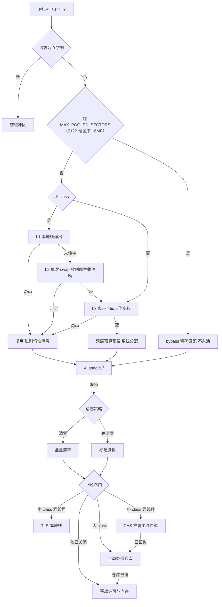

[English](#en) | [中文](#zh)

---

<a name="en"></a>

# wram : Zero-lock sector-aligned memory for async storage

- [Overview](#overview)
- [Usage](#usage)
  - [Pool rent and return](#pool-rent-and-return)
  - [Capacity guarantee and cross-thread return](#capacity-guarantee-and-cross-thread-return)
  - [Standalone aligned buffer and sector math](#standalone-aligned-buffer-and-sector-math)
  - [Direct virtual memory](#direct-virtual-memory)
  - [Budget isolation](#budget-isolation)
- [Features](#features)
- [Design](#design)
  - [Pool rent and return, end to end](#pool-rent-and-return-end-to-end)
  - [Key mechanisms](#key-mechanisms)
- [Tech Stack](#tech-stack)
- [Directory Layout](#directory-layout)
- [API](#api)
  - [Constants](#constants)
  - [Alignment functions](#alignment-functions)
  - [`SectorRange`](#sectorrange)
  - [`AlignedBuf`](#alignedbuf)
  - [`BufferPool`](#bufferpool)
  - [`DirectVirtualMemory` and `DirectVmBlock`](#directvirtualmemory-and-directvmblock)
  - [`NativeMemoryTracker`](#nativememorytracker)
  - [Errors](#errors)
  - [Utility functions](#utility-functions)

## Overview

wram delivers sector-aligned memory infrastructure, mirroring the industrial buffer pool design of Microsoft Garnet / Tsavorite:

- `BufferPool`: sector-aligned buffer pool. Three-tier cache ladder (thread-local stack → lock-free cross-thread inbox → global striped depot), 28 size classes (512B..16MB at 512B sectors), isolated small/large byte budgets, bypass allocation for oversize requests.
- `AlignedBuf`: the sector-aligned buffer itself. RAII drop returns it to the pool automatically; implements compio_buf `IoBuf` / `IoBufMut` / `SetLen`.
- `DirectVirtualMemory`: OS direct virtual memory allocator. Demand-zero mmap / VirtualAlloc mappings with Linux transparent huge page hints.
- `NativeMemoryTracker`: striped lock-free native memory counter for memory telemetry.
- Alignment math: const fn alignment primitives and `SectorRange` logical/physical translation.

Target workloads: async storage engines, file I/O paths built on compio, large page caches and index residency.

## Usage

### Pool rent and return

```rust
use wram::BufferPool;

// Default sector 4096, small budget 32MiB / large budget 128MiB
let pool = BufferPool::new(wram::DEFAULT_SECTOR_SIZE)?;

// Rent: bytes rounded up to sector granularity, content zeroed
let mut buf = pool.get(4096)?;
buf.set_len(100)?;

// Drop returns the buffer: same thread pushes to the local stack with
// zero atomics; foreign threads push to the owner inbox with one CAS
drop(buf);

// Read-destination scenario: rent without clear-on-return; the buffer is
// marked dirty on return and lazily cleared on next rent
let mut dst = pool.get_with_policy(8192, false)?;

// Copy-initialize from a slice
let payload = pool.get_from_slice(b"payload")?;
assert_eq!(&payload[..], b"payload");
```

### Capacity guarantee and cross-thread return

```rust
use wram::BufferPool;

let pool = BufferPool::new(4096)?;
let mut buf = pool.get(4096)?;

// In-place reuse when capacity suffices; otherwise the old buffer is
// returned and a larger one is rented automatically
pool.ensure_size(&mut buf, 65536)?;
assert!(buf.capacity() >= 65536);

// Dropping on a worker thread routes the buffer back to the owner inbox
let handle = std::thread::spawn(move || drop(buf));
handle.join().expect("worker thread succeeded");

// Owner rents again: bulk-claims the inbox and hits the same allocation
let again = pool.get(65536)?;
```

### Standalone aligned buffer and sector math

```rust
use wram::{AlignedBuf, DEFAULT_SECTOR_SIZE, SectorRange};

// Standalone (non-pooled): fully zeroed, pointer sector-aligned
let mut buf = AlignedBuf::zeroed(4096, DEFAULT_SECTOR_SIZE)?;
assert!(buf.is_ptr_aligned());

// Translate a logical read into a physical sector range:
// read 100 bytes at offset 4196
let range = SectorRange::calculate(4196, 100, DEFAULT_SECTOR_SIZE)?;
assert_eq!(range.aligned_offset, 4096); // aligned physical start
assert_eq!(range.aligned_len, 4096); // aligned physical length
assert_eq!(range.internal_offset, 100); // logical offset inside the sector

// Extract the logical slice from the aligned buffer
let user_data = &buf[range.sub_range(100)];
```

### Direct virtual memory

```rust
use wram::{DirectVirtualMemory, NativeMemoryTracker};

// 8MB demand-zero mapping aligned to 4096; Linux >= 2MB gets THP hints
let mut block = DirectVirtualMemory::allocate(8 << 20, 4096)?;
assert!(block.as_aligned_slice(8 << 20).iter().all(|&b| b == 0));

// The global tracker reflects reserved bytes
let reserved = NativeMemoryTracker::bytes();

// RAII drop unmaps and decrements the tracker; explicit free is idempotent
wram::DirectVirtualMemory::free(&mut block);
```

### Budget isolation

```rust
use wram::BufferPool;

// Explicit small/large budgets, strictly isolated: large-buffer churn
// can never starve the small-buffer quota
let pool = BufferPool::with_budgets(512, 2 << 20, 6 << 20)?;

assert_eq!(pool.small_budget_bytes(), 2 << 20);
assert_eq!(pool.large_budget_bytes(), 6 << 20);

// Close: reclaims the calling thread's cache and the global depot; quota returns to zero
pool.free();
assert_eq!(pool.reserved_bytes(), 0);
```

## Features

- **Three-tier cache ladder, zero-lock hot path**: L1 thread-local stack rents and returns with no locks and no atomics; L2 cross-thread MPSC lock-free inbox, claimed by the owner with a single atomic swap (no ABA); L3 global 8-way striped depot carries overflow, large-class sharing and thread-exit reclamation.
- **RAII origin-return routing**: same-thread returns land on the local stack at zero cost; foreign returns publish through intrusive list nodes with one CAS onto the owner inbox; once the owner exits, the inbox is sealed and late returns reroute to the global depot — permits never strand.
- **Clear-on-return policy**: cleared return by default; `get_with_policy(bytes, false)` skips clearing, marks the buffer dirty and defers clearing to the next renter, removing the memory-bandwidth bottleneck on read paths.
- \*_Dual-layer byte budgets\__: small (≤256KB classes) and large (>256KB classes) quotas are strongly isolated with `AtomicI64` CAS accounting; exhaustion degrades to non-pooled direct allocation without blocking callers.
- **28-class capacity ladder**: 2 exact + 4 linear + 22 geometric classes (two per doubling, worst-case waste 1.5x), driven by a compile-time constant table; oversize requests bypass with exact sizing.
- **Direct virtual memory**: demand-zero mappings, Linux `MADV_HUGEPAGE` hints, global byte tracking over 64 cache-line-padded stripes.
- **compio ecosystem**: implements `IoBuf` / `IoBufMut` / `SetLen`, ready as the buffer type for compio async file I/O.

## Design

### Pool rent and return, end to end

```mermaid
graph TD
  G[get_with_policy] --> Z{zero-byte request}
  Z -->|yes| E[empty buffer]
  Z -->|no| R{over MAX_POOLED_SECTORS (16MB at 512B sectors)}
  R -->|yes| B[bypass exact alloc, never pooled]
  R -->|no| C{small class}
  C -->|yes| L1[L1 local stack pop]
  L1 -->|hit| U[reuse, lazily clear if dirty]
  L1 -->|miss| L2[L2 single-swap inbox claim]
  L2 -->|non-empty| U
  L2 -->|empty| L3[L3 depot work stealing]
  L3 -->|hit| U
  L3 -->|empty| N[reserve budget, system alloc]
  C -->|no| L3
  U --> BUF[AlignedBuf]
  N --> BUF
  B --> BUF
  BUF -->|drop| P{clear policy}
  P -->|clear| FZ[zero the buffer]
  P -->|skip| DTY[mark dirty]
  FZ --> RT{return routing}
  DTY --> RT
  RT -->|pool closed| REL[release permit and memory]
  RT -->|large class| DEP[global striped depot]
  RT -->|small class, owner thread| TLS[TLS local stack]
  RT -->|small class, foreign thread| INB[CAS push to owner inbox]
  INB -->|sealed| DEP
  DEP -->|depot full| REL
```

### Key mechanisms

**Rent path**: the request is rounded up to sectors and `class_of_sectors` selects a class from the compile-time ladder. Small classes probe L1 → L2 → L3 in order; nodes claimed beyond the local cap spill back to L3; on total miss, a permit is reserved from the matching budget tier before the system allocation. Large classes skip thread-local tiers entirely and share through the global depot, preventing multi-thread residency from inflating the working set.

**Return path**: `AlignedBuf` drop triggers the RAII return. The buffer is cleared or marked dirty per policy, then routed by class. Budget permits travel with the buffer across local stack, inbox, depot and in-flight states; a permit is released only when the buffer dies permanently, keeping the ledger exact.

**Lifecycle**: thread-local entries hold weak references to the pool. On thread exit, TLS RAII seals the inbox and disperses leftover buffers to the depot stripes captured at entry creation, releasing permits inline. Pool close atomically flips the closed flag under each stripe lock, so late pushes fail and release inline — the quota is guaranteed to return to zero after close.

**Deliberate divergences from the C# original**: thread-local retention is capped per class in slots (C# uses a per-thread byte cap with fair refill); `free()` reclaims only the calling thread's cache and the depot eagerly, while other threads' caches are reclaimed when those threads exit (C# uses finalizers for best-effort eager reclaim); zero-byte requests return an empty buffer (C# issues a one-sector buffer).

## Tech Stack

| Component         | Role                                                       |
| ----------------- | ---------------------------------------------------------- |
| Rust 2024 edition | let-chains, modern iterators, const fn evaluation          |
| compio-buf        | `IoBuf` / `IoBufMut` / `SetLen` zero-copy I/O traits       |
| libc              | mmap / munmap / madvise / sysconf and Windows VirtualAlloc |
| parking_lot       | global depot stripe locks                                  |
| thiserror         | error definition and transparent forwarding                |
| log               | structured logging                                         |

Test stack: `cargo-nextest`, `aok`, `ctor`, `log_init`.

## Directory Layout

```text
wram/
├── src/
│   ├── lib.rs            # public export aggregation
│   ├── align.rs          # alignment primitives and SectorRange
│   ├── aligned_buf.rs    # AlignedBuf buffer type
│   ├── direct_vm.rs      # DirectVirtualMemory / DirectVmBlock
│   ├── error.rs          # Error / Result
│   ├── tracker.rs        # NativeMemoryTracker
│   └── pool/
│       ├── mod.rs        # BufferPool and the size-class ladder
│       ├── tls.rs        # thread-local L1 stack and lifecycle
│       ├── inbox.rs      # cross-thread MPSC lock-free inbox
│       ├── depot.rs      # global striped depot
│       └── budget.rs     # dual-layer byte budgets
└── tests/
    ├── main.rs           # single test entry with log init
    └── suite/            # ports of the C# test suites
        ├── align.rs
        ├── aligned_buf.rs
        ├── direct_vm.rs
        ├── pool_ladder.rs
        ├── pool_get_return.rs
        ├── pool_cross_thread.rs
        ├── pool_budget.rs
        └── pool_stress.rs
```

## API

### Constants

| Constant                     | Value         | Meaning                                         |
| ---------------------------- | ------------- | ----------------------------------------------- |
| `DEFAULT_SECTOR_SIZE`        | 4096          | default sector size                             |
| `MIN_SECTOR_SIZE`            | 512           | minimum legal sector size                       |
| `NUM_CLASSES`                | 28            | total size classes                              |
| `CLASS_CAPACITIES_SECTORS`   | `[usize; 28]` | compile-time per-class capacity table           |
| `MAX_POOLED_SECTORS`         | 32768         | maximum poolable sectors (16MB at 512B sectors) |
| `LARGE_TIER_MIN_BYTES`       | 262144        | small/large budget tier threshold               |
| `DEFAULT_SMALL_BUDGET_BYTES` | 32MiB         | default small budget                            |
| `DEFAULT_LARGE_BUDGET_BYTES` | 128MiB        | default large budget                            |
| `MAX_LOCAL_PER_CLASS`        | 64            | per-class thread-local cache slots              |
| `DEPOT_STRIPE_CAP`           | 8             | per-stripe depot capacity                       |

### Alignment functions

- `is_aligned(val, align) -> bool`: alignment check via power-of-two bit math or modulo fallback.
- `align_down(val, align) -> u64`: round down.
- `align_up(val, align) -> u64`: round up; saturates to the largest aligned multiple on overflow.
- `checked_align_up(val, align) -> Option<u64>`: round up with overflow detection.

### `SectorRange`

Translation result from a logical offset/length to a physical sector range.

```rust
pub struct SectorRange {
  pub aligned_offset: u64,    // aligned physical start offset
  pub aligned_len: usize,     // aligned physical length in bytes
  pub internal_offset: usize, // logical offset inside the first sector
}
```

- `calculate(offset, len, sector_size) -> Result<Self>`: translate; invalid sector size or overflow fails.
- `sector_count(&self, sector_size) -> usize`: number of sectors spanned.
- `sub_range(&self, len) -> Range<usize>`: logical data range inside the aligned buffer.

### `AlignedBuf`

Sector-aligned buffer. `Deref` / `DerefMut` / `AsRef<[u8]>` / `Borrow<[u8]>` expose the byte slice; implements `Clone` (deep copy, clones never enter the pool), `PartialEq`, `Debug`; implements compio `IoBuf` / `IoBufMut` / `SetLen`; `Send` / `Sync`.

- Construction: `new(cap, align)` (zeroed, len 0), `zeroed(cap, align)` (zeroed, len = cap), `from_slice(data, align)` (copy-initialized), `with_sector_size(cap)`, `zeroed_with_sector_size(cap)`; alignment must be a power of two ≥ 512.
- Length: `len` / `is_empty` / `set_len(usize) -> Result<()>` / `clear` / `unsafe set_len_unchecked`.
- Views: `as_slice` / `as_mut_slice` (logical length), `as_allocated_slice` / `as_allocated_slice_mut` (full capacity).
- Policy: `clear_on_return` / `set_clear_on_return(bool)` query and switch; `required_len` reports the effective request length.
- Pointers: `as_buf_ptr` / `as_mut_buf_ptr` / `is_ptr_aligned` / `is_aligned_to(align)`.
- Metadata: `capacity` / `align`.

### `BufferPool`

Sector-aligned buffer pool.

- Construction: `new(sector_size) -> Result<Arc<Self>>` (default budgets), `with_budgets(sector_size, small, large) -> Result<Arc<Self>>`; sector must be a power of two ≥ 512 and the largest class capacity must fit i64 budget accounting.
- Rent:
  - `get(required_bytes) -> Result<AlignedBuf>`: default clear-on-return.
  - `get_with_policy(required_bytes, clear_on_return) -> Result<AlignedBuf>`: explicit policy.
  - `get_from_slice(slice) -> Result<AlignedBuf>`: copy-initialized rent.
  - `ensure_size(&mut AlignedBuf, size) -> Result<()>`: in-place reuse when capacity suffices (syncing the required length); re-rent otherwise.
- Observation: `reserved_bytes` / `small_reserved_bytes` / `large_reserved_bytes` / `small_budget_bytes` / `large_budget_bytes` / `cached_len(cls)` / `sector_size` / `is_closed` / `stats() -> PoolStats`.
- `stats() -> PoolStats`: snapshot with `reserved_bytes` / `small_reserved_bytes` / `large_reserved_bytes` plus budget-exhaustion direct-alloc counters `direct_alloc_count` / `direct_alloc_bytes` (steady growth means the budget is too small).
- Close: `free()` is idempotent; it drains the calling thread's cache and the depot, after which rents become non-pooled direct allocations and in-flight returns release immediately.

### `DirectVirtualMemory` and `DirectVmBlock`

- `DirectVirtualMemory::allocate(size, alignment) -> Result<DirectVmBlock>`: demand-zero mapping; alignment must be a power of two; Linux requests ≥ 2MB promote alignment and hint transparent huge pages.
- `DirectVirtualMemory::free(&mut DirectVmBlock)`: explicit release, idempotent.
- `unsafe DirectVirtualMemory::clear(ptr, len)`: zero a raw pointer range.
- `DirectVmBlock` exposes its fields: `base_ptr` (mapping base), `aligned_ptr` (aligned usable address), `reserved_length` (reserved bytes); `empty()` / `is_empty()` / `as_aligned_slice` / `as_aligned_mut_slice` / `slice(range)` / `slice_mut(range)`.
- `system_page_size() -> usize`: physical page size, cached process-wide.

### `NativeMemoryTracker`

- `bytes() -> usize`: total native direct virtual memory reserved (lock-free sum over 64 stripes).
- `direct_vm_bytes() -> usize`: alias of `bytes`.

### Errors

`Result<T> = std::result::Result<T, Error>`; `Error` is a thiserror enum: `InvalidAlignment`, `InvalidSize`, `SetLenExceeded`, `AllocFailed`, `DirectVmAllocFailed`, `Overflow`, and transparent `Layout` forwarding.

### Utility functions

- `class_of_sectors(sectors) -> Option<usize>`: sector count to class mapping; `None` beyond the poolable cap.
- `class_capacity_sectors(cls) -> usize`: class capacity in sectors (const, saturating on out-of-range).
- `class_capacity_bytes(cls, sector_size) -> usize`: class capacity in bytes (const).
- `current_thread_id() -> u64`: process-wide increasing thread ID.

---

<a name="zh"></a>

# wram : 为异步存储供给零锁扇区内存

- [项目功能介绍](#项目功能介绍)
- [使用演示](#使用演示)
  - [缓冲池租借与归还](#缓冲池租借与归还)
  - [容量保障与跨线程归还](#容量保障与跨线程归还)
  - [独立对齐缓冲区与扇区换算](#独立对齐缓冲区与扇区换算)
  - [直接虚拟内存](#直接虚拟内存)
  - [预算隔离](#预算隔离)
- [特性介绍](#特性介绍)
- [设计思路](#设计思路)
  - [缓冲池借用与归还全景](#缓冲池借用与归还全景)
  - [关键机制](#关键机制)
- [技术堆栈](#技术堆栈)
- [目录结构](#目录结构)
- [API 说明](#api-说明)
  - [常量](#常量)
  - [对齐函数](#对齐函数)
  - [`SectorRange`](#sectorrange)
  - [`AlignedBuf`](#alignedbuf)
  - [`BufferPool`](#bufferpool)
  - [`DirectVirtualMemory` 与 `DirectVmBlock`](#directvirtualmemory-与-directvmblock)
  - [`NativeMemoryTracker`](#nativememorytracker)
  - [错误](#错误)
  - [工具函数](#工具函数)

## 项目功能介绍

wram 提供扇区对齐内存基础设施，语义对标微软 Garnet / Tsavorite 的工业级缓冲池体系：

- `BufferPool`：扇区对齐缓冲池。三级缓存阶梯（线程本地栈 → 跨线程无锁收件箱 → 全局条带仓库）、28 级 size class 容量阶梯（512B 扇区下覆盖 512B..16MB）、小/大双层字节预算、超界请求 bypass 直配。
- `AlignedBuf`：扇区对齐缓冲区本体。RAII drop 自动归还入池，接入 compio_buf 的 `IoBuf` / `IoBufMut` / `SetLen`。
- `DirectVirtualMemory`：操作系统直接虚拟内存分配器。mmap / VirtualAlloc 按需置零映射，Linux 透明大页提示。
- `NativeMemoryTracker`：条带化无锁原生内存计数器，支撑内存遥测。
- 对齐数学：const fn 对齐原语与 `SectorRange` 逻辑/物理扇区换算。

适用场景：异步存储引擎、以 compio 为底座的文件 I/O 路径、大容量页缓存与索引驻留。

## 使用演示

### 缓冲池租借与归还

```rust
use wram::BufferPool;

// 以默认扇区 4096、小预算 32MiB / 大预算 128MiB 创建
let pool = BufferPool::new(wram::DEFAULT_SECTOR_SIZE)?;

// 租借：请求字节数向上取整到扇区，内容全零
let mut buf = pool.get(4096)?;
buf.set_len(100)?;

// drop 即归还：同线程 0 锁入本地栈，跨线程单 CAS 推属主收件箱
drop(buf);

// 读目的地覆写场景：免清零租借，归还时标脏，下次借出惰性清零
let mut dst = pool.get_with_policy(8192, false)?;

// 从切片拷贝签发
let payload = pool.get_from_slice(b"payload")?;
assert_eq!(&payload[..], b"payload");
```

### 容量保障与跨线程归还

```rust
use wram::BufferPool;

let pool = BufferPool::new(4096)?;
let mut buf = pool.get(4096)?;

// 容量充足时就地复用，不足时自动归还旧缓冲并换借新缓冲
pool.ensure_size(&mut buf, 65536)?;
assert!(buf.capacity() >= 65536);

// 异步 worker 线程 drop 时，缓冲自动路由回属主线程收件箱
let handle = std::thread::spawn(move || drop(buf));
handle.join().expect("worker 线程执行成功");

// 属主线程再次租借：批量收割收件箱，命中同一分配
let again = pool.get(65536)?;
```

### 独立对齐缓冲区与扇区换算

```rust
use wram::{AlignedBuf, DEFAULT_SECTOR_SIZE, SectorRange};

// 独立分配（不入池）：全置零、指针按扇区对齐
let mut buf = AlignedBuf::zeroed(4096, DEFAULT_SECTOR_SIZE)?;
assert!(buf.is_ptr_aligned());

// 逻辑读请求换算为物理扇区范围：偏移 4196 处读 100 字节
let range = SectorRange::calculate(4196, 100, DEFAULT_SECTOR_SIZE)?;
assert_eq!(range.aligned_offset, 4096); // 对齐后物理起始
assert_eq!(range.aligned_len, 4096); // 对齐后物理长度
assert_eq!(range.internal_offset, 100); // 逻辑数据在扇区内偏移

// 从对齐缓冲提取逻辑切片
let user_data = &buf[range.sub_range(100)];
```

### 直接虚拟内存

```rust
use wram::{DirectVirtualMemory, NativeMemoryTracker};

// 8MB、按 4096 对齐的按需置零映射；Linux 下 >= 2MB 自动提示透明大页
let mut block = DirectVirtualMemory::allocate(8 << 20, 4096)?;
assert!(block.as_aligned_slice(8 << 20).iter().all(|&b| b == 0));

// 全局追踪器反映预留字节数
let reserved = NativeMemoryTracker::bytes();

// RAII drop 自动 munmap 并扣减追踪；也可显式 free（幂等）
wram::DirectVirtualMemory::free(&mut block);
```

### 预算隔离

```rust
use wram::BufferPool;

// 小/大预算显式给定，强隔离：大缓冲耗尽不得挤占小缓冲配额
let pool = BufferPool::with_budgets(512, 2 << 20, 6 << 20)?;

assert_eq!(pool.small_budget_bytes(), 2 << 20);
assert_eq!(pool.large_budget_bytes(), 6 << 20);

// 关闭并回收当前线程与全局仓库缓存；配额归零
pool.free();
assert_eq!(pool.reserved_bytes(), 0);
```

## 特性介绍

- **三级缓存阶梯，0 锁热路径**：L1 线程本地私有栈借还 0 锁、0 原子操作；L2 跨线程 MPSC 无锁收件箱，属主单次原子 swap 批量收割整链，无 ABA；L3 全局 8-way 条带仓库承载溢出、大容量共享与线程退出回收。
- **RAII 归还路由**：同线程归还零开销入本地栈；异线程归还经侵入式链表节点单 CAS 推入属主收件箱；属主退出后收件箱密封，迟到归还自动回退全局仓库，绝不滞留。
- **归还清零策略**：默认归还即清零；`get_with_policy(bytes, false)` 免清零归还，标脏交由后续借方惰性清零，消除读路径内存带宽瓶颈。
- **双层字节预算**：小（≤256KB class）与大（>256KB class）配额强隔离，`AtomicI64` CAS 记账；预算耗尽自动降级为非池化直配，不阻塞调用。
- **28 级容量阶梯**：2 精确级 + 4 线性级 + 22 几何级（倍频 2 级，最坏浪费 1.5x）；编译期常量表驱动；超出上限 bypass 精确直配。
- **直接虚拟内存**：demand-zero 映射、Linux `MADV_HUGEPAGE` 大页提示、64 条带缓存行填充的全局字节追踪。
- **compio 生态接入**：实现 `IoBuf` / `IoBufMut` / `SetLen`，直接作为 compio 异步文件 I/O 的缓冲载体。

## 设计思路

### 缓冲池借用与归还全景



### 关键机制

**借用路径**：请求字节数向上取整到扇区，`class_of_sectors` 依编译期容量阶梯选级。小 class 依次探测 L1 → L2 → L3；L2 收割超出的节点溢出回 L3；全部未命中则从对应预算层预留许可后系统分配。大 class 跳过线程本地层，直接走全局仓库共享，避免多线程持有造成内存膨胀。

**归还路径**：`AlignedBuf` drop 触发 RAII 归还。先按策略清零或标脏，再按 class 分层路由；预算许可随缓冲在本地栈、收件箱、仓库、在途四态间迁移，仅在缓冲永久释放时归还预算，账目严格守恒。

**生命周期**：线程本地条目持池弱引用；线程退出时 TLS RAII 密封收件箱，遗留缓冲按创建时条带分流回全局仓库，许可就地释放。池关闭采用条带锁内原子关闭标志，迟到推入必然失败并就地释放，保证关闭后配额可归零。

**与 C# 原版的刻意差异**：线程本地缓存以 per-class 槽位数计上限（C# 为 per-thread 字节上限加公平回填）；`free()` 只即时回收调用方线程与全局仓库，其他线程缓存延迟至其线程退出时回收（C# 借 finalizer 尽力即时回收）；0 字节请求返回空缓冲（C# 签发 1 扇区缓冲）。

## 技术堆栈

| 组件              | 用途                                                      |
| ----------------- | --------------------------------------------------------- |
| Rust 2024 edition | let-chain、现代迭代器与 const fn 求值                     |
| compio-buf        | `IoBuf` / `IoBufMut` / `SetLen` 零拷贝 I/O trait          |
| libc              | mmap / munmap / madvise / sysconf 与 Windows VirtualAlloc |
| parking_lot       | 全局条带仓库锁                                            |
| thiserror         | 错误定义与透明转发                                        |
| log               | 结构化日志                                                |

测试栈：`cargo-nextest`、`aok`、`ctor`、`log_init`。

## 目录结构

```text
wram/
├── src/
│   ├── lib.rs            # 公开导出聚合
│   ├── align.rs          # 对齐原语与 SectorRange
│   ├── aligned_buf.rs    # AlignedBuf 缓冲区本体
│   ├── direct_vm.rs      # DirectVirtualMemory / DirectVmBlock
│   ├── error.rs          # Error / Result
│   ├── tracker.rs        # NativeMemoryTracker
│   └── pool/
│       ├── mod.rs        # BufferPool 与 size class 阶梯
│       ├── tls.rs        # 线程本地 L1 栈与生命周期管理
│       ├── inbox.rs      # 跨线程 MPSC 无锁收件箱
│       ├── depot.rs      # 全局条带化仓库
│       └── budget.rs     # 双层字节预算
└── tests/
    ├── main.rs           # 测试唯一入口与日志初始化
    └── suite/            # 对标 C# 测试套件的移植用例
        ├── align.rs
        ├── aligned_buf.rs
        ├── direct_vm.rs
        ├── pool_ladder.rs
        ├── pool_get_return.rs
        ├── pool_cross_thread.rs
        ├── pool_budget.rs
        └── pool_stress.rs
```

## API 说明

### 常量

| 常量                         | 值            | 含义                                 |
| ---------------------------- | ------------- | ------------------------------------ |
| `DEFAULT_SECTOR_SIZE`        | 4096          | 默认扇区大小                         |
| `MIN_SECTOR_SIZE`            | 512           | 最小合法扇区大小                     |
| `NUM_CLASSES`                | 28            | size class 总数                      |
| `CLASS_CAPACITIES_SECTORS`   | `[usize; 28]` | 各 class 扇区容量编译期查找表        |
| `MAX_POOLED_SECTORS`         | 32768         | 可池化最大扇区数（512B 扇区下 16MB） |
| `LARGE_TIER_MIN_BYTES`       | 262144        | 大/小预算分层阈值                    |
| `DEFAULT_SMALL_BUDGET_BYTES` | 32MiB         | 默认小缓冲预算                       |
| `DEFAULT_LARGE_BUDGET_BYTES` | 128MiB        | 默认大缓冲预算                       |
| `MAX_LOCAL_PER_CLASS`        | 64            | 单 class 单线程本地缓存槽位上限      |
| `DEPOT_STRIPE_CAP`           | 8             | 全局仓库单条带容量上限               |

### 对齐函数

- `is_aligned(val, align) -> bool`：按 2 的幂位运算或模运算判定对齐。
- `align_down(val, align) -> u64`：向下取整。
- `align_up(val, align) -> u64`：向上取整；溢出时饱和到对齐上界最大倍数。
- `checked_align_up(val, align) -> Option<u64>`：带溢出检测的向上取整。

### `SectorRange`

逻辑偏移与长度到物理扇区范围的换算结果。

```rust
pub struct SectorRange {
  pub aligned_offset: u64,    // 对齐后物理起始偏移
  pub aligned_len: usize,     // 对齐后物理总长度
  pub internal_offset: usize, // 逻辑数据在首扇区内偏移
}
```

- `calculate(offset, len, sector_size) -> Result<Self>`：换算；非法扇区或溢出报错。
- `sector_count(&self, sector_size) -> usize`：跨越的扇区数。
- `sub_range(&self, len) -> Range<usize>`：逻辑数据在对齐缓冲内的切片区间。

### `AlignedBuf`

扇区对齐缓冲区。`Deref` / `DerefMut` / `AsRef<[u8]>` / `Borrow<[u8]>` 直通字节切片；实现 `Clone`（深拷贝且克隆体不入池）、`PartialEq`、`Debug`；实现 compio 的 `IoBuf` / `IoBufMut` / `SetLen`；`Send` / `Sync`。

- 构造：`new(cap, align)`（全零、长度 0）、`zeroed(cap, align)`（全零、长度等容量）、`from_slice(data, align)`（拷贝初始化）、`with_sector_size(cap)`、`zeroed_with_sector_size(cap)`；对齐须为 2 的幂且 ≥ 512。
- 长度：`len` / `is_empty` / `set_len(usize) -> Result<()>` / `clear` / `unsafe set_len_unchecked`。
- 视图：`as_slice` / `as_mut_slice`（逻辑长度内）、`as_allocated_slice` / `as_allocated_slice_mut`（全容量）。
- 策略：`clear_on_return` / `set_clear_on_return(bool)` 查询与动态切换归还清零策略；`required_len` 查询有效需求长度。
- 指针：`as_buf_ptr` / `as_mut_buf_ptr` / `is_ptr_aligned` / `is_aligned_to(align)`。
- 元数据：`capacity` / `align`。

### `BufferPool`

扇区对齐缓冲池。

- 构造：`new(sector_size) -> Result<Arc<Self>>`（默认双层预算）、`with_budgets(sector_size, small, large) -> Result<Arc<Self>>`；扇区须为 2 的幂且 ≥ 512，且最大 class 容量不得溢出 i64 预算记账。
- 租借：
  - `get(required_bytes) -> Result<AlignedBuf>`：默认归还清零。
  - `get_with_policy(required_bytes, clear_on_return) -> Result<AlignedBuf>`：显式清零策略。
  - `get_from_slice(slice) -> Result<AlignedBuf>`：拷贝签发。
  - `ensure_size(&mut AlignedBuf, size) -> Result<()>`：容量充足就地复用并同步需求长度，不足自动换借。
- 观测：`reserved_bytes` / `small_reserved_bytes` / `large_reserved_bytes` / `small_budget_bytes` / `large_budget_bytes` / `cached_len(cls)` / `sector_size` / `is_closed` / `stats() -> PoolStats`。
- `stats() -> PoolStats`：快照含 `reserved_bytes` / `small_reserved_bytes` / `large_reserved_bytes` 与预算耗尽显式直配累计 `direct_alloc_count` / `direct_alloc_bytes`（持续增长说明预算配小了）。
- 关闭：`free()` 幂等关闭；清空当前线程缓存与全局仓库，此后租借走非池化直配，在途缓冲归还即释放。

### `DirectVirtualMemory` 与 `DirectVmBlock`

- `DirectVirtualMemory::allocate(size, alignment) -> Result<DirectVmBlock>`：按需置零映射；对齐须为 2 的幂；Linux 下 ≥ 2MB 请求自动提升对齐并提示透明大页。
- `DirectVirtualMemory::free(&mut DirectVmBlock)`：显式释放，幂等。
- `unsafe DirectVirtualMemory::clear(ptr, len)`：裸指针区间置零。
- `DirectVmBlock` 字段公开：`base_ptr`（映射基址）、`aligned_ptr`（对齐后可用地址）、`reserved_length`（预留总长）；`empty()` / `is_empty()` / `as_aligned_slice` / `as_aligned_mut_slice` / `slice(range)` / `slice_mut(range)`。
- `system_page_size() -> usize`：系统物理页大小，进程内缓存。

### `NativeMemoryTracker`

- `bytes() -> usize`：当前原生直接虚拟内存预留总字节（64 条带无锁求和）。
- `direct_vm_bytes() -> usize`：同 `bytes`，语义别名。

### 错误

`Result<T> = std::result::Result<T, Error>`；`Error` 为 thiserror 枚举：`InvalidAlignment`、`InvalidSize`、`SetLenExceeded`、`AllocFailed`、`DirectVmAllocFailed`、`Overflow`、`Layout` 透明转发。

### 工具函数

- `class_of_sectors(sectors) -> Option<usize>`：扇区数到 class 映射；超池化上限返回 `None`。
- `class_capacity_sectors(cls) -> usize`：class 扇区容量（const，越界饱和）。
- `class_capacity_bytes(cls, sector_size) -> usize`：class 字节容量（const）。
- `current_thread_id() -> u64`：进程内递增线程 ID。
