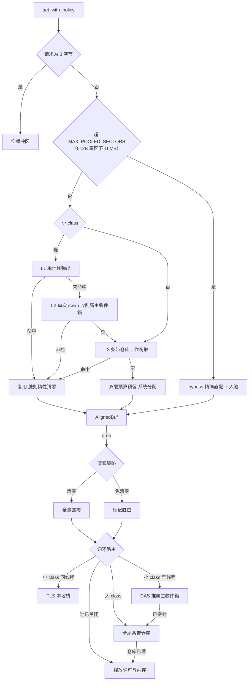

# wram : 为异步存储供给零锁扇区内存

## 项目功能介绍

wram 提供扇区对齐内存基础设施，语义对标微软 Garnet / Tsavorite 的工业级缓冲池体系：

- `BufferPool`：扇区对齐缓冲池。三级缓存阶梯（线程本地栈 → 跨线程无锁收件箱 → 全局条带仓库）、28 级 size class 容量阶梯（512B 扇区下覆盖 512B..16MB）、小/大双层字节预算、超界请求 bypass 直配。
- `AlignedBuf`：扇区对齐缓冲区本体。RAII drop 自动归还入池，接入 compio_buf 的 `IoBuf` / `IoBufMut` / `SetLen`。
- `DirectVirtualMemory`：操作系统直接虚拟内存分配器。mmap / VirtualAlloc 按需置零映射，Linux 透明大页提示。
- `NativeMemoryTracker`：条带化无锁原生内存计数器，支撑内存遥测。
- 对齐数学：const fn 对齐原语与 `SectorRange` 逻辑/物理扇区换算。

适用场景：异步存储引擎、以 compio 为底座的文件 I/O 路径、大容量页缓存与索引驻留。

## 使用演示

### 缓冲池租借与归还

```rust
use wram::BufferPool;

// 以默认扇区 4096、小预算 32MiB / 大预算 128MiB 创建
let pool = BufferPool::new(wram::DEFAULT_SECTOR_SIZE)?;

// 租借：请求字节数向上取整到扇区，内容全零
let mut buf = pool.get(4096)?;
buf.set_len(100)?;

// drop 即归还：同线程 0 锁入本地栈，跨线程单 CAS 推属主收件箱
drop(buf);

// 读目的地覆写场景：免清零租借，归还时标脏，下次借出惰性清零
let mut dst = pool.get_with_policy(8192, false)?;

// 从切片拷贝签发
let payload = pool.get_from_slice(b"payload")?;
assert_eq!(&payload[..], b"payload");
```

### 容量保障与跨线程归还

```rust
use wram::BufferPool;

let pool = BufferPool::new(4096)?;
let mut buf = pool.get(4096)?;

// 容量充足时就地复用，不足时自动归还旧缓冲并换借新缓冲
pool.ensure_size(&mut buf, 65536)?;
assert!(buf.capacity() >= 65536);

// 异步 worker 线程 drop 时，缓冲自动路由回属主线程收件箱
let handle = std::thread::spawn(move || drop(buf));
handle.join().expect("worker 线程执行成功");

// 属主线程再次租借：批量收割收件箱，命中同一分配
let again = pool.get(65536)?;
```

### 独立对齐缓冲区与扇区换算

```rust
use wram::{AlignedBuf, DEFAULT_SECTOR_SIZE, SectorRange};

// 独立分配（不入池）：全置零、指针按扇区对齐
let mut buf = AlignedBuf::zeroed(4096, DEFAULT_SECTOR_SIZE)?;
assert!(buf.is_ptr_aligned());

// 逻辑读请求换算为物理扇区范围：偏移 4196 处读 100 字节
let range = SectorRange::calculate(4196, 100, DEFAULT_SECTOR_SIZE)?;
assert_eq!(range.aligned_offset, 4096); // 对齐后物理起始
assert_eq!(range.aligned_len, 4096); // 对齐后物理长度
assert_eq!(range.internal_offset, 100); // 逻辑数据在扇区内偏移

// 从对齐缓冲提取逻辑切片
let user_data = &buf[range.sub_range(100)];
```

### 直接虚拟内存

```rust
use wram::{DirectVirtualMemory, NativeMemoryTracker};

// 8MB、按 4096 对齐的按需置零映射；Linux 下 >= 2MB 自动提示透明大页
let mut block = DirectVirtualMemory::allocate(8 << 20, 4096)?;
assert!(block.as_aligned_slice(8 << 20).iter().all(|&b| b == 0));

// 全局追踪器反映预留字节数
let reserved = NativeMemoryTracker::bytes();

// RAII drop 自动 munmap 并扣减追踪；也可显式 free（幂等）
wram::DirectVirtualMemory::free(&mut block);
```

### 预算隔离

```rust
use wram::BufferPool;

// 小/大预算显式给定，强隔离：大缓冲耗尽不得挤占小缓冲配额
let pool = BufferPool::with_budgets(512, 2 << 20, 6 << 20)?;

assert_eq!(pool.small_budget_bytes(), 2 << 20);
assert_eq!(pool.large_budget_bytes(), 6 << 20);

// 关闭并回收当前线程与全局仓库缓存；配额归零
pool.free();
assert_eq!(pool.reserved_bytes(), 0);
```

## 特性介绍

- **三级缓存阶梯，0 锁热路径**：L1 线程本地私有栈借还 0 锁、0 原子操作；L2 跨线程 MPSC 无锁收件箱，属主单次原子 swap 批量收割整链，无 ABA；L3 全局 8-way 条带仓库承载溢出、大容量共享与线程退出回收。
- **RAII 归还路由**：同线程归还零开销入本地栈；异线程归还经侵入式链表节点单 CAS 推入属主收件箱；属主退出后收件箱密封，迟到归还自动回退全局仓库，绝不滞留。
- **归还清零策略**：默认归还即清零；`get_with_policy(bytes, false)` 免清零归还，标脏交由后续借方惰性清零，消除读路径内存带宽瓶颈。
- **双层字节预算**：小（≤256KB class）与大（>256KB class）配额强隔离，`AtomicI64` CAS 记账；预算耗尽自动降级为非池化直配，不阻塞调用。
- **28 级容量阶梯**：2 精确级 + 4 线性级 + 22 几何级（倍频 2 级，最坏浪费 1.5x）；编译期常量表驱动；超出上限 bypass 精确直配。
- **直接虚拟内存**：demand-zero 映射、Linux `MADV_HUGEPAGE` 大页提示、64 条带缓存行填充的全局字节追踪。
- **compio 生态接入**：实现 `IoBuf` / `IoBufMut` / `SetLen`，直接作为 compio 异步文件 I/O 的缓冲载体。

## 设计思路

### 缓冲池借用与归还全景



### 关键机制

**借用路径**：请求字节数向上取整到扇区，`class_of_sectors` 依编译期容量阶梯选级。小 class 依次探测 L1 → L2 → L3；L2 收割超出的节点溢出回 L3；全部未命中则从对应预算层预留许可后系统分配。大 class 跳过线程本地层，直接走全局仓库共享，避免多线程持有造成内存膨胀。

**归还路径**：`AlignedBuf` drop 触发 RAII 归还。先按策略清零或标脏，再按 class 分层路由；预算许可随缓冲在本地栈、收件箱、仓库、在途四态间迁移，仅在缓冲永久释放时归还预算，账目严格守恒。

**生命周期**：线程本地条目持池弱引用；线程退出时 TLS RAII 密封收件箱，遗留缓冲按创建时条带分流回全局仓库，许可就地释放。池关闭采用条带锁内原子关闭标志，迟到推入必然失败并就地释放，保证关闭后配额可归零。

**与 C# 原版的刻意差异**：线程本地缓存以 per-class 槽位数计上限（C# 为 per-thread 字节上限加公平回填）；`free()` 只即时回收调用方线程与全局仓库，其他线程缓存延迟至其线程退出时回收（C# 借 finalizer 尽力即时回收）；0 字节请求返回空缓冲（C# 签发 1 扇区缓冲）。

## 技术堆栈

| 组件              | 用途                                                      |
| ----------------- | --------------------------------------------------------- |
| Rust 2024 edition | let-chain、现代迭代器与 const fn 求值                     |
| compio-buf        | `IoBuf` / `IoBufMut` / `SetLen` 零拷贝 I/O trait          |
| libc              | mmap / munmap / madvise / sysconf 与 Windows VirtualAlloc |
| parking_lot       | 全局条带仓库锁                                            |
| thiserror         | 错误定义与透明转发                                        |
| log               | 结构化日志                                                |

测试栈：`cargo-nextest`、`aok`、`ctor`、`log_init`。

## 目录结构

```text
wram/
├── src/
│   ├── lib.rs            # 公开导出聚合
│   ├── align.rs          # 对齐原语与 SectorRange
│   ├── aligned_buf.rs    # AlignedBuf 缓冲区本体
│   ├── direct_vm.rs      # DirectVirtualMemory / DirectVmBlock
│   ├── error.rs          # Error / Result
│   ├── tracker.rs        # NativeMemoryTracker
│   └── pool/
│       ├── mod.rs        # BufferPool 与 size class 阶梯
│       ├── tls.rs        # 线程本地 L1 栈与生命周期管理
│       ├── inbox.rs      # 跨线程 MPSC 无锁收件箱
│       ├── depot.rs      # 全局条带化仓库
│       └── budget.rs     # 双层字节预算
└── tests/
    ├── main.rs           # 测试唯一入口与日志初始化
    └── suite/            # 对标 C# 测试套件的移植用例
        ├── align.rs
        ├── aligned_buf.rs
        ├── direct_vm.rs
        ├── pool_ladder.rs
        ├── pool_get_return.rs
        ├── pool_cross_thread.rs
        ├── pool_budget.rs
        └── pool_stress.rs
```

## API 说明

### 常量

| 常量                         | 值            | 含义                                 |
| ---------------------------- | ------------- | ------------------------------------ |
| `DEFAULT_SECTOR_SIZE`        | 4096          | 默认扇区大小                         |
| `MIN_SECTOR_SIZE`            | 512           | 最小合法扇区大小                     |
| `NUM_CLASSES`                | 28            | size class 总数                      |
| `CLASS_CAPACITIES_SECTORS`   | `[usize; 28]` | 各 class 扇区容量编译期查找表        |
| `MAX_POOLED_SECTORS`         | 32768         | 可池化最大扇区数（512B 扇区下 16MB） |
| `LARGE_TIER_MIN_BYTES`       | 262144        | 大/小预算分层阈值                    |
| `DEFAULT_SMALL_BUDGET_BYTES` | 32MiB         | 默认小缓冲预算                       |
| `DEFAULT_LARGE_BUDGET_BYTES` | 128MiB        | 默认大缓冲预算                       |
| `MAX_LOCAL_PER_CLASS`        | 64            | 单 class 单线程本地缓存槽位上限      |
| `DEPOT_STRIPE_CAP`           | 8             | 全局仓库单条带容量上限               |

### 对齐函数

- `is_aligned(val, align) -> bool`：按 2 的幂位运算或模运算判定对齐。
- `align_down(val, align) -> u64`：向下取整。
- `align_up(val, align) -> u64`：向上取整；溢出时饱和到对齐上界最大倍数。
- `checked_align_up(val, align) -> Option<u64>`：带溢出检测的向上取整。

### `SectorRange`

逻辑偏移与长度到物理扇区范围的换算结果。

```rust
pub struct SectorRange {
  pub aligned_offset: u64,    // 对齐后物理起始偏移
  pub aligned_len: usize,     // 对齐后物理总长度
  pub internal_offset: usize, // 逻辑数据在首扇区内偏移
}
```

- `calculate(offset, len, sector_size) -> Result<Self>`：换算；非法扇区或溢出报错。
- `sector_count(&self, sector_size) -> usize`：跨越的扇区数。
- `sub_range(&self, len) -> Range<usize>`：逻辑数据在对齐缓冲内的切片区间。

### `AlignedBuf`

扇区对齐缓冲区。`Deref` / `DerefMut` / `AsRef<[u8]>` / `Borrow<[u8]>` 直通字节切片；实现 `Clone`（深拷贝且克隆体不入池）、`PartialEq`、`Debug`；实现 compio 的 `IoBuf` / `IoBufMut` / `SetLen`；`Send` / `Sync`。

- 构造：`new(cap, align)`（全零、长度 0）、`zeroed(cap, align)`（全零、长度等容量）、`from_slice(data, align)`（拷贝初始化）、`with_sector_size(cap)`、`zeroed_with_sector_size(cap)`；对齐须为 2 的幂且 ≥ 512。
- 长度：`len` / `is_empty` / `set_len(usize) -> Result<()>` / `clear` / `unsafe set_len_unchecked`。
- 视图：`as_slice` / `as_mut_slice`（逻辑长度内）、`as_allocated_slice` / `as_allocated_slice_mut`（全容量）。
- 策略：`clear_on_return` / `set_clear_on_return(bool)` 查询与动态切换归还清零策略；`required_len` 查询有效需求长度。
- 指针：`as_buf_ptr` / `as_mut_buf_ptr` / `is_ptr_aligned` / `is_aligned_to(align)`。
- 元数据：`capacity` / `align`。

### `BufferPool`

扇区对齐缓冲池。

- 构造：`new(sector_size) -> Result<Arc<Self>>`（默认双层预算）、`with_budgets(sector_size, small, large) -> Result<Arc<Self>>`；扇区须为 2 的幂且 ≥ 512，预算须非负，且最大 class 容量不得溢出 i64 预算记账。
- 租借：
  - `get(required_bytes) -> Result<AlignedBuf>`：默认归还清零。
  - `get_with_policy(required_bytes, clear_on_return) -> Result<AlignedBuf>`：显式清零策略。
  - `get_from_slice(slice) -> Result<AlignedBuf>`：拷贝签发。
  - `ensure_size(&mut AlignedBuf, size) -> Result<()>`：容量充足就地复用并同步需求长度，不足自动换借。
- 观测：`reserved_bytes` / `small_reserved_bytes` / `large_reserved_bytes` / `small_budget_bytes` / `large_budget_bytes` / `cached_len(cls)` / `sector_size` / `is_closed` / `stats() -> PoolStats`。
- `stats() -> PoolStats`：快照含 `reserved_bytes` / `small_reserved_bytes` / `large_reserved_bytes`、预算耗尽显式直配累计 `direct_alloc_count` / `direct_alloc_bytes`（持续增长说明预算配小了）与超界/关闭态绕过池缓存累计 `bypass_alloc_count` / `bypass_alloc_bytes`。
- 关闭：`free()` 幂等关闭；清空当前线程缓存与全局仓库，此后租借走非池化直配，在途缓冲归还即释放。

### `DirectVirtualMemory` 与 `DirectVmBlock`

- `DirectVirtualMemory::allocate(size, alignment) -> Result<DirectVmBlock>`：按需置零映射；对齐须为 2 的幂；Linux 下 ≥ 2MB 请求自动提升对齐并提示透明大页。
- `DirectVirtualMemory::free(&mut DirectVmBlock)`：显式释放，幂等。
- `unsafe DirectVirtualMemory::clear(ptr, len)`：裸指针区间置零。
- `DirectVmBlock` 字段公开：`base_ptr`（映射基址）、`aligned_ptr`（对齐后可用地址）、`reserved_length`（预留总长）；`empty()` / `is_empty()` / `as_aligned_slice` / `as_aligned_mut_slice` / `slice(range)` / `slice_mut(range)`。
- `system_page_size() -> usize`：系统物理页大小，进程内缓存。

### `NativeMemoryTracker`

- `bytes() -> usize`：当前原生直接虚拟内存预留总字节（64 条带无锁求和）。

### 错误

`Result<T> = std::result::Result<T, Error>`；`Error` 为 thiserror 枚举：`InvalidAlignment`、`InvalidSize`、`InvalidBudget`、`SetLenExceeded`、`AllocFailed`、`DirectVmAllocFailed`、`Overflow`、`Layout` 透明转发。

### 工具函数

- `class_of_sectors(sectors) -> Option<usize>`：扇区数到 class 映射；超池化上限返回 `None`。
- `class_capacity_sectors(cls) -> usize`：class 扇区容量（const，越界饱和）。
- `class_capacity_bytes(cls, sector_size) -> usize`：class 字节容量（const）。
- `current_thread_id() -> u64`：进程内递增线程 ID。
