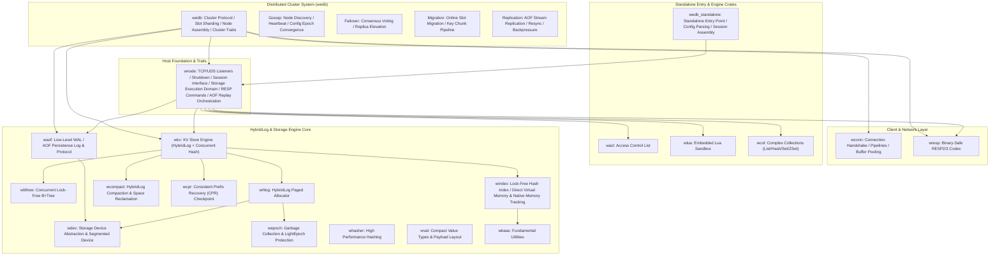

# WeDB: Next-Generation Ultra-High Performance Redis-Compatible Distributed Storage System

WeDB is an ultra-high performance, Redis-compatible distributed cache and persistent storage engine built on Rust 2024, meticulously benchmarked against Microsoft Garnet and completely re-engineered with modern zero-cost abstractions.

The architecture is cleanly decoupled into three primary tiers: the network host foundation and storage execution domain ([`wnode`](https://github.com/webc-site/wedb/tree/main/wedb/wnode), owning the RESP command sessions, database management and AOF replay orchestration), a cluster-free standalone service entry point ([`wedb_standalone`](https://github.com/webc-site/wedb/tree/main/wedb/wedb_standalone)), and a highly available distributed cluster coordination layer ([`wedb`](https://github.com/webc-site/wedb/tree/main/wedb/wedb)). Each crate adheres to high cohesion, low coupling, and a strictly acyclic dependency DAG.

---

## Architectural Topology & Garnet Mapping



### Garnet Subsystem Correspondence Matrix

| Garnet Project (C#) | WeDB Crate (Rust) | Responsibility & Scope |
|:---|:---|:---|
| `Garnet.host` / `libs/networking` / `Garnet.server` | [`wnode`](https://github.com/webc-site/wedb/tree/main/wedb/wnode) | Host foundation and storage execution domain: TCP / Unix Domain Socket listeners, nested text configuration, graceful shutdown coordination, session consumer interfaces, plus the RESP command session layer, database and txn/PubSub/TTL execution assembly, AOF append & replay orchestration (`AofProcessor` / `replaycoordinator`) and range-index replication/migration orchestration (**no cluster business logic**; cluster capability is injected via the `ClusterProvider` / `ClusterSession` traits, defaulting to the zero-cost `NoopClusterProvider`). |
| `Garnet.host` `GarnetServer.cs` startup assembly | [`wedb_standalone`](https://github.com/webc-site/wedb/tree/main/wedb/wedb_standalone) | Standalone Redis-compatible service entry (only `main.rs`): three-layer configuration parsing and `RespSessionConsumer` session assembly; all engine logic lives in `wnode`, shared with cluster (**100% pure standalone, zero cluster code**; regular dependencies are only `wconf` + `wnode`, every other crate is a dev-dependency). |
| `Garnet.cluster` | [`wedb`](https://github.com/webc-site/wedb/tree/main/wedb/wedb) | Distributed cluster protocols & state machines: Gossip health checks, Failover election, live Migration, replication streams, cluster traits (**zero dependency on `wedb_standalone`**). |
| `Garnet.client` | [`wconn`](https://github.com/webc-site/wedb/tree/main/wedb/wconn) | High-performance asynchronous client network layer: connection pool, handshakes, request multiplexing. |
| `libs/server/Resp` | [`wresp`](https://github.com/webc-site/wedb/tree/main/wedb/wresp) | Binary-safe Redis Serialization Protocol (RESP2/RESP3) parser and command extractor. |
| `libs/server/ACL` | [`wacl`](https://github.com/webc-site/wedb/tree/main/wedb/wacl) | User authentication, command categorization white-listing, and key-pattern permissions. |
| `libs/server/Lua` | [`wlua`](https://github.com/webc-site/wedb/tree/main/wedb/wlua) | Embedded Lua script sandbox runner and compiled bytecode cache. |
| `libs/server/Objects` | [`wcol`](https://github.com/webc-site/wedb/tree/main/wedb/wcol) | Complex data collections as in-memory envelopes (Hash/Set/ZSet/List/Geo) and the item broker; the BfTree range-index operator layer is not here. |
| `Tsavorite.core` | [`wkv`](https://github.com/webc-site/wedb/tree/main/wedb/wkv), [`whlog`](https://github.com/webc-site/wedb/tree/main/wedb/whlog), [`windex`](https://github.com/webc-site/wedb/tree/main/wedb/windex), [`wcpr`](https://github.com/webc-site/wedb/tree/main/wedb/wcpr) | Concurrent hash table, hybrid log allocator, lock-free hash index with direct virtual memory / native memory tracking (`windex::ram`), incremental checkpointing and crash recovery. |
| `bftree-garnet` | [`wbftree`](https://github.com/webc-site/wedb/tree/main/wedb/wbftree) | Concurrent latch-free B+tree engine plus the RangeIndex operator management layer (`BfTreeService` / `RangeIndexManager`; stubs and guards integrate into `wkv`, RI.* protocol commands in `wnode`). |
| `Tsavorite.devices` | [`wdev`](https://github.com/webc-site/wedb/tree/main/wedb/wdev), [`waof`](https://github.com/webc-site/wedb/tree/main/wedb/waof) | Abstract storage device (segmented files, direct I/O), write-ahead append log streams and protocol. |
| `libs/common` | [`wbase`](https://github.com/webc-site/wedb/tree/main/wedb/wbase), [`whasher`](https://github.com/webc-site/wedb/tree/main/wedb/whasher), [`wval`](https://github.com/webc-site/wedb/tree/main/wedb/wval) | Fundamental utilities and buffer pools (tiered sector-aligned `wbase::pool::BufferPool`, fixed-size network `wbase::pool::LimitedFixedBufferPool`), fast hashing algorithms, compact value models, and primitive utilities. |
| `modules/*` | [`wext_json`](https://github.com/webc-site/wedb/tree/main/wedb/wext_json), [`wext_roaring`](https://github.com/webc-site/wedb/tree/main/wedb/wext_roaring) | Compile-time static feature extensions (`wnode`'s `default = ["roaring", "json"]` pulls the two crates in): RedisJSON syntax support and RoaringBitmap computation. The C# `NoOpModule` is a sample plugin and, per the static-feature ruling, is not transpiled. |

---

## Architectural Decoupling Highlights

### 1. Physical Isolation Between Standalone and Cluster
- **Purity of `wedb_standalone`**:
  The standalone entry assembles only the cluster-free shape of `wnode`: the zero-cost `NoopClusterProvider` is injected and sessions hold no cluster aspect, so no cluster slot checks, role transition barriers, or cluster session branches exist anywhere in the code. Local execution stays lean.
- **Independence of `wedb`**:
  All distributed clustering mechanisms (16,384-slot database-level (namespace, db) integer-mixer slot hashing, failover state machines, Gossip discovery, migration pipelines) reside entirely inside `wedb`. `wedb` has **zero dependency on `wedb_standalone`** in its `Cargo.toml`.

### 2. Base Purity & Specialized Engines (`wnode` & `waof`)
- **`wnode` Host Base & Storage Execution Domain**:
  Beyond low-level networking (TCP/UDS listeners, backpressure throttling, lifecycle management, and the pure virtual session traits `MessageConsumerFace` / `SessionProviderFace`), it carries the storage execution domain shared by standalone and cluster: `database` / `storage` database management and execution sessions, the `resp` command session layer, AOF append & replay orchestration (`aof`: `AofProcessor` / `replaycoordinator` / `recover`) and range-index replication/migration orchestration (`range_index`). It contains no cluster business logic; cluster capability is injected by `wedb` through the `ClusterProvider` / `ClusterSession` traits. Network buffers are not pooled here: `wnode` borrows `LimitedFixedBufferPool` through `wbase`'s `pool` feature. That pool owns the buffers in `wbase::pool` with a fixed 64 KiB block size, a 1024-entry resident ceiling, and lock-free borrow/return over a bounded `crossfire` MPMC ring; it is not a sharded structure.
- **`waof` WAL & AOF Protocol Engine**:
  Independently handles write-ahead logging and replication stream primitives:
  - **`AofAddress`**: 40-byte compact strictly ordered log offset supporting stack allocation and zero-copy serialization.
  - **`AofEntryType`**: Efficient discriminant enum representing physical AOF record types.
  - **Sub-log Persistence**: Multi-segment append log management.
- **`wedb` Cluster-Specific Aspects**:
  Cluster-specific high-availability traits are strictly encapsulated within `wedb`, avoiding any leaky abstractions:
  - **`CheckpointCallbackFace`**: Checkpoint phase progression notification trait.
  - **`StoreCommitFn`**: AOF commit marker write delegate closure (mirrors C# StoreWrapper.EnqueueCommit direct call; not a trait).
  - **`AofBackpressure`** (defined in `wnode::aof`, consumed by the `wedb` replication plane): primary-side backpressure gate per physical sub-log shipped (ship) watermark and byte budget; lock-free check path, `event_listener`-driven parking.
  - **`ReplicaReplayHook`**: Decoupled hook triggered when physical log frames are safely persisted to disk.

---

## High-Performance Technology Stack

Engineered strictly according to modern Rust performance guidelines:

- **Asynchronous Runtime**: Powered by `compio`, leveraging kernel I/O completion engines (Linux `io_uring` / macOS `kqueue` / Windows `IOCP`).
- **Concurrent Maps**: `papaya` for lock-free concurrent hash maps, hashed via `gxhash`.
- **Synchronization**: `std::sync::Mutex` and `RwLock` are eliminated in favor of `parking_lot` to prevent poisoning overhead and spin wasting.
- **Channel Pipelines**: High-efficiency MPSC queues powered by `crossfire`.
- **Low-Overhead Clocks**: Monotonic timestamps provided by `coarsetime` to avoid frequent system call transitions.
- **Zero-Allocation Formatting**: Integers formatted via `itoa` and floats via `zmij`; JSON processed via `sonic-rs`; binary protocols serialized via `bitcode`.

---

## Quick Start & Verification

Chapter docs: [benchmark report](https://github.com/webc-site/wedb/tree/main/readme/en/bench.md).

### Build & Lint

```bash
# Run strict Clippy lint checks with zero warnings
./clippy.sh

# Run all 1,800+ unit and integration tests
./test.sh
```

### Launch Standalone Node

```bash
cargo run --release -p wedb_standalone -- --port 6379 --dir ./data
```

### Launch Distributed Cluster Node

```bash
cargo run --release -p wedb -- --port 7000 --dir ./cluster_data_7000
```
