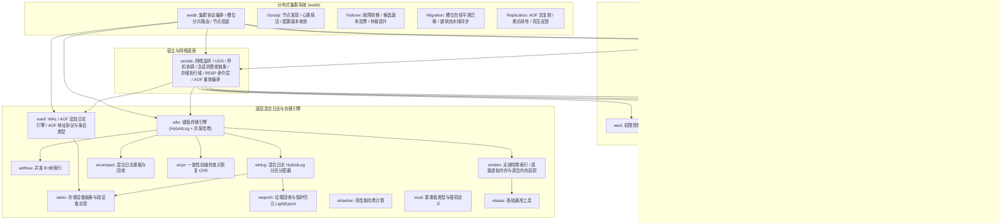

# WeDB: 新一代极致性能 Redis 兼容分布式存储系统

WeDB 是基于 Rust 2024 构建的极致性能 Redis 兼容分布式缓存与持久化存储引擎，深度对标微软 Garnet 体系并进行现代化零成本抽象重构。

系统解耦为三大核心层级：网络宿主与存储执行域底座（`wnode`，含 RESP 命令会话、数据库管理与 AOF 重放编排）、零集群装配的单机服务入口（`wedb_standalone`）以及高可用分布式集群编排（`wedb`）。各模块职责高内聚、物理低耦合、依赖单向无环。

---

## 架构拓扑与 Garnet 模块对标



### 对标 Garnet 模块矩阵

| Garnet 项目 (C#) | WeDB Crate (Rust) | 职责定位 |
|:---|:---|:---|
| `Garnet.host` / `libs/networking` / `Garnet.server` | [`wnode`](https://github.com/webc-site/wedb/tree/main/wedb/wnode) | 节点宿主底座与存储执行域：TCP/UDS 监听、嵌套文本配置、优雅关机协调、会话消费者接口；RESP 命令会话层、数据库与事务/PubSub/TTL 执行域、AOF 追加与重放编排（`AofProcessor` / `replaycoordinator`）、范围索引复制迁移编排（**无集群业务逻辑**，集群能力经 `ClusterProvider` / `ClusterSession` 切面注入，缺省 `NoopClusterProvider` 零开销直通） |
| `Garnet.host` `GarnetServer.cs` 启动装配 | [`wedb_standalone`](https://github.com/webc-site/wedb/tree/main/wedb/wedb_standalone) | 单机 Redis 兼容服务入口（仅 `main.rs`）：三层配置解析与 `RespSessionConsumer` 会话装配，执行域逻辑全在 `wnode`、与集群同源（**100% 纯单机，零集群代码**；正式依赖仅 `wconf` + `wnode`，其余 crate 皆为 dev-dependencies） |
| `Garnet.cluster` | [`wedb`](https://github.com/webc-site/wedb/tree/main/wedb/wedb) | 分布式集群协议与状态机：Gossip 探活、Failover 故障转移、Migration 槽位迁移、Replication 主从复制（**零依赖 `wedb_standalone`**） |
| `Garnet.client` | [`wconn`](https://github.com/webc-site/wedb/tree/main/wedb/wconn) | 异步客户端连接层：握手管理、请求流水线编排、网络缓冲区管理 |
| `libs/server/Resp` | [`wresp`](https://github.com/webc-site/wedb/tree/main/wedb/wresp) | 二进制安全 RESP 协议解析器、命令枚举与参数提取 |
| `libs/server/ACL` | [`wacl`](https://github.com/webc-site/wedb/tree/main/wedb/wacl) | 用户身份验证、命令类别白名单与键权限过滤 |
| `libs/server/Lua` | [`wlua`](https://github.com/webc-site/wedb/tree/main/wedb/wlua) | 嵌入式 Lua 沙箱运行器与脚本缓存 |
| `libs/server/Objects` | [`wcol`](https://github.com/webc-site/wedb/tree/main/wedb/wcol) | 复杂数据结构内存信封（Hash/Set/ZSet/List/Geo）与条目经纪（item broker）；不含范围索引算子层 |
| `Tsavorite.core` | [`wkv`](https://github.com/webc-site/wedb/tree/main/wedb/wkv), [`whlog`](https://github.com/webc-site/wedb/tree/main/wedb/whlog), [`windex`](https://github.com/webc-site/wedb/tree/main/wedb/windex), [`wcpr`](https://github.com/webc-site/wedb/tree/main/wedb/wcpr) | 混合并发哈希与日志存储核心、无锁哈希索引与直接虚拟内存 / 原生内存追踪（`windex::ram`）、增量检查点与崩溃恢复 |
| `bftree-garnet` | [`wbftree`](https://github.com/webc-site/wedb/tree/main/wedb/wbftree) | 高性能并发无锁 B+ 树引擎与 RangeIndex 范围索引算子管理层（`BfTreeService` / `RangeIndexManager`；存根与守护接入 `wkv`，RI.* 协议命令在 `wnode`） |
| `Tsavorite.devices` | [`wdev`](https://github.com/webc-site/wedb/tree/main/wedb/wdev), [`waof`](https://github.com/webc-site/wedb/tree/main/wedb/waof) | 存储设备适配器（段文件、直接 I/O）、预写日志追加流 |
| `libs/common` | [`wbase`](https://github.com/webc-site/wedb/tree/main/wedb/wbase), [`whasher`](https://github.com/webc-site/wedb/tree/main/wedb/whasher), [`wval`](https://github.com/webc-site/wedb/tree/main/wedb/wval) | 基础通用工具与缓冲池（分级扇区对齐 `wbase::pool::BufferPool`、固定块网络池 `wbase::pool::LimitedFixedBufferPool`）、哈希算法、二进制紧凑值布局与基元工具 |
| `modules/*` | [`wext_json`](https://github.com/webc-site/wedb/tree/main/wedb/wext_json), [`wext_roaring`](https://github.com/webc-site/wedb/tree/main/wedb/wext_roaring) | 编译期静态特性扩展（`wnode` 的 `default = ["roaring", "json"]` 分别引入两个 crate）：RedisJSON 语法支持与 RoaringBitmap 位图计算；C# 侧 `NoOpModule` 系示例插件，按静态特性裁定不转写 |

---

## 核心解耦架构

### 1. 单机与集群彻底物理剥离
- **`wedb_standalone` 纯粹化**：
  单机入口仅装配 `wnode` 的无集群形态：注入 `NoopClusterProvider` 零开销直通、会话不持集群切面，代码中不存在任何集群槽位检验、角色切换锁或集群会话分支，本地执行保持精瘦。
- **`wedb` 集群完全独立**：
  集群层聚焦于分布式拓扑协调。`wedb/Cargo.toml` 中**彻底剔除对 `wedb_standalone` 的依赖**，集群会话与复制链路经由统一底座及存储抽象切面完成，消除巨石交叉引用。

### 2. 底座职责极致纯化（`wnode` 与 `waof`）
- **`wnode` 宿主底座与存储执行域**：
  底层通信（TCP/UDS 监听、慢流控闸门、生命周期管理与 `MessageConsumerFace` / `SessionProviderFace` 纯虚会话契约）之外，还承载单机与集群同源的存储执行域：`database` / `storage` 数据库管理与执行会话、`resp` 命令会话层、`aof` 追加日志与重放编排（`AofProcessor` / `replaycoordinator` / `recover`）、`range_index` 复制迁移编排；不含集群业务逻辑，集群能力由 `wedb` 经 `ClusterProvider` / `ClusterSession` trait 注入。网络缓冲区不自建池，而是经 `wbase` 的 `pool` 特性借用 `LimitedFixedBufferPool`：本体归属 `wbase::pool`，固定 64KB 块、池内常驻上限 1024，由 `crossfire` 有界 MPMC 环无锁借还，并非分片结构。
- **`waof` WAL 与 AOF 协议引擎**：
  独立承载预写日志追加与复制协议基元：
  - **`AofAddress`**：40 字节紧凑全序复制/日志位点，支持栈上零分配序列化。
  - **`AofEntryType`**：高效判别 AOF 物理载荷类型的统一枚举。
  - **多子日志追加与持久化**：管理分段 AOF 文件与追加写入。
- **`wedb` 集群专有切面**：
  分布式集群特有的高可用切面完整收敛于 `wedb` 内部，不对底层造成任何抽象泄漏：
  - **`CheckpointCallbackFace`**：检查点状态流转通知切面。
  - **`StoreCommitFn`**：AOF 提交标记写入委托闭包（对标 C# StoreWrapper.EnqueueCommit 直调，非 trait）。
  - **`AofBackpressure`**（本体在 `wnode::aof`，由 `wedb` 复制链路消费）：基于每物理子日志已发布（ship）水位与字节预算的主侧反压闸门，校验路径零锁、`event_listener` 事件驱动挂起。
  - **`ReplicaReplayHook`**：物理帧落盘后的重放驱动切面。

---

## 极致性能技术选型

遵循现代 Rust 高性能规范，关键路径全面剔除多余开销：

- **异步运行时**：基于 `compio`，结合操作系统原语（Linux `io_uring` / macOS `kqueue` / Windows `IOCP`）实现零拷贝异步 I/O。
- **并发字典**：并发哈希字典采用 `papaya`，哈希算法采用 `gxhash`。
- **同步原语**：全局禁用 `std::sync::Mutex` 与 `std::sync::RwLock`，统一采用 `parking_lot` 避免毒化开销与自旋损耗。
- **管道通信**：内部多生产者单消费者/异步队列统一采用 `crossfire`。
- **时钟与时间**：避免高频系统调用，时间戳读取统一采用 `coarsetime`；高精度纳秒全序序列号采用原子递增推进。
- **零分配序列化**：数值转换采用 `itoa` 与 `zmij`，JSON 解析采用 `sonic-rs`，数据流编解码采用 `bitcode`。

---

## 快速开始与验证

分章文档：[性能评测](https://github.com/webc-site/wedb/tree/main/readme/zh/bench.md)。

### 编译与检查

```bash
# 执行全量代码规范与 Clippy 零警告校验
./clippy.sh

# 执行全套 1800+ 集成与单元测试
./test.sh
```

### 启动单机节点

```bash
cargo run --release -p wedb_standalone -- --port 6379 --dir ./data
```

### 启动分布式集群节点

```bash
cargo run --release -p wedb -- --port 7000 --dir ./cluster_data_7000
```
