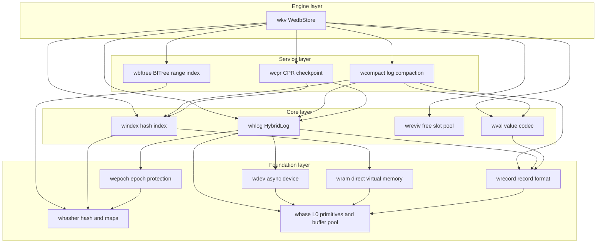
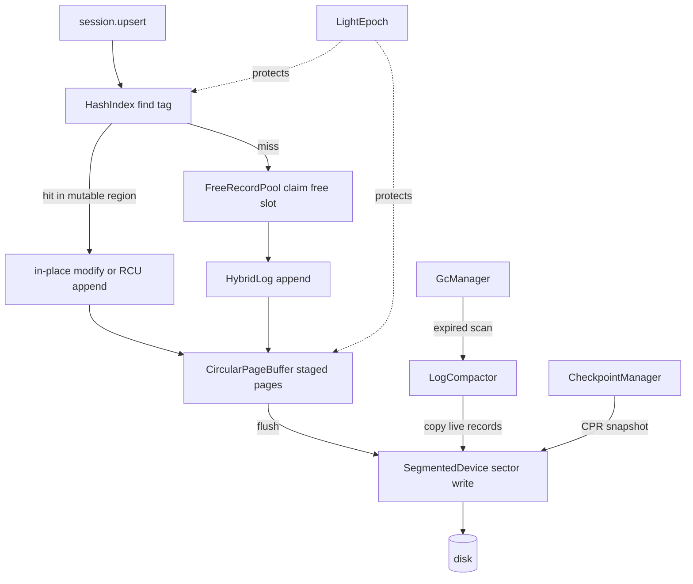
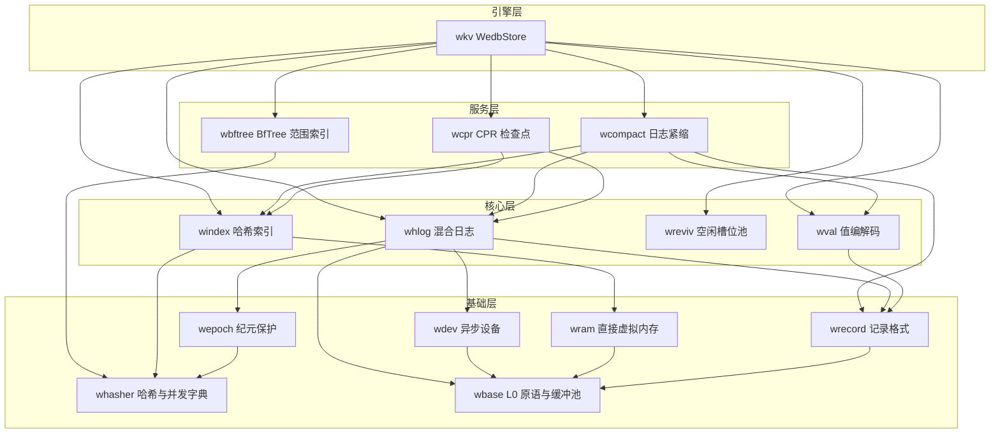
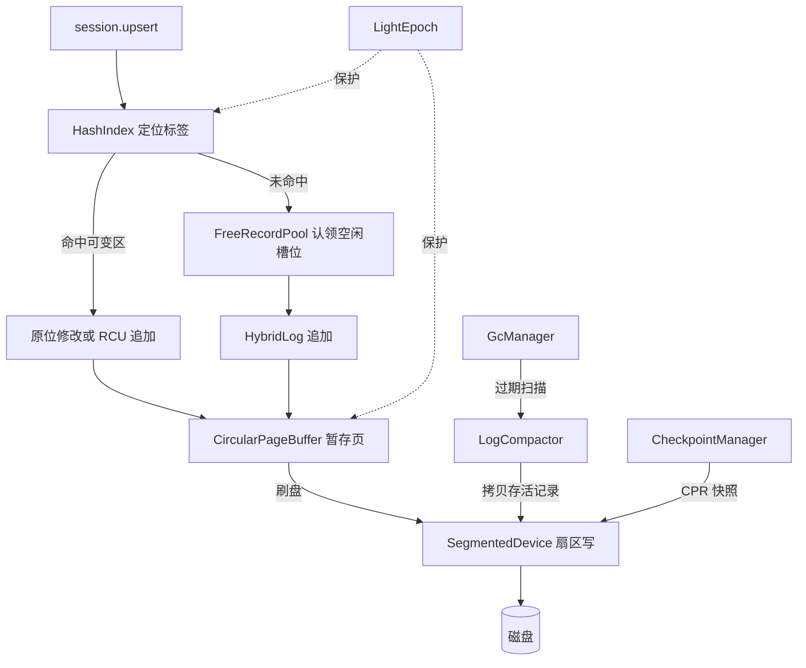

[English](#en) | [中文](#zh)

---

<a name="en"></a>

# WeDB Base : Full-stack Rust rewrite of the Microsoft Garnet storage engine

WeDB Base is the storage foundation of [WeDB](https://github.com/webc-site/wedb). It rewrites the C# storage core of Microsoft [Garnet](https://github.com/microsoft/garnet) — Tsavorite HybridLog, lock-free hash index, CPR checkpointing, revivification, log compaction — plus BfTree range indexing, delivered as fifteen focused Rust crates on the `compio` async runtime (Linux io_uring, Windows IOCP, macOS kqueue).

- [What It Does](#what-it-does)
- [Usage](#usage)
- [Highlights](#highlights)
- [Design](#design)
- [Tech Stack](#tech-stack)
- [Directory Layout](#directory-layout)
- [API Reference](#api-reference)
  - [wkv — top-level engine](#wkv-top-level-engine)
  - [wbase — L0 primitives](#wbase-l0-primitives)
  - [wram — direct virtual memory](#wram-direct-virtual-memory)
  - [whasher — hashing and concurrent maps](#whasher-hashing-and-concurrent-maps)
  - [wepoch — epoch protection](#wepoch-epoch-protection)
  - [wdev — async devices](#wdev-async-devices)
  - [wrecord — record format](#wrecord-record-format)
  - [wval — value layer](#wval-value-layer)
  - [windex — lock-free hash index](#windex-lock-free-hash-index)
  - [whlog — HybridLog allocator](#whlog-hybridlog-allocator)
  - [wreviv — free slot recycling](#wreviv-free-slot-recycling)
  - [wbftree — BfTree range index](#wbftree-bftree-range-index)
  - [wcompact — log compaction](#wcompact-log-compaction)
  - [wcpr — CPR checkpointing](#wcpr-cpr-checkpointing)

- [What It Does](#what-it-does)
- [Usage](#usage)
- [Highlights](#highlights)
- [Design](#design)
- [Tech Stack](#tech-stack)
- [Directory Layout](#directory-layout)
- [API Reference](#api-reference)
  - [wkv — top-level engine](#wkv-top-level-engine)
  - [wbase — L0 primitives](#wbase-l0-primitives)
  - [wram — direct virtual memory](#wram-direct-virtual-memory)
  - [whasher — hashing and concurrent maps](#whasher-hashing-and-concurrent-maps)
  - [wepoch — epoch protection](#wepoch-epoch-protection)
  - [wdev — async devices](#wdev-async-devices)
  - [wrecord — record format](#wrecord-record-format)
  - [wval — value layer](#wval-value-layer)
  - [windex — lock-free hash index](#windex-lock-free-hash-index)
  - [whlog — HybridLog allocator](#whlog-hybridlog-allocator)
  - [wreviv — free slot recycling](#wreviv-free-slot-recycling)
  - [wbftree — BfTree range index](#wbftree-bftree-range-index)
  - [wcompact — log compaction](#wcompact-log-compaction)
  - [wcpr — CPR checkpointing](#wcpr-cpr-checkpointing)

## What It Does

The workspace ships a layered storage stack. At the bottom, `wbase` provides cacheline-safe primitives: 48-bit log addressing, sector alignment math, adaptive backoff, TLS thread identity, and tiered Direct I/O sector-aligned buffer pools (mirroring the bottom-layer role of Tsavorite `core/Utilities`). `wram` manages direct virtual memory and native allocation tracking (with buffer pool compatibility re-exports). `whasher` wraps AES-accelerated GxHash, parallel-lane streaming checksums, and lock-free Papaya maps. `wepoch` supplies epoch protection for safe memory reclamation. `wdev` abstracts async block devices over `compio`.

On top of that foundation sit the Tsavorite-equivalent cores. `wrecord` defines the 16-byte record header and zero-copy record views. `windex` implements the 64-byte-aligned lock-free hash index with overflow buckets and per-bucket guards. `whlog` implements the HybridLog allocator with its three-region sliding window (Mutable / ReadOnly / OnDisk). `wreviv` recycles deleted record slots. `wval` adds the Redis value layer: multi-tenant namespace encoding, collection metadata, and compact hash / set / zset codecs.

Service crates orchestrate those cores. `wcpr` drives Concurrent Prefix Recovery checkpoints. `wcompact` compacts read-only log segments and physically truncates reclaimed segment files. `wbftree` manages BfTree-backed ordered range indexes. The `wkv` crate binds everything into `WedbStore`, a single-node engine with sessions, record-level TTL, background GC, read cache, checkpoint recovery, and range-index operations.

## Usage

Open a store on a segmented file device, then run CRUD through a session. Tests express errors via `aok::Void`; production code maps `wkv::Result` directly.

```rust
use std::sync::Arc;

use compio::runtime::Runtime;
use wdev::SegmentedDevice;
use wkv::{StoreConfig, WedbStore};

let rt = Runtime::new()?;
rt.block_on(async {
  // Auto-probe the host, or pin capacity explicitly:
  // index buckets, page size, page count, mutable fraction
  let config = StoreConfig::new(2048, 64 * 1024, 16, 0.5)?;
  let device = Arc::new(SegmentedDevice::single_file("demo.db")?);
  let store = Arc::new(WedbStore::open(config, device)?);

  let session = store.new_session()?;

  // Upsert, read, delete
  let addr = session.upsert(b"user:1001", b"alice").await?;
  assert!(addr > 0);
  assert_eq!(session.read(b"user:1001").await?, Some(b"alice".to_vec()));
  assert!(session.delete(b"user:1001").await?);

  // Flush the in-memory tail to disk
  store.flush_all().await?;

  Ok::<(), wkv::Error>(())
})?;
```

Record-level TTL follows Redis `EXPIREAT` / `PERSIST` return-code semantics: `-2` missing key, `0` condition rejected, `1` applied, `2` already expired and physically purged. Expired keys vanish lazily on read; background GC purges them ahead of scans.

```rust
use wbase::time::now_ms;
use wkv::TtlOpt;

assert_eq!(session.expire_at(b"session:42", now_ms() + 60_000, TtlOpt::NONE).await?, 1);
assert_eq!(session.ttl_of(b"session:42").await?, Some(now_ms() + 60_000));
assert_eq!(session.persist(b"session:42").await?, 1);
```

Checkpoint and crash-recover via CPR. After `FoldOver`, the read-only address aligns exactly with the tail address and every record seals on recovery. Recovery rebuilds capacity from the persisted `StoreMeta` — never silently resizes the index.

```rust
use std::sync::Arc;

use compio::runtime::Runtime;
use wcpr::CheckpointType;
use wdev::SegmentedDevice;
use wkv::{CheckpointManager, StoreConfig, WedbStore};

let rt = Runtime::new()?;
rt.block_on(async {
  let ckpt_dir = std::path::Path::new("checkpoints");

  // 1. Write data, take a FoldOver checkpoint, then drop the store
  let token;
  {
    let device = Arc::new(SegmentedDevice::single_file("demo.db")?);
    let store = Arc::new(WedbStore::open(StoreConfig::default(), device)?);
    let session = store.new_session()?;
    for i in 0..1000 {
      let k = format!("user_click:{i:05}");
      let v = format!("click_count_{i}");
      session.upsert(k.as_bytes(), v.as_bytes()).await?;
    }
    let meta = CheckpointManager::new()
      .create_checkpoint(&store, ckpt_dir, CheckpointType::FoldOver)
      .await?;
    token = meta.token;
  } // process exit simulated here

  // 2. Recover onto a fresh engine and verify
  let device = Arc::new(SegmentedDevice::single_file("demo.db")?);
  let recovered = Arc::new(CheckpointManager::recover(ckpt_dir, token, device).await?);
  assert_eq!(recovered.entry_count(), 1000);

  Ok::<(), wkv::Error>(())
})?;
```

Background GC starts automatically on `open_shared` when `config.gc.enabled`; retune it at runtime without restart, and drive single rounds manually when needed.

```rust
store.start_gc();
store.update_gc_config(|gc| {
  gc.scan_interval_ms = 60_000;
  gc.compaction_interval_ms = 300_000;
});
let stats: wkv::GcStatsSnapshot = store.gc_handle().unwrap().stats();
```

Compaction copies live records down the log and physically deletes reclaimed segment files.

```rust
use wcompact::{CompactionType, LogCompactor};

let stats = LogCompactor::new(Arc::clone(&store))
  .compact(2 * segment_size, CompactionType::Scan)
  .await?;
assert_eq!(store.begin_address(), stats.new_begin_address);
```

Range indexes answer ordered scans and closed-interval range queries for large sorted collections, backed by BfTree with records carried as 35-byte stubs inside the main log.

```rust
use wbftree::{ScanReturnField, StorageBackend, TreeTuning};

session
  .range_index_create(b"leaderboard", StorageBackend::Std, TreeTuning::default())
  .await?;
session.range_index_set(b"leaderboard", b"score:alice", b"9800").await?;
let records = session
  .range_index_scan(b"leaderboard", b"", 10, ScanReturnField::KeyAndValue)
  .await?;
```

## Highlights

- HybridLog memory-disk duality: mutable tail serves reads and in-place updates from memory; flush pipelines move sealed pages to disk through sector-aligned I/O.
- Lock-free hash index: fixed-capacity 64-byte buckets, overflow bucket pool, CAS slot updates guarded by shared / exclusive bucket guards, no rehash on the hot path.
- CPR checkpointing: `FoldOver` seals history read-only; `Snapshot` rebuilds the mutable region at recovery without separate snapshot files. Token ordering stays monotonic even across wall-clock regressions.
- Revivification: deleted slots return to size-binned free pools (First-Fit / Best-Fit) and revive in place, cutting allocation and log growth.
- BfTree range indexes: multi-tree registry with lazy recovery, chunked migration protocol, and write barriers shared with the main log.
- Redis-semantics TTL: `expire_at` / `persist` return codes align with Redis 7.4; NX / XX / GT / LT options, lazy expiry on read, and scheduled physical purge.
- Zero-copy discipline: `RecordRef` / `RecordMut` views, `fast_key_eq` SIMD comparison, and stack-backed key buffers avoid allocations on the hot path.
- Crash-consistent devices: `SegmentedDevice` enforces parent-directory fsync so file creation survives power loss.

## Design

Module layering follows strict single-direction dependencies; each layer imports only what it needs.



A write flows from session to disk as follows: locate the hash tag, claim memory in the HybridLog mutable region (reviving freed slots when enabled), stage the page in the circular buffer, then flush sealed pages to the device under epoch protection. GC and checkpoints run as side channels over the same device.



## Tech Stack

- Runtime: `compio` — io_uring on Linux, IOCP on Windows, kqueue on macOS.
- Hashing: `gxhash` AES-accelerated backends; `crc32fast` checksums.
- Concurrency: `papaya` lock-free maps, `parking_lot` striped locks.
- Serialization: `bitcode` binary codecs, `sonic-rs` for checkpoint metadata, `itoa` / `zmij` number formatting.
- Ordered index: `bf-tree` block-format BfTree.
- Errors and enums: `thiserror`, `strum`.
- Observability: `log` facade with `log_init` in tests.

## Directory Layout

```text
wedb/
  wbase/     L0 primitives: addressing, alignment, buffer pool (BufferPool), backoff, varint, glob, TLS thread id
  wram/      direct virtual memory, native memory tracker (buffer pool re-exported from wbase)
  whasher/   GxHash backends, streaming checksums, Papaya concurrent maps
  wepoch/    LightEpoch protection and entry table
  wdev/      compio Device trait, SegmentedDevice, NullDevice, fsync contract
  wrecord/   16B record header, zero-copy views, chunk framing, SIMD key compare
  wval/      namespace and session key codec, collection metadata, compact codecs, glob, TTL
  windex/    lock-free hash index, overflow pool, bucket guards
  whlog/     HybridLog allocator, address manager, page buffer, scan iterator
  wreviv/    free record pool, size-binned revivification
  wbftree/   BfTreeService, RangeIndexManager, chunked migration, 35B stub
  wcompact/  LogCompactor, compact session traits, compaction stats
  wcpr/      CPR checkpoint state machine, index checkpoint I/O, metadata formats
  wkv/       WedbStore, sessions, TTL, GC, read cache, recovery orchestration
  example/   workspace template with test scaffolding (not published)
  sh/        development and publish scripts
  test.sh    cargo nextest entry with all features
```

## API Reference

### wkv — top-level engine

- `WedbStore<D: Device>` — the engine over hash index, HybridLog, epoch, device, BfTree, range index, revivification pool, and read cache. Key methods:
  - `WedbStore::open(config, device)` / `open_shared` — build the engine; `open_shared` idempotently spawns GC when `config.gc.enabled`. Index capacity is fixed for the lifetime of the store.
  - `new_session()` — register a participant and return a `StoreSession<D>`.
  - `flush_all()` / `flush_and_evict_all()` — drain mutable pages to disk, optionally evicting memory.
  - `create_checkpoint(dir, CheckpointType)`, `create_checkpoint_with_token(dir, type, token)`, `WedbStore::recover(dir, token, device)`, `recover_latest(dir, device)` — checkpoint shortcuts without instantiating a manager.
  - `compact(until_address, CompactionType)`, `compact_with_filter`, `compact_lazy(max_seek_bytes)`, `compactor()` — hosted compaction entry points.
  - `start_gc()`, `update_gc_config(f)`, `gc_config()`, `gc_handle()` — background GC lifecycle and hot reload; each loop round re-reads the config.
  - `set_write_listener` / `set_range_listener` — inject AOF / replication adapters as ports.
  - Address observability: `tail_address`, `read_only_address`, `head_address`, `begin_address`, `shift_read_only_address`, `shift_head_address`, `shift_begin_address`, `truncate`.
  - `keyspace_stats()` — live / expired key census via a pooled scan session.
  - `entry_count()`, `hlog()`, `expired_key_deletion_scan`.
- `StoreConfig` — index buckets, page size, page count, mutable fraction, max sessions, range index dir, revivification / read cache switches, `GcConfig`. Constructors: `auto()`, `auto_with_budget(bytes)`, `new(...)`, `minimal()`, `recommended_index_size(expected_keys)`; builders `with_max_sessions`, `with_revivification`, `with_read_cache`, `with_read_cache_pages`, `with_range_index_dir`, `with_gc`.
- `StoreSession<D>` — session-scoped operations:
  - `upsert` / `read` / `delete` / `contains_key` / `read_batch_with` — tagged user-key CRUD; `upsert_raw` / `read_raw` / `read_raw_with` / `delete_raw` / `contains_key_raw` / `read_record(addr)` operate on physical keys.
  - `try_read_in_memory`, `try_modify_in_place`, `try_modify_with_slack`, `try_upsert_sync`, `try_read_sync`, `try_read_batch_in_memory` — fast paths that skip flush waits; `*_unprotected` variants for batch contexts.
  - `expire_at(key, ms, TtlOpt)` / `persist(key)` / `ttl_of(key)` — Redis-semantics record TTL; `hexpire_at`, `hpersist`, `collect_expired_hash_fields` — hash field TTL.
  - `set_context(ns, db)`, `set_namespace`, `set_active_db` — multi-tenant routing; `session_prefix()` exposes the 19-byte zero-allocation prefix.
  - `set_copy_reads_to_tail`, `set_record_elision` — Garnet-aligned read promotion and record elision switches.
  - `enter_batch()` — `BatchStoreSession` groups writes into one epoch window.
  - `load_meta`, `save_meta`, `load_collection_raw_read`, `save_compact_meta`, `append_hash_field(s)_batch` — collection metadata and chunked storage.
  - `range_index_create(key, StorageBackend, TreeTuning)` / `set` / `get` / `del` / `scan(key, start, count, ScanReturnField)` / `scan_stream` / `range(key, start, end, field)` / `range_stream` / `exists` / `config` / `metrics` / `rename_range_index` — BfTree range index operations.
- `CheckpointManager` — `create_checkpoint(store, dir, CheckpointType)`, `create_checkpoint_with_token`, `recover(dir, token, device) -> WedbStore`, `recover_latest`, `recover_store`, `list_checkpoints`, `find_latest_checkpoint`, `purge_checkpoint(dir, token)`, `purge_all_checkpoints`; plus `take_cpr_snapshots` / `recover_cpr_snapshots`.
- GC surface: `GcManager` (`new`, `spawn`, `run_once`, `drive`), `GcHandle` (`stats`, `stop`, `run_once`), `GcStatsSnapshot`, `GcConfig`, `RunGuard`.
- Re-exports from member crates: `DefaultWedbStore`, `LogCompactor`, `CompactSession`, `CompactStore`, `CompactionStats`, `CompactionType`, `CheckpointMeta`, `CheckpointType`, `CprRecover`, `CprStore`, `StoreMeta`, `BfTreeService`, `RangeIndexManager`, `RangeIndexStub`, `RangeIndexError`, `ScanRecord`, `ScanReturnField`, `StorageBackend`, `StorageBackendType`, `TreeTuning`, `StorageEncoding`, `TaggedKeyBuf`, `ReadCache`, `TtlOpt`, `TtlProbe`, `WriteListenerFn`, `RangeIndexListenerFn`.

### wbase — L0 primitives

Feature-gated modules, no `full` feature: `addr` (48-bit `LogAddress` masking), `align` (64B cacheline / sector math), `backoff` (adaptive retry state machine), `base32`, `buf`, `crc` (`crc32fast`), `float` (order-preserving f64 bits), `glob`, `pool` (`BufferPool` tiered Direct I/O pools, `AlignedBuf` sector-aligned buffers, mirroring Tsavorite `core/Utilities/BufferPool.OriginReturn.cs`), `simd`, `striped` (lock striping), `thread` (TLS thread identity), `time` (`coarsetime` helpers, `now_ms`), `varint` (OPPV varints).

### wram — direct virtual memory

- `DirectVirtualMemory`, `DirectVmBlock`, `system_page_size()` (mirroring `core/Native/DirectVirtualMemory.cs`).
- `NativeMemoryTracker`; alignment helpers `align_up` / `align_down` / `checked_align_up` / `is_aligned` / `SectorRange` re-exported for compatibility.
- `BufferPool` / `AlignedBuf` re-exported from wbase (Allocator→Utilities direction, same as C#).

### whasher — hashing and concurrent maps

- `fast_hash(_with_seed)`, `fast_hash_u64`, `fast_hash128`, `hash128(_with_seed)`, `hash_value(_with_seed)` — GxHash backends.
- `StreamHasher` — four parallel lanes, streaming checksum with `write` / `finish` / `reset` / `total_bytes_written`.
- `compute_checksum(_with_seed)` — CRC-based checksums; `mix13` / `splitmix64` / `mix_thread_id` — bit mixers.
- Re-exports `gxhash` `HashMap` / `HashSet` plus `GxPapayaMap` / `GxPapayaSet` lock-free concurrent collections with constructors `new_papaya_map`, `papaya_map_with_capacity`, `new_papaya_set`.

### wepoch — epoch protection

- `LightEpoch` — `register()`, `suspend` / `resume`, `protect_and_drain()`, `protected_scope()`, `bump_epoch` / `bump_current_epoch_action`, `drain()`, `safe_to_reclaim_epoch()`, `allocate_user_word()`.
- `Participant`, `EpochGuard`, `ProtectedScope`, `EpochEntry`, `MAX_USER_WORDS`.

### wdev — async devices

- `Device` / `StorageDevice` traits — async read / write / flush with segment lifecycle.
- `SegmentedDevice` — growable segmented file (`single_file` and `segmented` constructors), `SegmentChunk` / `SegmentChunks`, `FileMap`.
- `NullDevice` — discard sink for benchmarks.
- `sys::detect_system_memory` / `detect_cpu_cores`, `MAX_SEGMENT_SIZE`; re-exports `wbase::BufferPool` (Utilities-layer primitive).

### wrecord — record format

- `RecordHeader` constants — `HEADER_SIZE` (16B), `SEALED_BIT`, `TOMBSTONE_BIT`, `READ_CACHE_BIT`, `MODIFIED_BIT`, `IN_NEW_VERSION_BIT`, `ADDRESS_MASK`, `MAX_FILLER_BYTES`.
- `RecordRef` / `RecordMut` — zero-copy read / write views over log memory.
- `record_size`, `checked_record_size`, `encode_to_slice`, `try_encode_to_vec` — encode records into log slots.
- `ChunkCodec` / `ChunkIter` — length-prefix chunk framing; `fast_key_eq` — SIMD key comparison.

### wval — value layer

- `KeyTag`, `CollectionType` (`Hash` / `Set` / `ZSet` / `RangeIndex` / …), `StorageEncoding` — tagged key scheme.
- `NamespaceDbCodec`, `SessionPrefixBuf`, `TaggedKeyBuf`, `SubKeyCodec` / `SubKeyRef`, `DecodedSubKey` — multi-tenant namespace, session prefix, and subkey encoding over OPPV varints with stack-buffer constants (`STACK_KEY_CAP`, `MAX_SESSION_PREFIX_LEN`).
- `MetaValue` / `CompactMetaValue` — collection metadata; `CompactHash` / `CompactSet` / `CompactZSet` codecs with iterators; zset subkeys via `ZScoreKeyRef` / `ZMemberKeyRef` and order-preserving f64 codecs.
- `glob_match(_nocase)(_opt)` — Redis-style glob matching; `TtlCodec` — field-level TTL values; `sample_distinct_indices` — distinct sampling; `RecordValueExt` / `RecordValueMutExt` — bridge record views to value parsing.

### windex — lock-free hash index

- `HashIndex` — fixed-capacity table of 64B buckets; `find_tag` / `find_tag_by_hash`, CAS slot updates through `HashEntryInfo`, `acquire_keys_lock_exclusive` for read-modify-write serialization.
- `HashBucket` (`ENTRIES_PER_BUCKET`, `DATA_ENTRIES`, `OVERFLOW_INDEX`), `HashBucketEntry`, `CandidateAddresses` (inline candidate list with `retain` / `sort_descending`).
- `OverflowPool`, `MultiBucketGuard`, `BucketExclusiveGuard` / `BucketSharedGuard`, `prefetch_read_l1`.

### whlog — HybridLog allocator

- `HybridLog<D>` — `append`, `try_update_in_place`, `try_modify_record_in_place`, `try_modify_record_with_slack`, `try_revivify_in_chain`, region shifting (`shift_read_only_address`, `shift_head_address`, `shift_begin_address`), `read_record` / `read_disk_record`, `flush_page(s_range)` / `flush_all` / `sync`, `iterate_version_chain`, `with_memory_record`, scan, and `recover`.
- `HybridLogConfig` — page size, page count, mutable fraction defaults and `ro_lag_num_from_fraction`.
- `AddressManager` / `AddressSnapshot` — logical / physical address translation; `CircularPageBuffer` — staged page ring; `PendingFlushList` / `PageFlushRange` — flush bookkeeping; `ScanIterator`, `RecordOutput`.

### wreviv — free slot recycling

- `FreeRecordPool` — size-binned pools (`DEFAULT_BIN_SIZES`, `DEFAULT_BIN_CAPACITY`), `RevivAllocation`, `RevivStats`.
- `FreeRecordBin`, `FreeRecord`, `SetStatus`, `USE_FIRST_FIT`, `BEST_FIT_SCAN_ALL`.

### wbftree — BfTree range index

- `BfTreeService` — `new(BfTreeConfig)`, `open_disk(path, cb_min_record_size)` / `open_memory(...)`, `insert`, `read` / `read_into`, `delete`, `scan_with_count(_callback)`, `scan_with_end_key(_callback)`, `scan_all(_callback)`, `write_barrier()`, `cpr_snapshot(path)`, `recover_in_place(snapshot, work)`, result types `BfTreeInsertResult` / `BfTreeReadResult` / `BfTreeDeleteResult`.
- `RangeIndexManager` — multi-tree registry keyed by `key_id_of(key)`, lazy recovery, checkpoint claim / release, `RangeIndexLocks` striped locking.
- `RangeIndexStub` (`RANGE_INDEX_STUB_SIZE` = 35B), `RangeIndexChunkedSerializer` / `RangeIndexChunkedDeserializer` / `RangeIndexMigrationReader`, `compute_checksum(_with_seed)`.

### wcompact — log compaction

- `LogCompactor<S: CompactStore>` — `new(store)`, `with_cas_retries`, `compact(until_address, CompactionType)`, `compact_lazy(max_seek_bytes)`, `compact_with_filter`; physically truncates reclaimed segment files.
- `CompactStore` / `CompactSession` — host traits wiring the compactor to a live engine; `CompactionType`, `CompactionStats`.

### wcpr — CPR checkpointing

- `CprStore` / `CprRecover` — trait contracts for stores participating in checkpoint / recovery.
- `RecoveredCheckpoint<D>` — recovered `CheckpointMeta` plus rebuilt `HashIndex`, `HybridLog`, `LightEpoch`.
- `write_index_checkpoint` / `read_index_checkpoint_truncated`, `take_index_checkpoint`, `IndexCkptHeader`, `next_token`.
- `CheckpointManager` — device-level manager behind the `wkv` wrapper; `CheckpointMeta`, `CheckpointType` (`FoldOver` / `Snapshot`), `StoreMeta`, `HlogMeta`, `IndexMeta`, file naming helpers.


---

<a name="zh"></a>

# WeDB Base : 以 Rust 全栈重写微软 Garnet 存储引擎

WeDB Base 是 [WeDB](https://github.com/webc-site/wedb) 的存储引擎底座。以 Rust 重写微软 [Garnet](https://github.com/microsoft/garnet) 的 C# 存储核心——Tsavorite 混合日志、无锁哈希索引、CPR 检查点、槽位复活、日志紧缩——以及 BfTree 范围索引，拆分为十五个职责单一的 crate，运行于 `compio` 异步运行时（Linux io_uring、Windows IOCP、macOS kqueue）。

- [功能介绍](#功能介绍)
- [使用演示](#使用演示)
- [特性介绍](#特性介绍)
- [设计思路](#设计思路)
- [技术堆栈](#技术堆栈)
- [目录结构](#目录结构)
- [API 说明](#api-说明)
  - [wkv —— 顶层引擎](#wkv-顶层引擎)
  - [wbase —— L0 原语](#wbase-l0-原语)
  - [wram —— 直接虚拟内存](#wram-直接虚拟内存)
  - [whasher —— 哈希与并发字典](#whasher-哈希与并发字典)
  - [wepoch —— 纪元保护](#wepoch-纪元保护)
  - [wdev —— 异步设备](#wdev-异步设备)
  - [wrecord —— 记录格式](#wrecord-记录格式)
  - [wval —— 值层](#wval-值层)
  - [windex —— 无锁哈希索引](#windex-无锁哈希索引)
  - [whlog —— 混合日志分配器](#whlog-混合日志分配器)
  - [wreviv —— 空闲槽位回收](#wreviv-空闲槽位回收)
  - [wbftree —— BfTree 范围索引](#wbftree-bftree-范围索引)
  - [wcompact —— 日志紧缩](#wcompact-日志紧缩)
  - [wcpr —— CPR 检查点](#wcpr-cpr-检查点)

- [功能介绍](#功能介绍)
- [使用演示](#使用演示)
- [特性介绍](#特性介绍)
- [设计思路](#设计思路)
- [技术堆栈](#技术堆栈)
- [目录结构](#目录结构)
- [API 说明](#api-说明)
  - [wkv —— 顶层引擎](#wkv-顶层引擎)
  - [wbase —— L0 原语](#wbase-l0-原语)
  - [wram —— 直接虚拟内存](#wram-直接虚拟内存)
  - [whasher —— 哈希与并发字典](#whasher-哈希与并发字典)
  - [wepoch —— 纪元保护](#wepoch-纪元保护)
  - [wdev —— 异步设备](#wdev-异步设备)
  - [wrecord —— 记录格式](#wrecord-记录格式)
  - [wval —— 值层](#wval-值层)
  - [windex —— 无锁哈希索引](#windex-无锁哈希索引)
  - [whlog —— 混合日志分配器](#whlog-混合日志分配器)
  - [wreviv —— 空闲槽位回收](#wreviv-空闲槽位回收)
  - [wbftree —— BfTree 范围索引](#wbftree-bftree-范围索引)
  - [wcompact —— 日志紧缩](#wcompact-日志紧缩)
  - [wcpr —— CPR 检查点](#wcpr-cpr-检查点)

## 功能介绍

工作区分层交付整套存储栈。底层 `wbase` 提供缓存行安全原语：48 位日志寻址、扇区对齐运算、自适应退避、TLS 线程标识，并承载分级 Direct I/O 扇区对齐缓冲池（对标 Tsavorite `core/Utilities` 底层位）。`wram` 管理直接虚拟内存与原生内存追踪（兼容再导出缓冲池）。`whasher` 封装 AES 加速 GxHash、四链并行流式校验和与 Papaya 无锁并发字典。`wepoch` 提供纪元保护，支撑安全内存回收。`wdev` 基于 `compio` 抽象异步块设备。

核心层对标 Tsavorite。`wrecord` 定义 16 字节记录头与零拷贝记录视图。`windex` 实现 64 字节对齐的无锁哈希索引，含溢出桶池与桶级并发守卫。`whlog` 实现混合日志分配器与三区滑动窗口（可变 / 只读 / 磁盘）。`wreviv` 回收已删记录槽位。`wval` 叠加 Redis 值层：多租户命名空间编码、集合元数据、hash / set / zset 紧凑编解码。

服务层编排核心模块。`wcpr` 驱动 CPR 检查点。`wcompact` 紧缩只读日志段并物理截断回收段文件。`wbftree` 管理基于 BfTree 的有序范围索引。`wkv` 把上述能力聚合为 `WedbStore` 单机引擎，提供存储会话、记录级 TTL、后台 GC、读缓存、检查点恢复与范围索引操作。

## 使用演示

在分段文件设备上打开存储，经会话执行 CRUD。测试用 `aok::Void` 表达错误；生产代码直接映射 `wkv::Result`。

```rust
use std::sync::Arc;

use compio::runtime::Runtime;
use wdev::SegmentedDevice;
use wkv::{StoreConfig, WedbStore};

let rt = Runtime::new()?;
rt.block_on(async {
  // 自动探测宿主机推导配置，或显式指定：
  // 索引桶数、页大小、页数、可变区占比
  let config = StoreConfig::new(2048, 64 * 1024, 16, 0.5)?;
  let device = Arc::new(SegmentedDevice::single_file("demo.db")?);
  let store = Arc::new(WedbStore::open(config, device)?);

  let session = store.new_session()?;

  // 写入、读取、删除
  let addr = session.upsert(b"user:1001", b"alice").await?;
  assert!(addr > 0);
  assert_eq!(session.read(b"user:1001").await?, Some(b"alice".to_vec()));
  assert!(session.delete(b"user:1001").await?);

  // 内存可变区刷盘
  store.flush_all().await?;

  Ok::<(), wkv::Error>(())
})?;
```

记录级 TTL 对齐 Redis `EXPIREAT` / `PERSIST` 返回码语义：-2 键不存在、0 条件不满足、1 设置成功、2 已过期并立即物理删除。过期键读取时惰性消失；后台 GC 提前物理清除。

```rust
use wbase::time::now_ms;
use wkv::TtlOpt;

assert_eq!(session.expire_at(b"session:42", now_ms() + 60_000, TtlOpt::NONE).await?, 1);
assert_eq!(session.ttl_of(b"session:42").await?, Some(now_ms() + 60_000));
assert_eq!(session.persist(b"session:42").await?, 1);
```

经 CPR 做检查点与崩溃恢复。`FoldOver` 恢复后只读地址精确对齐尾地址，全部历史记录封印只读。恢复容量完全由持久化 `StoreMeta` 决定，绝不静默缩表。

```rust
use std::sync::Arc;

use compio::runtime::Runtime;
use wcpr::CheckpointType;
use wdev::SegmentedDevice;
use wkv::{CheckpointManager, StoreConfig, WedbStore};

let rt = Runtime::new()?;
rt.block_on(async {
  let ckpt_dir = std::path::Path::new("checkpoints");

  // 1. 写入数据、创建 FoldOver 检查点、随后释放存储实例
  let token;
  {
    let device = Arc::new(SegmentedDevice::single_file("demo.db")?);
    let store = Arc::new(WedbStore::open(StoreConfig::default(), device)?);
    let session = store.new_session()?;
    for i in 0..1000 {
      let k = format!("user_click:{i:05}");
      let v = format!("click_count_{i}");
      session.upsert(k.as_bytes(), v.as_bytes()).await?;
    }
    let meta = CheckpointManager::new()
      .create_checkpoint(&store, ckpt_dir, CheckpointType::FoldOver)
      .await?;
    token = meta.token;
  } // 此处模拟进程退出

  // 2. 在全新引擎上恢复并校验
  let device = Arc::new(SegmentedDevice::single_file("demo.db")?);
  let recovered = Arc::new(CheckpointManager::recover(ckpt_dir, token, device).await?);
  assert_eq!(recovered.entry_count(), 1000);

  Ok::<(), wkv::Error>(())
})?;
```

`open_shared` 在 `config.gc.enabled` 时自动拉起后台 GC，运行期免重启热调参，亦可手动驱动单轮。

```rust
store.start_gc();
store.update_gc_config(|gc| {
  gc.scan_interval_ms = 60_000;
  gc.compaction_interval_ms = 300_000;
});
let stats: wkv::GcStatsSnapshot = store.gc_handle().unwrap().stats();
```

紧缩把存活记录前移，物理删除回收后的段文件。

```rust
use wcompact::{CompactionType, LogCompactor};

let stats = LogCompactor::new(Arc::clone(&store))
  .compact(2 * segment_size, CompactionType::Scan)
  .await?;
assert_eq!(store.begin_address(), stats.new_begin_address);
```

范围索引服务大规模有序集合的有序扫描与闭区间范围查询，数据落 BfTree，主日志内仅存 35 字节定长桩。

```rust
use wbftree::{ScanReturnField, StorageBackend, TreeTuning};

session
  .range_index_create(b"leaderboard", StorageBackend::Std, TreeTuning::default())
  .await?;
session.range_index_set(b"leaderboard", b"score:alice", b"9800").await?;
let records = session
  .range_index_scan(b"leaderboard", b"", 10, ScanReturnField::KeyAndValue)
  .await?;
```

## 特性介绍

- 混合日志内存磁盘二象性：可变尾区在内存中服务读与原位更新；封印页经扇区对齐 I/O 管道刷盘。
- 无锁哈希索引：定容 64 字节桶、溢出桶池、共享 / 独占桶守卫下的 CAS 槽位更新，热路径无 rehash。
- CPR 检查点：`FoldOver` 封印历史只读；`Snapshot` 恢复时重建可变区，无需独立快照文件。Token 大小序即版本序，墙钟回拨不破坏单调性。
- 槽位复活：已删槽位按尺寸分桶回收（First-Fit / Best-Fit），原位复用，抑制分配与日志增长。
- BfTree 范围索引：多树注册表、惰性恢复、分块迁移协议、与主日志共享写屏障。
- Redis 语义 TTL：`expire_at` / `persist` 返回码对齐 Redis 7.4，支持 NX / XX / GT / LT 条件，读路径惰性过期加定时物理清除。
- 零拷贝纪律：`RecordRef` / `RecordMut` 视图、`fast_key_eq` SIMD 键比较、栈上键缓冲，热路径免分配。
- 崩溃一致设备：`SegmentedDevice` 强制父目录 fsync，掉电后文件创建不丢失。

## 设计思路

模块按严格单向依赖分层，每层只导入所需依赖。



写入路径从会话到磁盘：定位哈希标签，在混合日志可变区占位（启用时优先复活空闲槽位），页进入环形缓冲暂存，封印页在纪元保护下刷入设备。GC 与检查点作为旁路通道复用同一设备。



## 技术堆栈

- 运行时：`compio`——Linux io_uring、Windows IOCP、macOS kqueue。
- 哈希：`gxhash` AES 加速后端；`crc32fast` 校验和。
- 并发：`papaya` 无锁字典、`parking_lot` 条带锁。
- 序列化：`bitcode` 二进制编解码、`sonic-rs` 检查点元数据、`itoa` / `zmij` 数字格式化。
- 有序索引：`bf-tree` 块级 BfTree。
- 错误与枚举：`thiserror`、`strum`。
- 可观测：`log` 门面，测试配 `log_init`。

## 目录结构

```text
wedb/
  wbase/     L0 原语：寻址、对齐、缓冲池（BufferPool）、退避、变长整型、glob、TLS 线程标识
  wram/      直接虚拟内存、原生内存追踪（缓冲池兼容再导出自 wbase）
  whasher/   GxHash 后端、流式校验和、Papaya 并发字典
  wepoch/    LightEpoch 纪元保护与条目表
  wdev/      compio Device trait、SegmentedDevice、NullDevice、fsync 契约
  wrecord/   16B 记录头、零拷贝视图、分块框架、SIMD 键比较
  wval/      命名空间与会话键编码、集合元数据、紧凑编解码、glob、TTL
  windex/    无锁哈希索引、溢出桶池、桶守卫
  whlog/     HybridLog 分配器、地址管理、页缓冲、扫描迭代器
  wreviv/    空闲记录池、按尺寸分桶复活
  wbftree/   BfTreeService、RangeIndexManager、分块迁移、35B 桩
  wcompact/  LogCompactor、紧缩会话 trait、紧缩统计
  wcpr/      CPR 检查点状态机、索引检查点读写、元数据格式
  wkv/       WedbStore、会话、TTL、GC、读缓存、恢复编排
  example/   工作区模板与测试脚手架（不发布）
  sh/        开发与发布脚本
  test.sh    全特性 cargo nextest 入口
```

## API 说明

### wkv —— 顶层引擎

- `WedbStore<D: Device>`——聚合哈希索引、混合日志、纪元、设备、BfTree、范围索引、复活池与读缓存的引擎。核心方法：
  - `WedbStore::open(config, device)` / `open_shared`——构建引擎；`open_shared` 在 `config.gc.enabled` 时幂等拉起 GC。索引容量在生命周期内定容。
  - `new_session()`——注册参与者并返回 `StoreSession<D>`。
  - `flush_all()` / `flush_and_evict_all()`——可变页刷盘，可选逐出内存。
  - `create_checkpoint(dir, CheckpointType)`、`create_checkpoint_with_token(dir, type, token)`、`WedbStore::recover(dir, token, device)`、`recover_latest(dir, device)`——免建管理器的检查点快捷入口。
  - `compact(until_address, CompactionType)`、`compact_with_filter`、`compact_lazy(max_seek_bytes)`、`compactor()`——引擎内置紧缩入口。
  - `start_gc()`、`update_gc_config(f)`、`gc_config()`、`gc_handle()`——后台 GC 生命周期与热更新；驱动循环每轮重读配置。
  - `set_write_listener` / `set_range_listener`——以端口注入 AOF / 复制适配器。
  - 地址观测：`tail_address`、`read_only_address`、`head_address`、`begin_address`、`shift_read_only_address`、`shift_head_address`、`shift_begin_address`、`truncate`。
  - `keyspace_stats()`——经池化扫描会话统计存活 / 过期键。
  - `entry_count()`、`hlog()`、`expired_key_deletion_scan`。
- `StoreConfig`——索引桶数、页大小、页数、可变区占比、最大会话数、范围索引目录、复活 / 读缓存开关、`GcConfig`。构造器：`auto()`、`auto_with_budget(bytes)`、`new(...)`、`minimal()`、`recommended_index_size(expected_keys)`；建造器 `with_max_sessions`、`with_revivification`、`with_read_cache`、`with_read_cache_pages`、`with_range_index_dir`、`with_gc`。
- `StoreSession<D>`——会话级操作：
  - `upsert` / `read` / `delete` / `contains_key` / `read_batch_with`——带标签用户键 CRUD；`upsert_raw` / `read_raw` / `read_raw_with` / `delete_raw` / `contains_key_raw` / `read_record(addr)` 直接操作物理键。
  - `try_read_in_memory`、`try_modify_in_place`、`try_modify_with_slack`、`try_upsert_sync`、`try_read_sync`、`try_read_batch_in_memory`——跳过刷盘等待的快路径；`*_unprotected` 变体服务批处理上下文。
  - `expire_at(key, ms, TtlOpt)` / `persist(key)` / `ttl_of(key)`——Redis 语义记录级 TTL；`hexpire_at`、`hpersist`、`collect_expired_hash_fields`——哈希字段级 TTL。
  - `set_context(ns, db)`、`set_namespace`、`set_active_db`——多租户路由；`session_prefix()` 输出 19 字节零分配前缀。
  - `set_copy_reads_to_tail`、`set_record_elision`——对标 Garnet 的冷读提升与记录脱钩开关。
  - `enter_batch()`——`BatchStoreSession` 将写入聚合到同一纪元窗口。
  - `load_meta`、`save_meta`、`load_collection_raw_read`、`save_compact_meta`、`append_hash_field(s)_batch`——集合元数据与分块存储。
  - `range_index_create(key, StorageBackend, TreeTuning)` / `set` / `get` / `del` / `scan(key, start, count, ScanReturnField)` / `scan_stream` / `range(key, start, end, field)` / `range_stream` / `exists` / `config` / `metrics` / `rename_range_index`——BfTree 范围索引操作。
- `CheckpointManager`——`create_checkpoint(store, dir, CheckpointType)`、`create_checkpoint_with_token`、`recover(dir, token, device) -> WedbStore`、`recover_latest`、`recover_store`、`list_checkpoints`、`find_latest_checkpoint`、`purge_checkpoint(dir, token)`、`purge_all_checkpoints`；另有 `take_cpr_snapshots` / `recover_cpr_snapshots`。
- GC 面：`GcManager`（`new`、`spawn`、`run_once`、`drive`）、`GcHandle`（`stats`、`stop`、`run_once`）、`GcStatsSnapshot`、`GcConfig`、`RunGuard`。
- 成员 crate 再导出：`DefaultWedbStore`、`LogCompactor`、`CompactSession`、`CompactStore`、`CompactionStats`、`CompactionType`、`CheckpointMeta`、`CheckpointType`、`CprRecover`、`CprStore`、`StoreMeta`、`BfTreeService`、`RangeIndexManager`、`RangeIndexStub`、`RangeIndexError`、`ScanRecord`、`ScanReturnField`、`StorageBackend`、`StorageBackendType`、`TreeTuning`、`StorageEncoding`、`TaggedKeyBuf`、`ReadCache`、`TtlOpt`、`TtlProbe`、`WriteListenerFn`、`RangeIndexListenerFn`。

### wbase —— L0 原语

按特性启用的模块，无 `full` 特性：`addr`（48 位 `LogAddress` 掩码）、`align`（64B 缓存行 / 扇区运算）、`backoff`（自适应重试状态机）、`base32`、`buf`、`crc`（`crc32fast`）、`float`（保序 f64 位模式）、`glob`、`pool`（`BufferPool` 分级 Direct I/O 缓冲池、`AlignedBuf` 扇区对齐缓冲区，对标 Tsavorite `core/Utilities/BufferPool.OriginReturn.cs`）、`simd`、`striped`（锁条带）、`thread`（TLS 线程标识）、`time`（`coarsetime` 助手、`now_ms`）、`varint`（OPPV 变长整型）。

### wram —— 直接虚拟内存

- `DirectVirtualMemory`、`DirectVmBlock`、`system_page_size()`（对标 `core/Native/DirectVirtualMemory.cs`）。
- `NativeMemoryTracker`；对齐助手 `align_up` / `align_down` / `checked_align_up` / `is_aligned` / `SectorRange` 兼容再导出。
- `BufferPool` / `AlignedBuf` 自 wbase 兼容再导出（Allocator→Utilities 方向，与 C# 一致）。

### whasher —— 哈希与并发字典

- `fast_hash(_with_seed)`、`fast_hash_u64`、`fast_hash128`、`hash128(_with_seed)`、`hash_value(_with_seed)`——GxHash 后端。
- `StreamHasher`——四链并行折叠，流式校验和 `write` / `finish` / `reset` / `total_bytes_written`。
- `compute_checksum(_with_seed)`——CRC 校验和；`mix13` / `splitmix64` / `mix_thread_id`——位混合器。
- 再导出 `gxhash` 的 `HashMap` / `HashSet`，以及 `GxPapayaMap` / `GxPapayaSet` 无锁并发集合与构造函数 `new_papaya_map`、`papaya_map_with_capacity`、`new_papaya_set`。

### wepoch —— 纪元保护

- `LightEpoch`——`register()`、`suspend` / `resume`、`protect_and_drain()`、`protected_scope()`、`bump_epoch` / `bump_current_epoch_action`、`drain()`、`safe_to_reclaim_epoch()`、`allocate_user_word()`。
- `Participant`、`EpochGuard`、`ProtectedScope`、`EpochEntry`、`MAX_USER_WORDS`。

### wdev —— 异步设备

- `Device` / `StorageDevice` trait——异步读 / 写 / 刷与段生命周期。
- `SegmentedDevice`——可增长分段文件（`single_file` 与 `segmented` 构造器）、`SegmentChunk` / `SegmentChunks`、`FileMap`。
- `NullDevice`——基准测试用丢弃设备。
- `sys::detect_system_memory` / `detect_cpu_cores`、`MAX_SEGMENT_SIZE`；再导出 `wbase::BufferPool`（Utilities 层原语）。

### wrecord —— 记录格式

- `RecordHeader` 常量——`HEADER_SIZE`（16B）、`SEALED_BIT`、`TOMBSTONE_BIT`、`READ_CACHE_BIT`、`MODIFIED_BIT`、`IN_NEW_VERSION_BIT`、`ADDRESS_MASK`、`MAX_FILLER_BYTES`。
- `RecordRef` / `RecordMut`——日志内存上的零拷贝读 / 写视图。
- `record_size`、`checked_record_size`、`encode_to_slice`、`try_encode_to_vec`——把记录编码进日志槽位。
- `ChunkCodec` / `ChunkIter`——长度前缀分块框架；`fast_key_eq`——SIMD 键比较。

### wval —— 值层

- `KeyTag`、`CollectionType`（`Hash` / `Set` / `ZSet` / `RangeIndex` 等）、`StorageEncoding`——带标签键方案。
- `NamespaceDbCodec`、`SessionPrefixBuf`、`TaggedKeyBuf`、`SubKeyCodec` / `SubKeyRef`、`DecodedSubKey`——基于 OPPV 变长整型的多租户命名空间、会话前缀与子键编码，栈缓冲常量 `STACK_KEY_CAP`、`MAX_SESSION_PREFIX_LEN`。
- `MetaValue` / `CompactMetaValue`——集合元数据；`CompactHash` / `CompactSet` / `CompactZSet` 编解码器与迭代器；zset 子键经 `ZScoreKeyRef` / `ZMemberKeyRef` 与保序 f64 编解码。
- `glob_match(_nocase)(_opt)`——Redis 风格 glob 匹配；`TtlCodec`——字段级 TTL 值；`sample_distinct_indices`——无重复抽样；`RecordValueExt` / `RecordValueMutExt`——把记录视图桥接回值层解析。

### windex —— 无锁哈希索引

- `HashIndex`——定容 64B 桶表；`find_tag` / `find_tag_by_hash`，经 `HashEntryInfo` 做 CAS 槽位更新，`acquire_keys_lock_exclusive` 串行化读改写窗口。
- `HashBucket`（`ENTRIES_PER_BUCKET`、`DATA_ENTRIES`、`OVERFLOW_INDEX`）、`HashBucketEntry`、`CandidateAddresses`（内联候选地址表，`retain` / `sort_descending`）。
- `OverflowPool`、`MultiBucketGuard`、`BucketExclusiveGuard` / `BucketSharedGuard`、`prefetch_read_l1`。

### whlog —— 混合日志分配器

- `HybridLog<D>`——`append`、`try_update_in_place`、`try_modify_record_in_place`、`try_modify_record_with_slack`、`try_revivify_in_chain`、区域推进（`shift_read_only_address`、`shift_head_address`、`shift_begin_address`）、`read_record` / `read_disk_record`、`flush_page(s_range)` / `flush_all` / `sync`、`iterate_version_chain`、`with_memory_record`、扫描与 `recover`。
- `HybridLogConfig`——页大小、页数、可变区占比默认值与 `ro_lag_num_from_fraction`。
- `AddressManager` / `AddressSnapshot`——逻辑 / 物理地址换算；`CircularPageBuffer`——暂存页环形缓冲；`PendingFlushList` / `PageFlushRange`——刷盘记账；`ScanIterator`、`RecordOutput`。

### wreviv —— 空闲槽位回收

- `FreeRecordPool`——按尺寸分桶（`DEFAULT_BIN_SIZES`、`DEFAULT_BIN_CAPACITY`）、`RevivAllocation`、`RevivStats`。
- `FreeRecordBin`、`FreeRecord`、`SetStatus`、`USE_FIRST_FIT`、`BEST_FIT_SCAN_ALL`。

### wbftree —— BfTree 范围索引

- `BfTreeService`——`new(BfTreeConfig)`、`open_disk(path, cb_min_record_size)` / `open_memory(...)`、`insert`、`read` / `read_into`、`delete`、`scan_with_count(_callback)`、`scan_with_end_key(_callback)`、`scan_all(_callback)`、`write_barrier()`、`cpr_snapshot(path)`、`recover_in_place(snapshot, work)`，结果类型 `BfTreeInsertResult` / `BfTreeReadResult` / `BfTreeDeleteResult`。
- `RangeIndexManager`——以 `key_id_of(key)` 为键的多树注册表、惰性恢复、检查点认领 / 释放、`RangeIndexLocks` 条带锁。
- `RangeIndexStub`（`RANGE_INDEX_STUB_SIZE` = 35B）、`RangeIndexChunkedSerializer` / `RangeIndexChunkedDeserializer` / `RangeIndexMigrationReader`、`compute_checksum(_with_seed)`。

### wcompact —— 日志紧缩

- `LogCompactor<S: CompactStore>`——`new(store)`、`with_cas_retries`、`compact(until_address, CompactionType)`、`compact_lazy(max_seek_bytes)`、`compact_with_filter`；紧缩后物理截断回收段文件。
- `CompactStore` / `CompactSession`——把紧缩器接入在役引擎的宿主 trait；`CompactionType`、`CompactionStats`。

### wcpr —— CPR 检查点

- `CprStore` / `CprRecover`——参与检查点 / 恢复的存储 trait 契约。
- `RecoveredCheckpoint<D>`——恢复出的 `CheckpointMeta` 与重建的 `HashIndex`、`HybridLog`、`LightEpoch`。
- `write_index_checkpoint` / `read_index_checkpoint_truncated`、`take_index_checkpoint`、`IndexCkptHeader`、`next_token`。
- `CheckpointManager`——`wkv` 包装之下的设备级管理器；`CheckpointMeta`、`CheckpointType`（`FoldOver` / `Snapshot`）、`StoreMeta`、`HlogMeta`、`IndexMeta`、文件命名助手。


