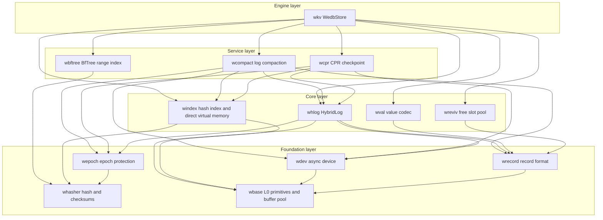
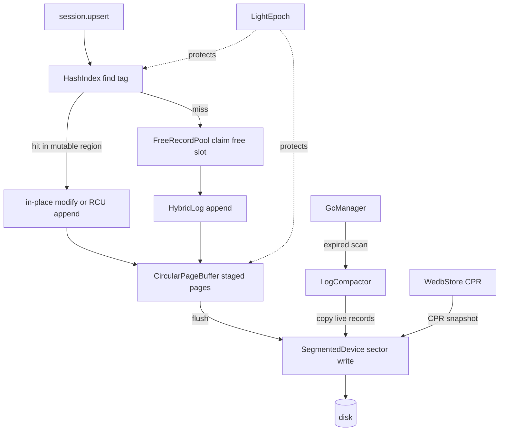

# WeDB Base : Full-stack Rust rewrite of the Microsoft Garnet storage engine

WeDB Base is the storage foundation of [WeDB](https://github.com/webc-site/wedb). It rewrites the C# storage core of Microsoft [Garnet](https://github.com/microsoft/garnet) — Tsavorite HybridLog, lock-free hash index, CPR checkpointing, revivification, log compaction — plus BfTree range indexing, delivered as thirteen focused Rust crates on the `compio` async runtime (Linux io_uring, Windows IOCP, macOS kqueue).

- [What It Does](#what-it-does)
- [Usage](#usage)
- [Highlights](#highlights)
- [Design](#design)
- [Tech Stack](#tech-stack)
- [Directory Layout](#directory-layout)
- [API Reference](#api-reference)
  - [wkv — top-level engine](#wkv-top-level-engine)
  - [wbase — L0 primitives](#wbase-l0-primitives)
  - [whasher — hashing and checksums](#whasher-hashing-and-checksums)
  - [wepoch — epoch protection](#wepoch-epoch-protection)
  - [wdev — async devices](#wdev-async-devices)
  - [wrecord — record format](#wrecord-record-format)
  - [wval — value layer](#wval-value-layer)
  - [windex — lock-free hash index and direct virtual memory](#windex-lock-free-hash-index-and-direct-virtual-memory)
  - [whlog — HybridLog allocator](#whlog-hybridlog-allocator)
  - [wreviv — free slot recycling](#wreviv-free-slot-recycling)
  - [wbftree — BfTree range index](#wbftree-bftree-range-index)
  - [wcompact — log compaction](#wcompact-log-compaction)
  - [wcpr — CPR checkpointing](#wcpr-cpr-checkpointing)

## What It Does

The workspace ships a layered storage stack. At the bottom, `wbase` supplies feature-gated cacheline-safe primitives: 48-bit log addressing, sector alignment math, adaptive backoff, TLS thread identity, OPPV varints, Papaya concurrent maps and sets, and two buffer pools — the tiered sector-aligned Direct I/O `BufferPool` and the fixed-size network `LimitedFixedBufferPool` (mirroring Tsavorite `core/Utilities` plus `libs/common/Memory`). `whasher` wraps AES-accelerated GxHash, parallel-lane streaming checksums and CRC checksums. `wepoch` supplies epoch protection for safe memory reclamation. `wdev` abstracts async block devices over `compio`.

On top of that foundation sit the Tsavorite-equivalent cores. `wrecord` defines the 16-byte record header and zero-copy record views. `windex` implements the 64-byte-aligned lock-free hash index with overflow buckets and per-bucket guards, and carries a `ram` submodule for direct virtual memory and native allocation tracking (mirroring C# `core/Native/DirectVirtualMemory.cs` and `core/Native/NativeMemoryTracker.cs`). `whlog` implements the HybridLog allocator with its three-region sliding window (Mutable / ReadOnly / OnDisk). `wreviv` recycles deleted record slots. `wval` adds the Redis value layer: tagged-key scheme, multi-tenant namespace and session-prefix encoding, and collection metadata.

Service crates orchestrate those cores. `wcpr` drives Concurrent Prefix Recovery checkpoints. `wcompact` compacts read-only log segments and physically truncates reclaimed segment files. `wbftree` manages BfTree-backed ordered range indexes. The `wkv` crate binds everything into `WedbStore`, a single-node engine with sessions, record-level TTL, background GC, read cache, checkpoint recovery, and range-index operations.

## Usage

Open a store on a segmented file device, then run CRUD through a session. Tests express errors via `aok::Void`; production code maps `wkv::Result` directly.

```rust
use std::sync::Arc;

use compio::runtime::Runtime;
use wdev::SegmentedDevice;
use wkv::{StoreConfig, WedbStore};

let rt = Runtime::new()?;
rt.block_on(async {
  // Auto-probe the host, or pin capacity explicitly:
  // index buckets, page size, page count, mutable fraction
  let config = StoreConfig::new(2048, 64 * 1024, 16, 0.5)?;
  let device = Arc::new(SegmentedDevice::single_file("demo.db")?);
  let store = Arc::new(WedbStore::open(config, device)?);

  let session = store.new_session()?;

  // Upsert, read, delete
  let addr = session.upsert(b"user:1001", b"alice").await?;
  assert!(addr > 0);
  assert_eq!(session.read(b"user:1001").await?, Some(b"alice".to_vec()));
  assert!(session.delete(b"user:1001").await?);

  // Flush the in-memory tail to disk
  store.flush_all().await?;

  Ok::<(), wkv::Error>(())
})?;
```

Record-level TTL follows Redis `EXPIREAT` / `PERSIST` return-code semantics: `-2` missing key, `0` condition rejected, `1` applied, `2` already expired and physically purged. Expired keys vanish lazily on read; background GC purges them ahead of scans.

```rust
use wbase::time::now_ms;
use wkv::TtlOpt;

assert_eq!(session.expire_at(b"session:42", now_ms() + 60_000, TtlOpt::NONE).await?, 1);
assert_eq!(session.ttl_of(b"session:42").await?, Some(now_ms() + 60_000));
assert_eq!(session.persist(b"session:42").await?, 1);
```

Checkpoint and crash-recover via CPR. After `FoldOver`, the read-only address aligns exactly with the tail address and every record seals on recovery. Recovery rebuilds capacity from the persisted `StoreMeta` — never silently resizes the index.

```rust
use std::sync::Arc;

use compio::runtime::Runtime;
use wcpr::CheckpointType;
use wdev::SegmentedDevice;
use wkv::{StoreConfig, WedbStore};

let rt = Runtime::new()?;
rt.block_on(async {
  let ckpt_dir = std::path::Path::new("checkpoints");

  // 1. Write data, take a FoldOver checkpoint, then drop the store
  let token;
  {
    let device = Arc::new(SegmentedDevice::single_file("demo.db")?);
    let store = Arc::new(WedbStore::open(StoreConfig::default(), device)?);
    let session = store.new_session()?;
    for i in 0..1000 {
      let k = format!("user_click:{i:05}");
      let v = format!("click_count_{i}");
      session.upsert(k.as_bytes(), v.as_bytes()).await?;
    }
    let meta = store
      .create_checkpoint(ckpt_dir, CheckpointType::FoldOver)
      .await?;
    token = meta.token;
  } // process exit simulated here

  // 2. Recover onto a fresh engine and verify
  let device = Arc::new(SegmentedDevice::single_file("demo.db")?);
  let recovered = Arc::new(WedbStore::recover(ckpt_dir, token, device).await?);
  assert_eq!(recovered.entry_count(), 1000);

  Ok::<(), wkv::Error>(())
})?;
```

Background GC starts automatically on `open_shared` when `config.gc.enabled`; retune it at runtime without restart and read the stats snapshot directly.

```rust
store.start_gc();
store.update_gc_config(|gc| {
  gc.scan_interval_ms = 60_000;
  gc.compaction_max_segments = 16;
});
let stats: Option<wkv::GcStatsSnapshot> = store.gc_stats();
```

Compaction copies live records down the log and physically deletes reclaimed segment files.

```rust
use wcompact::{CompactionType, LogCompactor};

let stats = LogCompactor::new(Arc::clone(&store))
  .compact(2 * segment_size, CompactionType::Scan)
  .await?;
assert_eq!(store.begin_address(), stats.new_begin_address);
```

Range indexes answer ordered scans and closed-interval range queries for large sorted collections, backed by BfTree with records carried as 35-byte stubs inside the main log. Scanning is stream-shaped with a per-record callback and returns the number of records visited.

```rust
use wbftree::{ScanReturnField, StorageBackendType, TreeTuning};

session
  .range_index_create(b"leaderboard", StorageBackendType::Disk, TreeTuning::default())
  .await?;
session.range_index_set(b"leaderboard", b"score:alice", b"9800").await?;
let visited = session
  .range_index_scan_stream(b"leaderboard", b"", 10, ScanReturnField::KeyAndValue, |_, _| true)
  .await?;
```

## Highlights

- HybridLog memory-disk duality: mutable tail serves reads and in-place updates from memory; flush pipelines move sealed pages to disk through sector-aligned I/O.
- Lock-free hash index: 64-byte-aligned buckets, overflow bucket pool, CAS slot updates guarded by shared / exclusive bucket guards, online growth through `windex::split` chunk migration driven by `WedbStore::grow_index`.
- CPR checkpointing: `FoldOver` seals history read-only; `Snapshot` rebuilds the mutable region at recovery without separate snapshot files. Token ordering stays monotonic even across wall-clock regressions.
- Revivification: deleted slots return to size-binned free pools (First-Fit / Best-Fit) and revive in place, cutting allocation and log growth.
- BfTree range indexes: multi-tree registry with lazy recovery, chunked migration protocol, and a checkpoint barrier shared with the main log.
- Redis-semantics TTL: `expire_at` / `persist` return codes align with Redis 7.4; NX / XX / GT / LT options, lazy expiry on read, and scheduled physical purge.
- Zero-copy discipline: `RecordRef` / `RecordMut` views and stack-backed key buffers avoid allocations on the hot path.
- Crash-consistent devices: `SegmentedDevice` enforces parent-directory fsync so file creation survives power loss.

## Design

Module layering follows strict single-direction dependencies; each layer imports only what it needs.



A write flows from session to disk as follows: locate the hash tag, claim memory in the HybridLog mutable region (reviving freed slots when enabled), stage the page in the circular buffer, then flush sealed pages to the device under epoch protection. GC and checkpoints run as side channels over the same device.



## Tech Stack

- Runtime: `compio` — io_uring on Linux, IOCP on Windows, kqueue on macOS.
- Hashing: `gxhash` AES-accelerated backends; `crc32fast` checksums.
- Concurrency: `papaya` lock-free maps, `parking_lot` striped locks.
- Serialization: `bitcode` binary codecs, `sonic-rs` for checkpoint metadata, `itoa` / `zmij` number formatting.
- Ordered index: `bf-tree` block-format BfTree.
- Errors and enums: `thiserror`, `strum`.
- Observability: `log` facade with `log_init` in tests.

## Directory Layout

```text
wedb/
  wbase/     L0 primitives (feature-gated): addressing, alignment, buffer pools, backoff, varint, glob, Papaya maps and sets, TLS thread id
  whasher/   GxHash backends, streaming checksums, CRC checksums and bit mixers
  wepoch/    LightEpoch protection and entry table
  wdev/      compio Device trait, SegmentedDevice, fsync contract
  wrecord/   16B record header, zero-copy views, record encoding
  wval/      tagged-key scheme, namespace and session-prefix codec, collection metadata
  windex/    lock-free hash index, overflow pool, bucket guards, online split, direct virtual memory and native memory tracker (ram submodule)
  whlog/     HybridLog allocator, address manager, page buffer, scan iterator
  wreviv/    free record pool, size-binned revivification
  wbftree/   BfTreeService, RangeIndexManager, chunked migration, 35B stub
  wcompact/  LogCompactor, compact host traits, compaction stats
  wcpr/      CPR checkpoint state machine, index checkpoint I/O, metadata formats
  wkv/       WedbStore, sessions, TTL, GC, read cache, recovery orchestration
  sh/        development and publish scripts
  test.sh    cargo nextest entry with all features
```

## API Reference

The lists below mirror each crate's real crate-root `pub use` surface; internal implementation details are deliberately not enumerated.

### wkv — top-level engine

- `WedbStore<D: Device>` — the engine over hash index, HybridLog, epoch, device, BfTree, range index, revivification pool, and read cache. Key methods:
  - `WedbStore::open(config, device)` / `open_shared` — build the engine; `open_shared` idempotently spawns GC when `config.gc.enabled`. The index grows online via `grow_index`.
  - `new_session()` — register a participant and return a `StoreSession<D>`.
  - `flush_all()` / `flush_and_evict_all()` — drain mutable pages to disk, optionally evicting memory.
  - `create_checkpoint(dir, CheckpointType)`, `create_checkpoint_with_token(dir, type, token)`, `WedbStore::recover(dir, token, device)`, `recover_latest(dir, device)` — checkpoint shortcuts without instantiating a manager.
  - `start_gc()`, `stop_gc()`, `update_gc_config(f)`, `gc_config()`, `gc_stats()`, `gc_running()` — background GC lifecycle and hot reload; each loop round re-reads the config.
  - `set_event_sink`, `set_watch_hook` — inject the unified AOF / replication event sink and the version-fence hook.
  - Address observability: `tail_address`, `read_only_address`, `head_address`, `begin_address`, `safe_read_only_address`, `shift_read_only_address`, `shift_head_address`, `shift_begin_address`, `truncate`.
  - `keyspace_stats(ns)` — INFO KEYSPACE single kernel: read-only pass over the tenant's registered databases, one bucketed scan, per-db `(db, live keys, keys with TTL)`.
  - `entry_count()`, `hlog()`, `expired_key_deletion_scan`, `hash_distribution_dump`, `revivification_dump`.
- `StoreConfig` — index buckets, page size, page count, mutable fraction, max sessions, range index dir, revivification / read cache switches, `GcConfig`. Constructors: `auto()`, `auto_with_budget(bytes)`, `new(...)`, `minimal()`, `recommended_index_size(expected_keys)`; builders `with_max_sessions`, `with_revivification`, `with_revivifiable_fraction`, `with_read_cache`, `with_read_cache_pages`, `with_range_index_dir`, `with_copy_reads_to_tail`.
- Config constants: `DEFAULT_INDEX_SIZE`, `MIN_INDEX_SIZE`, `MAX_INDEX_SIZE`, `INDEX_BUCKET_BYTES`, `INDEX_BUCKET_DATA_SLOTS`, `DEFAULT_MAX_SESSIONS`, `DEFAULT_MEMORY_PERCENT`, `MIN_MEMORY_BUDGET_BYTES`, `MAX_DEFAULT_MEMORY_BUDGET_BYTES`, `MIN_ADAPTIVE_BUDGET_BYTES`, `DEFAULT_REVIVIFIABLE_FRACTION`, `DEFAULT_GC_MAX_SEGMENTS`, `DEFAULT_GC_MAX_BATCH_DELETES`.
- `StoreSession<D>` — session-scoped operations:
  - `upsert` / `read` / `read_with` / `delete` / `contains_key` / `read_batch_with` / `read_batch_raw_with` — tagged user-key CRUD; `upsert_raw` / `read_raw` / `read_raw_with` / `delete_raw` / `contains_key_raw` / `read_record(addr)` operate on physical keys.
  - `try_upsert_sync`, `try_read_sync`, `try_rmw_sync`, `try_read_batch_in_memory` — fast paths that skip flush waits; `*_unprotected` and `*_with_prefix` variants serve batch contexts and prefix hoisting.
  - `expire_at(key, ms, TtlOpt)` / `persist(key)` / `ttl_of(key)` — Redis-semantics record TTL; TTL predicates `is_expired`, `is_expired_or_now`, `TtlCarrier`, `TtlGate`.
  - `set_context(ns, db)`, `set_strict_context`, `set_active_db`, `namespace()`, `active_db()` — multi-tenant routing; `session_prefix()` exposes the fixed-length zero-allocation prefix.
  - `set_copy_reads_to_tail`, `set_record_elision` — Garnet-aligned read promotion and record elision switches.
  - `enter_batch()` — `BatchStoreSession` groups writes into one epoch window.
  - `load_meta`, `persist_dbmeta` / `try_persist_dbmeta_sync`, `check_object_meta_fast` — collection metadata and envelope fast checks.
  - `range_index_create(key, StorageBackendType, TreeTuning)` / `range_index_set` / `range_index_set_batch` / `range_index_get` / `range_index_get_with` / `range_index_del` / `range_index_scan_stream` / `range_index_range_stream` / `range_index_exists` / `range_index_count` / `range_index_config` / `range_index_metrics` — BfTree range index operations.
- Range-index aspects: `RangeIndexError`, `RangeIndexMetrics`, `TreeGuard` / `TreeReadGuard` / `TreeWriteGuard`, `encode_meta_stub_record`, `validate_bftree_record`.
- Checkpoint maintenance — `wcpr::list_checkpoints`, `wcpr::find_latest_checkpoint`, `wcpr::purge_checkpoint(dir, token)`, `wcpr::purge_all`, `wcpr::purge_outdated`. Checkpointing and recovery are directly provided as intrinsic methods on `WedbStore`.
- GC surface: `GcManager`, `GcHandle`, `GcStatsSnapshot`, `GcConfig`, `RunGuard`.
- Engine types: the `WedbStore` trait with its `DefaultWedbStore` implementation, `StoreResult`, `RecordRead`, `DeleteMissHook`, `WatchHook`, `ConsistentReadContext`, `ConsistentReadFunctions`, `StoreEvent`, `StoreEventSink`, `ObjectRmwNotification`, `HybridLogScanMetrics`, `ReadCache`, `RcVisit`, `WedbCompactionFunctions`, `CollectionError` / `CollectionResult` / `Error` / `Result`.

### wbase — L0 primitives

Feature-gated modules, no `full` feature: `addr` (48-bit `LogAddress` masking), `align` (64B cacheline / sector math), `backoff` (adaptive retry state machine), `base32`, `buf`, `convert`, `crc` (`crc32fast`), `crc64`, `error`, `future`, `glob`, `group-commit`, `hash`, `hash_slot` (slot routing), `hex`, `map` / `set` (`papaya` + `gxhash` concurrent collections), `num`, `pool` (`BufferPool` tiered Direct I/O sector-aligned pools, `AlignedBuf` sector-aligned buffers, the fixed-size network `LimitedFixedBufferPool` with RAII handles `PooledBuffer` / `PooledRefBuffer`, and the derived `throttle` module; mirroring Tsavorite `core/Utilities` and `libs/common/Memory`), `simd`, `store_type`, `striped` (lock striping), `thread` (TLS thread identity), `time` (`coarsetime` helpers, `now_ms`), `varint` (OPPV varints).

### whasher — hashing and checksums

- `fast_hash(_with_seed)`, `hash128(bytes, seed_a, seed_b)` — GxHash backends.
- `StreamHasher` — four parallel lanes, streaming checksum with `write` / `finish` / `reset`.
- `compute_checksum(_with_seed)` — CRC-based checksums; `mix13` / `splitmix64` / `mix_thread_id` — bit mixers.
- Concurrent maps and sets are not here: they live behind `wbase`'s `map` / `set` features.

### wepoch — epoch protection

- `LightEpoch` — `register()`, `suspend` / `resume` / `try_suspend`, `protect_and_drain()`, `protected_scope()`, `bump_current_epoch` / `bump_current_epoch_action`, `drain()`, `current_epoch()`, `safe_to_reclaim_epoch()`, `compute_safe_to_reclaim_epoch()`, `is_safe_to_reclaim(target)`, `thread_protected()` / `this_instance_protected()`, `refresh_thread_protected_entries()`.
- `Participant`, `EpochGuard`, `EpochSuspendGuard`, `ProtectedScope`, `EpochEntry`, `DRAIN_LIST_SIZE`.

### wdev — async devices

- `Device` trait — async read / write / flush with segment lifecycle.
- `SegmentedDevice` — growable segmented file (`single_file` and `segmented` constructors), `DeviceParams`.
- `sys::detect_system_memory` / `detect_cpu_cores`, `MAX_SEGMENT_SIZE`; buffers always come from `wbase::pool` directly — this crate no longer re-exports them.

### wrecord — record format

- `RecordHeader` constants — `HEADER_SIZE` (16B), `RECORD_ALIGNMENT`, `SEALED_BIT`, `TOMBSTONE_BIT`, `HEADER_READ_CACHE_BIT`, `MODIFIED_BIT`, `IN_NEW_VERSION_BIT`, `MAX_FILLER_BYTES`, `PAD_KEY_LEN`.
- `RecordRef` / `RecordMut` — zero-copy read / write views over log memory.
- `record_size`, `checked_record_size`, `encode_to_slice`, `try_encode_to_vec`, `MAX_KEY_LEN` — encode records into log slots.

### wval — value layer

- `KeyTag`, `GarnetObjectType`, `CustomObjectType`, `LAST_RESERVED_BUILTIN_TYPE`, `CUSTOM_OBJECT_TYPE_BASE` — tagged-key scheme and the single definition point for type enums.
- `NamespaceDbCodec`, `SessionPrefixBuf`, `TaggedKeyBuf`, `STACK_KEY_CAP` — namespace, database and session-prefix encoding over OPPV varints with stack-buffer allocation avoidance.
- `MetaValue` / `META_VALUE_SIZE` — fixed-layout collection metadata; `StorageEncoding` — storage encoding marker.
- `I64Codec` / `I64_VAL_LEN` — fixed-length integer codec; `NO_ETAG` — default etag sentinel.
- Collection payload codecs live in `wcol`, TTL predicates in `wkv::ttl`, glob matching in `wbase::glob`.

### windex — lock-free hash index and direct virtual memory

- `HashIndex` — `new(num_buckets)` fixed bucket table; `find_tag` / `find_tag_by_hash` / `find_tag_entry_by_hash_with_min_addr`, `lookup_candidates(_by_hash)`, `insert_to_bucket`, `find_or_create_tag_by_hash_with_min_addr`, `update_address`, `delete`, `bucket_index_for_key` / `bucket_index_for_hash`, `try_lock_shared` / `unlock_shared`, `try_lock_exclusive` / `unlock_exclusive` / `downgrade`, `lock_shared_guard` / `try_lock_key_exclusive`, `prefetch_batch_probes`, `hash_key`, `clear`.
- `HashBuckets`, `PrefetchProbe`, `HashBucket` (`ENTRIES_PER_BUCKET`, `DATA_ENTRIES`, `OVERFLOW_INDEX`), `HashBucketEntry`, `HashEntryInfo`, `CandidateAddresses` (inline candidate list with `push` / `retain` / `iter` / `as_slice`).
- `OverflowPool`, `KeyLatch`, `BucketExclusiveGuard` / `BucketSharedGuard`, `prefetch_read_l1`, `PREFETCH_WINDOW`.
- Online growth: `split_chunk`, `split_single_bucket`, `chunk_count`, `chunk_offset_for_hash`, `CHUNK_SIZE` / `CHUNK_BITS`, `SPLIT_UNSTARTED` / `SPLIT_IN_PROGRESS` / `SPLIT_COMPLETED`.
- `ram` submodule — `DirectVirtualMemory`, `DirectVmBlock`, `system_page_size()` (mirroring `core/Native/DirectVirtualMemory.cs`) and `NativeMemoryTracker` (mirroring `core/Native/NativeMemoryTracker.cs`); it backs the production hash-index bucket array through `HashBuckets`, while sector-aligned buffer pools stay in `wbase::pool`.

### whlog — HybridLog allocator

- `HybridLog<D>` — `append`, `try_update_in_place`, `try_modify_record_in_place`, `try_revivify_in_chain`, `revivify_record_at`, `try_set_tombstone_in_place`, region shifting (`shift_read_only_address` including `_with_wait`, `shift_head_address`, `shift_begin_address`), `read_record` / `read_disk_record` / `with_memory_record`, `flush_page` / `flush_pages_range` / `flush_all` / `flush_until_async` / `flushed_until_address` / `wait_flushed_until_address_async`, `tail_address` / `read_only_address` / `head_address` / `begin_address`, `safe_read_only_address` / `safe_head_address` / `wait_safe_head_drained`, `is_mutable` / `is_read_only` / `is_on_disk` / `is_in_memory`, `recover`.
- `HybridLogConfig` — page size, page count, mutable fraction defaults and `ro_lag_num_from_fraction`; constants `DEFAULT_PAGE_SIZE`, `DEFAULT_NUM_PAGES`, `DEFAULT_MUTABLE_FRACTION`, `DEFAULT_INITIAL_ADDRESS`, `DEFAULT_SERVER_PAGE_SIZE`, `SECTOR_ALIGNMENT`.
- `AddressManager` / `AddressSnapshot` — logical / physical address translation; `CircularPageBuffer` — staged page ring; `PendingFlushList` / `PageFlushRange` — flush bookkeeping; `ScanIterator`, `RecordOutput`.

### wreviv — free slot recycling

- `FreeRecordPool` — size-binned pools (`DEFAULT_BIN_SIZES`), `put(address, size, min_address)` / `take(required_size, min_address)` / `purge_below(min_address)` / `stats()` / `pause` / `resume` / `is_enabled` / `find_bin_index` / `clear` / `is_empty`.
- `FreeRecordBin`, `FreeRecord`, `SetStatus`, `USE_FIRST_FIT`, `BEST_FIT_SCAN_ALL`, `RevivStats` (`hit_rate()`).

### wbftree — BfTree range index

- `BfTreeService` — `insert` / `upsert`, `read` / `read_callback` / `read_into`, `delete` / `bulk_delete` / `bulk_load` / `contains_key`, `scan_with_count(_callback)`, `scan_with_end_key(_callback)`, `cpr_snapshot(path)` / `recover_from_cpr_snapshot(...)` / `dispose`, observability via `native_ptr` / `file_path` / `storage_backend` / `is_disposed`, result types `BfTreeInsertResult` / `BfTreeReadResult` / `BfTreeDeleteResult`.
- `RangeIndexManager` — multi-tree registry keyed by `key_id` with lazy recovery and checkpoint claim / release; entry type `TreeEntry`, detached tree `DetachedTree`; plus `file_has_cpr_magic` and `INDEX_SIZE_BYTES`.
- `RangeIndexStub` (`RANGE_INDEX_STUB_SIZE` = 35B), `RangeIndexChunkedSerializer` / `RangeIndexChunkedDeserializer` / `RangeIndexMigrationReader`, `DEFAULT_MIGRATION_CHUNK_SIZE`, `DEFAULT_FILE_READ_BUFFER_SIZE`, `MIN_CHUNK_SIZE`.
- Type surface: `ScanReturnField`, `ScanRecord`, `StorageBackendType` (`Disk` / `Memory`), `TreeTuning`.

### wcompact — log compaction

- `LogCompactor<S: CompactStore>` — `new(store)`, `with_cas_retries`, `compact(until_address, CompactionType)`, `compact_lazy(max_seek_bytes)`, `compact_with_filter`; physically truncates reclaimed segment files.
- `CompactStore` / `CompactSession` — host traits wiring the compactor to a live engine; `CompactionFunctions` / `DefaultCompactionFunctions` record-filter aspects; `CompactionType`, `CompactionStats`.

### wcpr — CPR checkpointing

- `CprStore` / `CprRecover` — trait contracts for stores participating in checkpoint / recovery.
- `RecoveredCheckpoint<D>` — recovered `CheckpointMeta` plus the rebuilt index / log / epoch components.
- Checkpoint drivers: `create_checkpoint`, `create_checkpoint_with_token`, `next_token_above`, `publish_checkpoint_aof_address`, `find_latest_checkpoint`, `list_checkpoints`, `purge_checkpoint` / `purge_all` / `purge_outdated`.
- Recovery family: `recover`, `recover_latest`, `run_recovery_kernel`, `RecoveryScanStats`, `RecoveryVisitor`.
- Index checkpoint I/O: `write_index_checkpoint`, `read_index_checkpoint_truncated`, `IndexCkptHeader`.
- Metadata formats: `CheckpointMeta`, `CheckpointType` (`FoldOver` / `Snapshot`), `StoreMeta`, `HlogMeta`, `IndexMeta`, `FORMAT_VERSION`.
