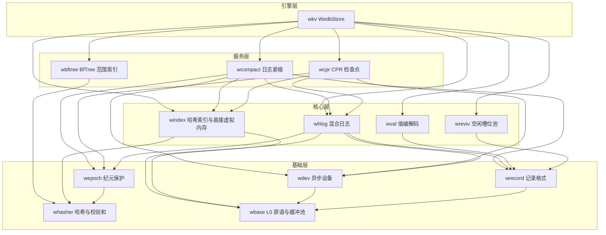
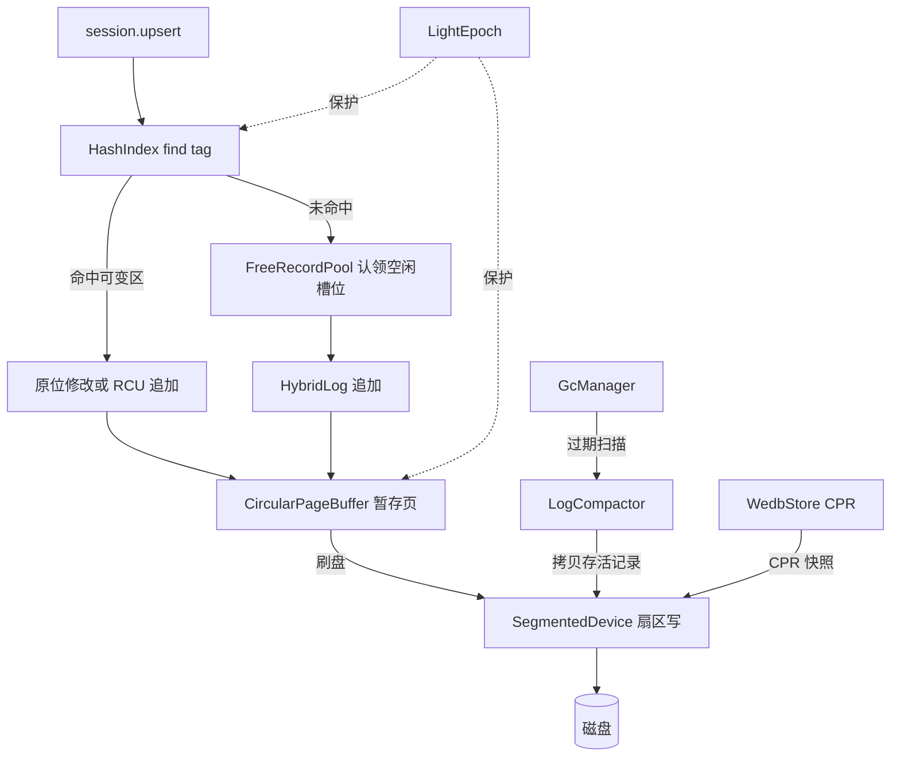

# WeDB Base : 以 Rust 全栈重写微软 Garnet 存储引擎

WeDB Base 是 [WeDB](https://github.com/webc-site/wedb) 的存储引擎底座。以 Rust 重写微软 [Garnet](https://github.com/microsoft/garnet) 的 C# 存储核心——Tsavorite 混合日志、无锁哈希索引、CPR 检查点、槽位复活、日志紧缩——以及 BfTree 范围索引，拆分为十三个职责单一的 crate，运行于 `compio` 异步运行时（Linux io_uring、Windows IOCP、macOS kqueue）。

- [功能介绍](#功能介绍)
- [使用演示](#使用演示)
- [特性介绍](#特性介绍)
- [设计思路](#设计思路)
- [技术堆栈](#技术堆栈)
- [目录结构](#目录结构)
- [API 说明](#api-说明)
  - [wkv —— 顶层引擎](#wkv-顶层引擎)
  - [wbase —— L0 原语](#wbase-l0-原语)
  - [whasher —— 哈希与校验和](#whasher-哈希与校验和)
  - [wepoch —— 纪元保护](#wepoch-纪元保护)
  - [wdev —— 异步设备](#wdev-异步设备)
  - [wrecord —— 记录格式](#wrecord-记录格式)
  - [wval —— 值层](#wval-值层)
  - [windex —— 无锁哈希索引与直接虚拟内存](#windex-无锁哈希索引与直接虚拟内存)
  - [whlog —— 混合日志分配器](#whlog-混合日志分配器)
  - [wreviv —— 空闲槽位回收](#wreviv-空闲槽位回收)
  - [wbftree —— BfTree 范围索引](#wbftree-bftree-范围索引)
  - [wcompact —— 日志紧缩](#wcompact-日志紧缩)
  - [wcpr —— CPR 检查点](#wcpr-cpr-检查点)

## 功能介绍

工作区分层交付整套存储栈。底层 `wbase` 按特性提供缓存行安全原语：48 位日志寻址、扇区对齐运算、自适应退避、TLS 线程标识、OPPV 变长整型、papaya 并发字典与集合，并承载两级缓冲池——分级扇区对齐 Direct I/O `BufferPool` 与固定块网络缓冲池 `LimitedFixedBufferPool`（对标 Tsavorite `core/Utilities` 与 `libs/common/Memory` 底层位）。`whasher` 封装 AES 加速 GxHash、四链并行流式校验和与 CRC 校验。`wepoch` 提供纪元保护，支撑安全内存回收。`wdev` 基于 `compio` 抽象异步块设备。

核心层对标 Tsavorite。`wrecord` 定义 16 字节记录头与零拷贝记录视图。`windex` 实现 64 字节对齐的无锁哈希索引，含溢出桶池与桶级并发守卫，并内置 `ram` 子模块承载直接虚拟内存与原生内存追踪（对标 C# `core/Native/DirectVirtualMemory.cs` 与 `core/Native/NativeMemoryTracker.cs`）。`whlog` 实现混合日志分配器与三区滑动窗口（可变 / 只读 / 磁盘）。`wreviv` 回收已删记录槽位。`wval` 叠加 Redis 值层：带标签键方案、多租户命名空间与会话前缀编码、集合元数据。

服务层编排核心模块。`wcpr` 驱动 CPR 检查点。`wcompact` 紧缩只读日志段并物理截断回收段文件。`wbftree` 管理基于 BfTree 的有序范围索引。`wkv` 把上述能力聚合为 `WedbStore` 单机引擎，提供存储会话、记录级 TTL、后台 GC、读缓存、检查点恢复与范围索引操作。

## 使用演示

在分段文件设备上打开存储，经会话执行 CRUD。测试用 `aok::Void` 表达错误；生产代码直接映射 `wkv::Result`。

```rust
use std::sync::Arc;

use compio::runtime::Runtime;
use wdev::SegmentedDevice;
use wkv::{StoreConfig, WedbStore};

let rt = Runtime::new()?;
rt.block_on(async {
  // 自动探测宿主机推导配置，或显式指定：
  // 索引桶数、页大小、页数、可变区占比
  let config = StoreConfig::new(2048, 64 * 1024, 16, 0.5)?;
  let device = Arc::new(SegmentedDevice::single_file("demo.db")?);
  let store = Arc::new(WedbStore::open(config, device)?);

  let session = store.new_session()?;

  // 写入、读取、删除
  let addr = session.upsert(b"user:1001", b"alice").await?;
  assert!(addr > 0);
  assert_eq!(session.read(b"user:1001").await?, Some(b"alice".to_vec()));
  assert!(session.delete(b"user:1001").await?);

  // 内存可变区刷盘
  store.flush_all().await?;

  Ok::<(), wkv::Error>(())
})?;
```

记录级 TTL 对齐 Redis `EXPIREAT` / `PERSIST` 返回码语义：-2 键不存在、0 条件不满足、1 设置成功、2 已过期并立即物理删除。过期键读取时惰性消失；后台 GC 提前物理清除。

```rust
use wbase::time::now_ms;
use wkv::TtlOpt;

assert_eq!(session.expire_at(b"session:42", now_ms() + 60_000, TtlOpt::NONE).await?, 1);
assert_eq!(session.ttl_of(b"session:42").await?, Some(now_ms() + 60_000));
assert_eq!(session.persist(b"session:42").await?, 1);
```

经 CPR 做检查点与崩溃恢复。`FoldOver` 恢复后只读地址精确对齐尾地址，全部历史记录封印只读。恢复容量完全由持久化 `StoreMeta` 决定，绝不静默缩表。

```rust
use std::sync::Arc;

use compio::runtime::Runtime;
use wcpr::CheckpointType;
use wdev::SegmentedDevice;
use wkv::{StoreConfig, WedbStore};

let rt = Runtime::new()?;
rt.block_on(async {
  let ckpt_dir = std::path::Path::new("checkpoints");

  // 1. 写入数据、创建 FoldOver 检查点、随后释放存储实例
  let token;
  {
    let device = Arc::new(SegmentedDevice::single_file("demo.db")?);
    let store = Arc::new(WedbStore::open(StoreConfig::default(), device)?);
    let session = store.new_session()?;
    for i in 0..1000 {
      let k = format!("user_click:{i:05}");
      let v = format!("click_count_{i}");
      session.upsert(k.as_bytes(), v.as_bytes()).await?;
    }
    let meta = store
      .create_checkpoint(ckpt_dir, CheckpointType::FoldOver)
      .await?;
    token = meta.token;
  } // 此处模拟进程退出

  // 2. 在全新引擎上恢复并校验
  let device = Arc::new(SegmentedDevice::single_file("demo.db")?);
  let recovered = Arc::new(WedbStore::recover(ckpt_dir, token, device).await?);
  assert_eq!(recovered.entry_count(), 1000);

  Ok::<(), wkv::Error>(())
})?;
```

`open_shared` 在 `config.gc.enabled` 时自动拉起后台 GC，运行期免重启热调参，统计快照直读。

```rust
store.start_gc();
store.update_gc_config(|gc| {
  gc.scan_interval_ms = 60_000;
  gc.compaction_max_segments = 16;
});
let stats: Option<wkv::GcStatsSnapshot> = store.gc_stats();
```

紧缩把存活记录前移，物理删除回收后的段文件。

```rust
use wcompact::{CompactionType, LogCompactor};

let stats = LogCompactor::new(Arc::clone(&store))
  .compact(2 * segment_size, CompactionType::Scan)
  .await?;
assert_eq!(store.begin_address(), stats.new_begin_address);
```

范围索引服务大规模有序集合的有序扫描与闭区间范围查询，数据落 BfTree，主日志内仅存 35 字节定长桩。扫描为流式回调形态，返回实际访问条数。

```rust
use wbftree::{ScanReturnField, StorageBackendType, TreeTuning};

session
  .range_index_create(b"leaderboard", StorageBackendType::Disk, TreeTuning::default())
  .await?;
session.range_index_set(b"leaderboard", b"score:alice", b"9800").await?;
let visited = session
  .range_index_scan_stream(b"leaderboard", b"", 10, ScanReturnField::KeyAndValue, |_, _| true)
  .await?;
```

## 特性介绍

- 混合日志内存磁盘二象性：可变尾区在内存中服务读与原位更新；封印页经扇区对齐 I/O 管道刷盘。
- 无锁哈希索引：64 字节缓存行对齐桶、溢出桶池、共享 / 独占桶守卫下的 CAS 槽位更新，支持在线动态扩容（`windex::split` 分块迁移 + `WedbStore::grow_index`）。
- CPR 检查点：`FoldOver` 封印历史只读；`Snapshot` 恢复时重建可变区，无需独立快照文件。Token 大小序即版本序，墙钟回拨不破坏单调性。
- 槽位复活：已删槽位按尺寸分桶回收（First-Fit / Best-Fit），原位复用，抑制分配与日志增长。
- BfTree 范围索引：多树注册表、惰性恢复、分块迁移协议、与主日志共享检查点栅栏。
- Redis 语义 TTL：`expire_at` / `persist` 返回码对齐 Redis 7.4，支持 NX / XX / GT / LT 条件，读路径惰性过期加定时物理清除。
- 零拷贝纪律：`RecordRef` / `RecordMut` 视图、栈上键缓冲，热路径免分配。
- 崩溃一致设备：`SegmentedDevice` 强制父目录 fsync，掉电后文件创建不丢失。

## 设计思路

模块按严格单向依赖分层，每层只导入所需依赖。



写入路径从会话到磁盘：定位哈希标签，在混合日志可变区占位（启用时优先复活空闲槽位），页进入环形缓冲暂存，封印页在纪元保护下刷入设备。GC 与检查点作为旁路通道复用同一设备。



## 技术堆栈

- 运行时：`compio`——Linux io_uring、Windows IOCP、macOS kqueue。
- 哈希：`gxhash` AES 加速后端；`crc32fast` 校验和。
- 并发：`papaya` 无锁字典、`parking_lot` 条带锁。
- 序列化：`bitcode` 二进制编解码、`sonic-rs` 检查点元数据、`itoa` / `zmij` 数字格式化。
- 有序索引：`bf-tree` 块级 BfTree。
- 错误与枚举：`thiserror`、`strum`。
- 可观测：`log` 门面，测试配 `log_init`。

## 目录结构

```text
wedb/
  wbase/     L0 原语（按特性启用）：寻址、对齐、缓冲池、退避、变长整型、glob、papaya 字典与集合、TLS 线程标识
  whasher/   GxHash 后端、流式校验和、CRC 校验和与位混合器
  wepoch/    LightEpoch 纪元保护与条目表
  wdev/      compio Device trait、SegmentedDevice、fsync 契约
  wrecord/   16B 记录头、零拷贝视图、记录编解码
  wval/      带标签键方案、命名空间与会话前缀编码、集合元数据
  windex/    无锁哈希索引、溢出桶池、桶守卫、分块扩容、直接虚拟内存与原生内存追踪（ram 子模块）
  whlog/     HybridLog 分配器、地址管理、页缓冲、扫描迭代器
  wreviv/    空闲记录池、按尺寸分桶复活
  wbftree/   BfTreeService、RangeIndexManager、分块迁移、35B 桩
  wcompact/  LogCompactor、紧缩宿主 trait、紧缩统计
  wcpr/      CPR 检查点状态机、索引检查点读写、元数据格式
  wkv/       WedbStore、会话、TTL、GC、读缓存、恢复编排
  sh/        开发与发布脚本
  test.sh    全特性 cargo nextest 入口
```

## API 说明

以下清单取自各 crate 根的真实 `pub use` 面，不罗列内部实现细节。

### wkv —— 顶层引擎

- `WedbStore<D: Device>`——聚合哈希索引、混合日志、纪元、设备、BfTree、范围索引、复活池与读缓存的引擎。核心方法：
  - `WedbStore::open(config, device)` / `open_shared`——构建引擎；`open_shared` 在 `config.gc.enabled` 时幂等拉起 GC。索引可经 `grow_index` 在线动态扩容。
  - `new_session()`——注册参与者并返回 `StoreSession<D>`。
  - `flush_all()` / `flush_and_evict_all()`——可变页刷盘，可选逐出内存。
  - `create_checkpoint(dir, CheckpointType)`、`create_checkpoint_with_token(dir, type, token)`、`WedbStore::recover(dir, token, device)`、`recover_latest(dir, device)`——免建管理器的检查点快捷入口。
  - `start_gc()`、`stop_gc()`、`update_gc_config(f)`、`gc_config()`、`gc_stats()`、`gc_running()`——后台 GC 生命周期与热更新；驱动循环每轮重读配置。
  - `set_event_sink`、`set_watch_hook`——注入统一 AOF / 复制事件分发处理器与版本栅栏钩子。
  - 地址观测：`tail_address`、`read_only_address`、`head_address`、`begin_address`、`safe_read_only_address`、`shift_read_only_address`、`shift_head_address`、`shift_begin_address`、`truncate`。
  - `keyspace_stats(ns)`——INFO KEYSPACE 统计单内核：只读遍历该租户在册库、一趟分桶扫描，按库返回 `(库号, 存活键数, 带 TTL 键数)`。
  - `entry_count()`、`hlog()`、`expired_key_deletion_scan`、`hash_distribution_dump`、`revivification_dump`。
- `StoreConfig`——索引桶数、页大小、页数、可变区占比、最大会话数、范围索引目录、复活 / 读缓存开关、`GcConfig`。构造器：`auto()`、`auto_with_budget(bytes)`、`new(...)`、`minimal()`、`recommended_index_size(expected_keys)`；建造器 `with_max_sessions`、`with_revivification`、`with_revivifiable_fraction`、`with_read_cache`、`with_read_cache_pages`、`with_range_index_dir`、`with_copy_reads_to_tail`。
- 配置常量：`DEFAULT_INDEX_SIZE`、`MIN_INDEX_SIZE`、`MAX_INDEX_SIZE`、`INDEX_BUCKET_BYTES`、`INDEX_BUCKET_DATA_SLOTS`、`DEFAULT_MAX_SESSIONS`、`DEFAULT_MEMORY_PERCENT`、`MIN_MEMORY_BUDGET_BYTES`、`MAX_DEFAULT_MEMORY_BUDGET_BYTES`、`MIN_ADAPTIVE_BUDGET_BYTES`、`DEFAULT_REVIVIFIABLE_FRACTION`、`DEFAULT_GC_MAX_SEGMENTS`、`DEFAULT_GC_MAX_BATCH_DELETES`。
- `StoreSession<D>`——会话级操作：
  - `upsert` / `read` / `read_with` / `delete` / `contains_key` / `read_batch_with` / `read_batch_raw_with`——带标签用户键 CRUD；`upsert_raw` / `read_raw` / `read_raw_with` / `delete_raw` / `contains_key_raw` / `read_record(addr)` 直接操作物理键。
  - `try_upsert_sync`、`try_read_sync`、`try_rmw_sync`、`try_read_batch_in_memory`——跳过刷盘等待的快路径；`*_unprotected` 与 `*_with_prefix` 变体服务批处理与前缀外提。
  - `expire_at(key, ms, TtlOpt)` / `persist(key)` / `ttl_of(key)`——Redis 语义记录级 TTL；TTL 判定面 `is_expired`、`is_expired_or_now`、`TtlCarrier`、`TtlGate`。
  - `set_context(ns, db)`、`set_strict_context`、`set_active_db`、`namespace()`、`active_db()`——多租户路由；`session_prefix()` 输出定长零分配前缀。
  - `set_copy_reads_to_tail`、`set_record_elision`——对标 Garnet 的冷读提升与记录脱钩开关。
  - `enter_batch()`——`BatchStoreSession` 将写入聚合到同一纪元窗口。
  - `load_meta`、`persist_dbmeta` / `try_persist_dbmeta_sync`、`check_object_meta_fast`——集合元数据与信封快检。
  - `range_index_create(key, StorageBackendType, TreeTuning)` / `range_index_set` / `range_index_set_batch` / `range_index_get` / `range_index_get_with` / `range_index_del` / `range_index_scan_stream` / `range_index_range_stream` / `range_index_exists` / `range_index_count` / `range_index_config` / `range_index_metrics`——BfTree 范围索引操作。
- 范围索引切面：`RangeIndexError`、`RangeIndexMetrics`、`TreeGuard` / `TreeReadGuard` / `TreeWriteGuard`、`encode_meta_stub_record`、`validate_bftree_record`。
- 检查点维护——`wcpr::list_checkpoints`、`wcpr::find_latest_checkpoint`、`wcpr::purge_checkpoint(dir, token)`、`wcpr::purge_all`、`wcpr::purge_outdated`。快照与恢复直接由 `WedbStore` 固有方法承载。
- GC 面：`GcManager`、`GcHandle`、`GcStatsSnapshot`、`GcConfig`、`RunGuard`。
- 引擎面类型：`WedbStore` trait 与 `DefaultWedbStore` 实现、`StoreResult`、`RecordRead`、`DeleteMissHook`、`WatchHook`、`ConsistentReadContext`、`ConsistentReadFunctions`、`StoreEvent`、`StoreEventSink`、`ObjectRmwNotification`、`HybridLogScanMetrics`、`ReadCache`、`RcVisit`、`WedbCompactionFunctions`、`CollectionError` / `CollectionResult` / `Error` / `Result`。

### wbase —— L0 原语

按特性启用的模块，无 `full` 特性：`addr`（48 位 `LogAddress` 掩码）、`align`（64B 缓存行 / 扇区运算）、`backoff`（自适应重试状态机）、`base32`、`buf`、`convert`、`crc`（`crc32fast`）、`crc64`、`error`、`future`、`glob`、`group-commit`（组提交）、`hash`、`hash_slot`（槽位路由）、`hex`、`map` / `set`（`papaya` + `gxhash` 并发字典与集合）、`num`、`pool`（`BufferPool` 分级 Direct I/O 扇区对齐缓冲池、`AlignedBuf` 扇区对齐缓冲区、`LimitedFixedBufferPool` 固定块网络缓冲池与 RAII 句柄 `PooledBuffer` / `PooledRefBuffer`，并派生 `throttle`）、`simd`、`store_type`、`striped`（锁条带）、`thread`（TLS 线程标识）、`time`（`coarsetime` 助手、`now_ms`）、`varint`（OPPV 变长整型）。

### whasher —— 哈希与校验和

- `fast_hash(_with_seed)`、`hash128(bytes, seed_a, seed_b)`——GxHash 后端。
- `StreamHasher`——四链并行折叠，流式校验和 `write` / `finish` / `reset`。
- `compute_checksum(_with_seed)`——CRC 校验和；`mix13` / `splitmix64` / `mix_thread_id`——位混合器。
- 并发字典与集合不在本 crate：统一由 `wbase` 的 `map` / `set` 特性承载。

### wepoch —— 纪元保护

- `LightEpoch`——`register()`、`suspend` / `resume` / `try_suspend`、`protect_and_drain()`、`protected_scope()`、`bump_current_epoch` / `bump_current_epoch_action`、`drain()`、`current_epoch()`、`safe_to_reclaim_epoch()`、`compute_safe_to_reclaim_epoch()`、`is_safe_to_reclaim(target)`、`thread_protected()` / `this_instance_protected()`、`refresh_thread_protected_entries()`。
- `Participant`、`EpochGuard`、`EpochSuspendGuard`、`ProtectedScope`、`EpochEntry`、`DRAIN_LIST_SIZE`。

### wdev —— 异步设备

- `Device` trait——异步读 / 写 / 刷与段生命周期。
- `SegmentedDevice`——可增长分段文件（`single_file` 与 `segmented` 构造器）、`DeviceParams`。
- `sys::detect_system_memory` / `detect_cpu_cores`、`MAX_SEGMENT_SIZE`；缓冲池一律直接使用 `wbase::pool`，本 crate 不再二次导出。

### wrecord —— 记录格式

- `RecordHeader` 常量——`HEADER_SIZE`（16B）、`RECORD_ALIGNMENT`、`SEALED_BIT`、`TOMBSTONE_BIT`、`HEADER_READ_CACHE_BIT`、`MODIFIED_BIT`、`IN_NEW_VERSION_BIT`、`MAX_FILLER_BYTES`、`PAD_KEY_LEN`。
- `RecordRef` / `RecordMut`——日志内存上的零拷贝读 / 写视图。
- `record_size`、`checked_record_size`、`encode_to_slice`、`try_encode_to_vec`、`MAX_KEY_LEN`——把记录编码进日志槽位。

### wval —— 值层

- `KeyTag`、`GarnetObjectType`、`CustomObjectType`、`LAST_RESERVED_BUILTIN_TYPE`、`CUSTOM_OBJECT_TYPE_BASE`——带标签键方案与类型枚举单点定义。
- `NamespaceDbCodec`、`SessionPrefixBuf`、`TaggedKeyBuf`、`STACK_KEY_CAP`——基于 OPPV 变长整型的命名空间、库号与会话前缀编码，栈缓冲免分配。
- `MetaValue` / `META_VALUE_SIZE`——集合元数据定长布局；`StorageEncoding`——存储编码标记。
- `I64Codec` / `I64_VAL_LEN`——定长整数编解码；`NO_ETAG`——缺省 etag 标记。
- 集合载荷编解码在 `wcol`，TTL 判定在 `wkv::ttl`，glob 匹配在 `wbase::glob`。

### windex —— 无锁哈希索引与直接虚拟内存

- `HashIndex`——`new(num_buckets)` 定长桶表；`find_tag` / `find_tag_by_hash` / `find_tag_entry_by_hash_with_min_addr`、`lookup_candidates(_by_hash)`、`insert_to_bucket`、`find_or_create_tag_by_hash_with_min_addr`、`update_address`、`delete`、`bucket_index_for_key` / `bucket_index_for_hash`、`try_lock_shared` / `unlock_shared`、`try_lock_exclusive` / `unlock_exclusive` / `downgrade`、`lock_shared_guard` / `try_lock_key_exclusive`、`prefetch_batch_probes`、`hash_key`、`clear`。
- `HashBuckets`、`PrefetchProbe`、`HashBucket`（`ENTRIES_PER_BUCKET`、`DATA_ENTRIES`、`OVERFLOW_INDEX`）、`HashBucketEntry`、`HashEntryInfo`、`CandidateAddresses`（内联候选地址表，`push` / `retain` / `iter` / `as_slice`）。
- `OverflowPool`、`KeyLatch`、`BucketExclusiveGuard` / `BucketSharedGuard`、`prefetch_read_l1`、`PREFETCH_WINDOW`。
- 在线扩容：`split_chunk`、`split_single_bucket`、`chunk_count`、`chunk_offset_for_hash`、`CHUNK_SIZE` / `CHUNK_BITS`、`SPLIT_UNSTARTED` / `SPLIT_IN_PROGRESS` / `SPLIT_COMPLETED`。
- `ram` 子模块——`DirectVirtualMemory`、`DirectVmBlock`、`system_page_size()`（对标 `core/Native/DirectVirtualMemory.cs`）与 `NativeMemoryTracker`（对标 `core/Native/NativeMemoryTracker.cs`）；经 `HashBuckets` 撑起生产哈希索引桶数组，扇区对齐缓冲池本体仍在 `wbase::pool`。

### whlog —— 混合日志分配器

- `HybridLog<D>`——`append`、`try_update_in_place`、`try_modify_record_in_place`、`try_revivify_in_chain`、`revivify_record_at`、`try_set_tombstone_in_place`、区域推进（`shift_read_only_address`（含 `_with_wait`）、`shift_head_address`、`shift_begin_address`）、`read_record` / `read_disk_record` / `with_memory_record`、`flush_page` / `flush_pages_range` / `flush_all` / `flush_until_async` / `flushed_until_address` / `wait_flushed_until_address_async`、`tail_address` / `read_only_address` / `head_address` / `begin_address`、`safe_read_only_address` / `safe_head_address` / `wait_safe_head_drained`、`is_mutable` / `is_read_only` / `is_on_disk` / `is_in_memory`、`recover`。
- `HybridLogConfig`——页大小、页数、可变区占比默认值与 `ro_lag_num_from_fraction`；常量 `DEFAULT_PAGE_SIZE`、`DEFAULT_NUM_PAGES`、`DEFAULT_MUTABLE_FRACTION`、`DEFAULT_INITIAL_ADDRESS`、`DEFAULT_SERVER_PAGE_SIZE`、`SECTOR_ALIGNMENT`。
- `AddressManager` / `AddressSnapshot`——逻辑 / 物理地址换算；`CircularPageBuffer`——暂存页环形缓冲；`PendingFlushList` / `PageFlushRange`——刷盘记账；`ScanIterator`、`RecordOutput`。

### wreviv —— 空闲槽位回收

- `FreeRecordPool`——按尺寸分桶（`DEFAULT_BIN_SIZES`）、`put(address, size, min_address)` / `take(required_size, min_address)` / `purge_below(min_address)` / `stats()` / `pause` / `resume` / `is_enabled` / `find_bin_index` / `clear` / `is_empty`。
- `FreeRecordBin`、`FreeRecord`、`SetStatus`、`USE_FIRST_FIT`、`BEST_FIT_SCAN_ALL`、`RevivStats`（`hit_rate()`）。

### wbftree —— BfTree 范围索引

- `BfTreeService`——`insert` / `upsert`、`read` / `read_callback` / `read_into`、`delete` / `bulk_delete` / `bulk_load` / `contains_key`、`scan_with_count(_callback)`、`scan_with_end_key(_callback)`、`cpr_snapshot(path)` / `recover_from_cpr_snapshot(...)` / `dispose`、观测面 `native_ptr` / `file_path` / `storage_backend` / `is_disposed`，结果类型 `BfTreeInsertResult` / `BfTreeReadResult` / `BfTreeDeleteResult`。
- `RangeIndexManager`——以 `key_id` 为键的多树注册表、惰性恢复、检查点认领 / 释放，条目类型 `TreeEntry`、脱离树 `DetachedTree`；`file_has_cpr_magic`、`INDEX_SIZE_BYTES`。
- `RangeIndexStub`（`RANGE_INDEX_STUB_SIZE` = 35B）、`RangeIndexChunkedSerializer` / `RangeIndexChunkedDeserializer` / `RangeIndexMigrationReader`、`DEFAULT_MIGRATION_CHUNK_SIZE`、`DEFAULT_FILE_READ_BUFFER_SIZE`、`MIN_CHUNK_SIZE`。
- 类型面 `ScanReturnField`、`ScanRecord`、`StorageBackendType`（`Disk` / `Memory`）、`TreeTuning`。

### wcompact —— 日志紧缩

- `LogCompactor<S: CompactStore>`——`new(store)`、`with_cas_retries`、`compact(until_address, CompactionType)`、`compact_lazy(max_seek_bytes)`、`compact_with_filter`；紧缩后物理截断回收段文件。
- `CompactStore` / `CompactSession`——把紧缩器接入在役引擎的宿主 trait；`CompactionFunctions` / `DefaultCompactionFunctions` 记录过滤切面；`CompactionType`、`CompactionStats`。

### wcpr —— CPR 检查点

- `CprStore` / `CprRecover`——参与检查点 / 恢复的存储 trait 契约。
- `RecoveredCheckpoint<D>`——恢复出的 `CheckpointMeta` 与重建的索引 / 日志 / 纪元组件。
- 检查点驱动：`create_checkpoint`、`create_checkpoint_with_token`、`next_token_above`、`publish_checkpoint_aof_address`、`find_latest_checkpoint`、`list_checkpoints`、`purge_checkpoint` / `purge_all` / `purge_outdated`。
- 恢复族：`recover`、`recover_latest`、`run_recovery_kernel`、`RecoveryScanStats`、`RecoveryVisitor`。
- 索引检查点 I/O：`write_index_checkpoint`、`read_index_checkpoint_truncated`、`IndexCkptHeader`。
- 元数据格式：`CheckpointMeta`、`CheckpointType`（`FoldOver` / `Snapshot`）、`StoreMeta`、`HlogMeta`、`IndexMeta`、`FORMAT_VERSION`。
